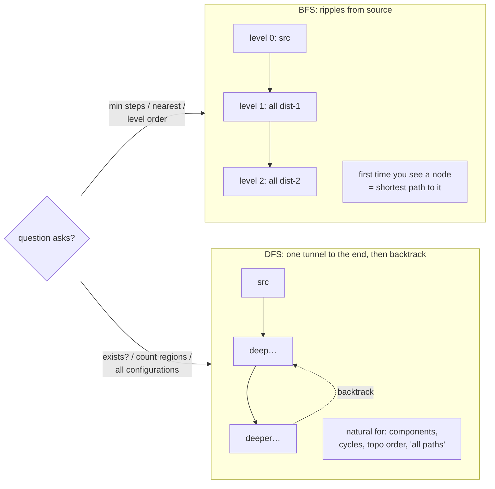

# Graphs 1: BFS & DFS — two templates cover 80% of graph questions; the only real decision is "shortest path or exhaustive?"

**DSA track · Session 36 · [INTERVIEW-CRITICAL]**

## TL;DR

- **BFS = shortest path in unweighted graphs / level-by-level.** Queue + visited-on-enqueue. If the question says "minimum steps/moves/levels" → BFS, no debate.
- **DFS = reachability, exhaustive exploration, connected components, cycle detection.** Recursion (or explicit stack) + visited.
- Most interview "graphs" arrive disguised as **grids** (islands, rotting oranges) or **implicit graphs** (word ladder: words are nodes, one-letter-diff are edges). Recognizing the graph is the hard part; the traversal is muscle memory.
- Mark visited **when you enqueue/first touch, not when you pop** — the #1 bug; it causes duplicate queue entries and TLE.
- Complexities to say without thinking: O(V+E) time, O(V) space. Grid: V=mn, E≈4mn → O(mn).

## Mental Model



## What Actually Happens

The two templates, annotated with the failure points:

```python
from collections import deque

def bfs(start, graph):
    q = deque([start])
    visited = {start}              # mark ON ENQUEUE — not on pop
    dist = 0
    while q:
        for _ in range(len(q)):    # freeze level size → level-by-level
            node = q.popleft()
            if is_target(node):
                return dist        # first hit = shortest, guaranteed
            for nxt in graph[node]:
                if nxt not in visited:
                    visited.add(nxt)   # here. not after popping.
                    q.append(nxt)
        dist += 1
    return -1

def dfs(node, graph, visited):
    visited.add(node)
    for nxt in graph[node]:
        if nxt not in visited:
            dfs(nxt, graph, visited)
```

Walkthrough of the load-bearing lines:

1. **Visited-on-enqueue (BFS):** if you mark on pop, a node at distance d gets enqueued by *every* dist-(d−1) neighbor before its first pop — exponential queue blowup on dense grids. The `visited.add` sits next to `append`, always.
2. **The level loop `for _ in range(len(q))`:** snapshotting the queue length separates level d from d+1 — this is what makes "minimum steps" and "rotting oranges minutes" fall out for free. Without it you have *a* BFS but no level counter.
3. **Grid-as-graph:** neighbors = `[(r±1,c), (r,c±1)]` with bounds-check; visited is often the grid itself (`grid[r][c] = '#'` — mutate-as-visited saves the set, mention the trade). Number of Islands = "count DFS/BFS launches over unvisited land."
4. **Implicit graphs:** Word Ladder never hands you edges — neighbors are generated (`for i, for c in alphabet: word[:i]+c+word[i+1:]`). State-space BFS ("min steps to reach config X") is the same: nodes are *states*, edges are *moves*. Lock-combination, jug-pouring, sliding-puzzle — all this one idea.
5. **Multi-source BFS:** seed the queue with *all* sources at distance 0 (rotting oranges, walls-and-gates, "distance to nearest X"). It's one line different and interviewers love it.
6. **DFS recursion depth:** Python's limit (~1000) dies on a 1000×1000 grid snake — either `sys.setrecursionlimit` (say it, it's fine in interviews) or convert to an explicit stack (mechanical: push instead of recurse).
7. **Cycle detection needs three colors in directed graphs:** white (unseen) / gray (in current stack) / black (done). Gray→gray edge = cycle. Undirected: a visited neighbor that isn't your parent = cycle. This foreshadows [topological sort](graphs_toposort_unionfind.md), where "cycle = no valid order."

## The Opinionated Take

- **Decide BFS vs DFS from the question's noun, then stop thinking about it:** "shortest/minimum/nearest/fewest" → BFS; "exists/count/all/any" → DFS (either works for plain reachability — pick DFS for less code, BFS when depth could explode).
- **Write the neighbor generator first.** In grids and implicit graphs, `get_neighbors(state)` is where the problem actually lives; the traversal around it is boilerplate. Structuring your interview code this way also reads senior.
- **Don't reach for Dijkstra until edges have weights.** Interviewers plant unweighted problems hoping you'll over-engineer; BFS *is* Dijkstra when all weights are 1. (Weights of only 0 and 1 → deque-based 0-1 BFS; know the name.)
- Where the templates bend: bidirectional BFS for huge branching factors (word ladder optimization — mention, don't default); iterative-deepening when memory is the constraint (rare in interviews).

## Interview Ammo

1. **"Number of Islands — and why is your complexity O(mn)?"** — Launch DFS per unvisited land cell, sink as you go; every cell enters/leaves visited once, each edge examined ≤2× → O(mn). The follow-up "what if the grid can't be mutated" → visited set, O(mn) space.
2. **"Word Ladder."** — Name the implicit graph (words=nodes, 1-letter-diff=edges), BFS for shortest, neighbor generation 26×L per word; precompute wildcard buckets (`h*t`) for the optimization. Saying "this is BFS on an implicit graph" in sentence one is the win.
3. **"Rotting Oranges."** — Multi-source BFS, all rotten seeds at t=0, level loop = minutes; answer −1 if fresh remain. One-liner insight: "simultaneous spread = multi-source."
4. **"Detect a cycle in a directed graph."** — Three-color DFS, gray-hit = cycle; contrast the undirected parent-check version — mixing them up is a known mid-level tell.
5. **"Clone Graph / copy with random pointers."** — Traversal + hashmap old→new, create-on-first-visit; works with either BFS or DFS, the map *is* the visited set.

## Practice Rep (60 min, pass/fail)

Timed, in order, no notes (LeetCode): **200 Number of Islands (20 min) → 994 Rotting Oranges (20 min) → 127 Word Ladder (20 min)**.

**Pass:** all 3 accepted within their time boxes; islands + oranges on the first or second submission; you wrote the level-loop and visited-on-enqueue correctly *without* debugging them (check your submission count).
**Fail:** any TLE from visited-on-pop, or Word Ladder attempted without stating (in a comment) what the nodes and edges are before coding.

## Self-Check (5 questions, answers at bottom)

1. Why does BFS guarantee shortest path in unweighted graphs, and where exactly does the guarantee break with weights?
2. What goes wrong, mechanically, when you mark visited on pop instead of enqueue?
3. How do you count *levels* in BFS, and name two problems where the level count is the answer.
4. Directed vs undirected cycle detection — what's different and why?
5. You're asked for minimum moves from a start state to a goal state with a move-generator. What's the graph, and what's your first question back?

---

<details><summary>Answers</summary>

1. The queue processes nodes in non-decreasing distance order, so a node's first discovery is via a shortest path. With weights, a "later" queue entry can represent a cheaper path — order by cost instead (priority queue) = Dijkstra.
2. A node reachable from k same-level predecessors gets enqueued k times before its first pop marks it; queue and work balloon (worst-case exponential on grids), and level counts distort. Marking on enqueue makes each node enter the queue exactly once.
3. Snapshot `len(q)` and process exactly that many pops per outer iteration; increment the counter after each snapshot. Rotting Oranges (minutes), Word Ladder (transformation count), "minimum knight moves."
4. Undirected: any visited neighbor other than your parent closes a cycle (the parent edge is just where you came from). Directed: you need in-current-path (gray) vs finished (black) — a visited-but-black neighbor is fine (diamond shapes), only a gray hit means a back-edge/cycle.
5. The graph is the implicit state space — nodes are states, edges are legal moves; BFS gives minimum moves. First question: "roughly how many distinct states?" — it bounds V and tells you whether plain BFS fits memory or you need bidirectional/pruning.

</details>
