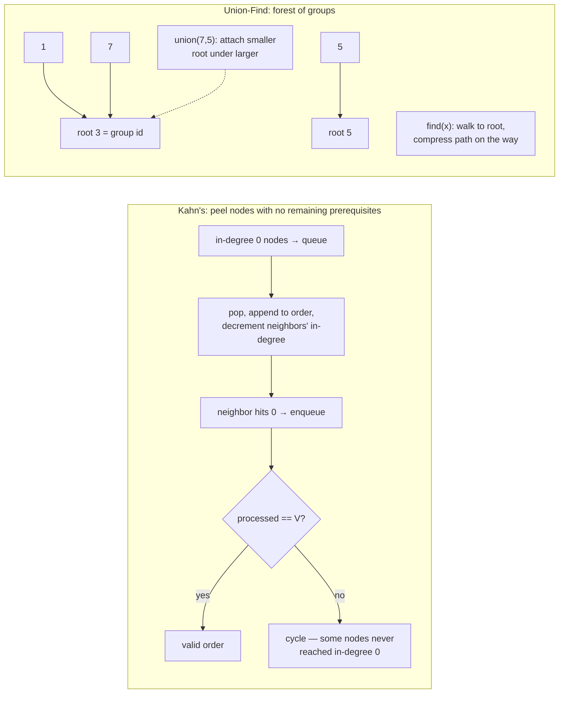

# Graphs 2: Topological Sort & Union-Find — "dependency order" and "same group?" are solved problems; recognize them and type

**DSA track · Session 37 · [INTERVIEW-CRITICAL]**

## TL;DR

- **Topological sort** = linear order of a DAG where every edge points forward. Trigger words: prerequisites, build order, dependency, "must come before." Kahn's algorithm (BFS + in-degrees) is the template; **fewer processed nodes than V = cycle** — detection built in.
- **Union-Find (DSU)** = near-O(1) "are these connected?" + "merge these groups" under *incremental* connections. Trigger words: connected components that grow, accounts to merge, redundant connection, islands appearing over time.
- Both are recognition problems: the coding is ~15 lines each, memorized; the interview is spotting which one the story is hiding.
- DSU needs both optimizations to be fast — **path compression + union by size/rank** → amortized α(n) ≈ constant. Say "inverse Ackermann" once, smile, move on.
- Choose DFS/BFS when the graph is static and you traverse it; choose DSU when edges *arrive* and you answer connectivity between arrivals. Topo sort when edges mean *order*, not just connection.

## Mental Model



## What Actually Happens

The two templates, annotated:

```python
from collections import deque, defaultdict

def topo_order(n, edges):                  # edges: (a, b) = a before b
    adj, indeg = defaultdict(list), [0] * n
    for a, b in edges:
        adj[a].append(b)
        indeg[b] += 1
    q = deque(i for i in range(n) if indeg[i] == 0)
    order = []
    while q:
        node = q.popleft()
        order.append(node)
        for nxt in adj[node]:
            indeg[nxt] -= 1
            if indeg[nxt] == 0:            # last prerequisite done
                q.append(nxt)
    return order if len(order) == n else []   # short = cycle

class DSU:
    def __init__(self, n):
        self.parent = list(range(n))
        self.size = [1] * n
    def find(self, x):
        while self.parent[x] != x:
            self.parent[x] = self.parent[self.parent[x]]  # path halving
            x = self.parent[x]
        return x
    def union(self, a, b):                 # returns False if already joined
        ra, rb = self.find(a), self.find(b)
        if ra == rb:
            return False
        if self.size[ra] < self.size[rb]:
            ra, rb = rb, ra
        self.parent[rb] = ra
        self.size[ra] += self.size[rb]
        return True
```

1. **Kahn's is "peel the ready set":** in-degree = unmet prerequisites; the queue holds everything currently startable. Popping a node "completes" it, decrementing dependents; hitting zero means *its last blocker cleared*. The order out is a valid schedule. This is literally how build systems and your [job-scheduler DAG workflows](../../system-design/designs/canonical_4_scheduler_storage.md) think.
2. **The cycle test is free:** nodes inside a cycle never reach in-degree 0, so they never enter the queue → `len(order) < n`. Course Schedule I is *just this boolean*. (DFS three-color from [session 36](graphs_bfs_dfs.md) also works; Kahn's is less error-prone live.)
3. **Order within the order:** "return lexically smallest valid schedule" → swap the deque for a min-heap. "Can the order be uniquely determined?" → queue must never hold 2+ nodes at once. Both are one-line pivots interviewers use to test whether you memorized or understood.
4. **DSU's find walks to the group's root** — the root is the group's identity. **Path halving** (each node re-points to its grandparent mid-walk) flattens the tree as a side effect of querying; **union by size** keeps trees shallow by attaching small under large. Either alone: O(log n); both: amortized α(n) — effectively constant. Without them, a degenerate chain makes find O(n) — the classic "why is my DSU TLE-ing."
5. **`union` returning False is a feature:** "this edge connects already-connected nodes" = the redundant edge (Redundant Connection), = the cycle-forming edge (as-you-build cycle detection), = "these two were already friends." Count `True` unions to track component count: `components = n - successful_unions` (Number of Provinces, islands-over-time).
6. **Modeling is the actual skill:** Accounts Merge — nodes are emails, union all emails within an account, groups = people. Most Stones Removed — union by shared row/col (rows and cols as virtual nodes). The graph is rarely handed to you; you *declare* what a node is. Same muscle as implicit-graph BFS.
7. **When each loses:** DSU can't *un*-union (offline reversal tricks exist; out of interview scope) and answers only connectivity — not paths or distances (that's BFS). Topo sort needs a DAG by definition — feeding it an undirected graph is a category error interviewers watch for.

## The Opinionated Take

- **Memorize both templates cold — this is explicitly a typing-speed topic.** The interview minutes should go to modeling (what's a node? what's an edge? does edge-direction mean order?), not to re-deriving path compression under pressure.
- **Kahn's over DFS-based topo in interviews:** iterative (no recursion-limit landmine), cycle check falls out of a length comparison, and the level structure answers follow-ups ("which courses can be taken in parallel?" — each queue generation is a semester).
- **Reach for DSU only when connectivity is *dynamic*.** Static graph, one query → BFS/DFS is simpler and equally fast. The DSU tell is edges arriving in a stream with questions in between.
- Real-world echoes worth dropping in interviews: topo sort = build systems, migration ordering, DAG schedulers; DSU = network partition detection, dedup/entity-resolution (accounts merge *is* identity resolution), Kruskal's MST.

## Interview Ammo

1. **"Course Schedule I/II."** — Model prerequisites as edges, Kahn's; I = "did all n get ordered," II = the order itself. Follow-up "minimum semesters?" = count queue generations (level structure).
2. **"Redundant Connection."** — Process edges through DSU; the first `union` returning False is the answer. One sentence of why: that edge's endpoints were already connected, so it closes the cycle.
3. **"Accounts Merge."** — Union emails within each account (email↔email via first email as anchor), then group by root and sort. The senior part is declaring emails-as-nodes without prompting.
4. **"Number of connected components / provinces — which tool?"** — Static adjacency matrix → either; say DFS is enough, but if edges streamed in you'd flip to DSU. Showing the *decision*, not just a solution, is the point.
5. **"Why is Union-Find nearly O(1)?"** — Path compression flattens trees on every find; union by size bounds depth; combined amortized cost is inverse-Ackermann α(n) < 5 for any conceivable n. Two-sentence answer, don't derive.

## Practice Rep (60 min, pass/fail)

Timed, no notes: **207 Course Schedule (15 min) → 210 Course Schedule II (10 min — reuse!) → 684 Redundant Connection (15 min) → 721 Accounts Merge (20 min)**.

**Pass:** all 4 accepted in their boxes; 210 completed inside 10 min *because* 207's code was reused (that reuse is the skill being tested); DSU written with both optimizations from memory; a one-line comment in 721 declaring the node model before the code.
**Fail:** DSU written without path compression or by-size union, or 721 started coding before the node/edge declaration comment existed.

## Self-Check (5 questions, answers at bottom)

1. Why does Kahn's algorithm detect cycles without any explicit cycle-checking code?
2. "Return any valid build order" vs "is the build order unique?" — what changes in the algorithm?
3. What specific workload makes DSU beat repeated BFS by a huge margin, and what's the complexity comparison?
4. In Accounts Merge, what are the nodes, what are the edges, and what does a DSU root represent?
5. Your DSU solution TLEs on a chain-heavy adversarial test. Name the missing line(s) and the resulting complexity with and without them.

---

<details><summary>Answers</summary>

1. Nodes in a cycle each wait on another cycle member, so none ever reaches in-degree 0 and none is ever enqueued; the output order comes up short (`len(order) < n`). Absence from the schedule *is* the cycle report.
2. Any order: standard Kahn's. Uniqueness: check that the queue never contains more than one node at any pop — two simultaneously-ready nodes = two interchangeable orders. (Lexically-smallest variant: min-heap instead of deque.)
3. Edges arriving incrementally with connectivity queries interleaved ("after adding this cable, are A and B connected?"). DSU: ~α(n) per operation → ~O(E α) total; re-running BFS per query: O(V+E) each → O(Q(V+E)) total. For 10^5 queries that's the difference between instant and minutes.
4. Nodes = email addresses; edges = "appear in the same account" (union each account's emails to its first email); a root = one real person's identity; final answer = emails grouped by root, sorted, with the account name attached.
5. Path compression in `find` (and union by size in `union`). Without them, unions can build a linked-list-shaped tree → find degrades to O(n), total O(n²)-ish; with both, amortized α(n) per op — effectively linear overall.

</details>
