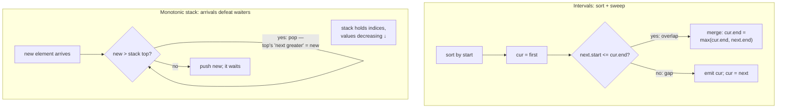

# Intervals & Monotonic Stack — sort-then-sweep and the stack that throws away losers: two patterns that masquerade as twenty problems

**DSA track · Session 39 · [INTERVIEW-CRITICAL]**

## TL;DR

- **Intervals: sort by start, then sweep with one "current" interval.** Overlap test between sorted neighbors is just `next.start <= cur.end`. Merge/insert/erase-overlaps are all this sweep with different bookkeeping.
- The greedy twist: for **"remove fewest to make non-overlapping" / "max non-overlapping set," sort by *end*** and always keep the interval that ends earliest — it constrains the future least. Being able to say *why* is the interview.
- **"Minimum rooms/resources at once" = the sweep-line trick:** split intervals into +1/−1 events (or heap of end-times), sort, running sum's max is the answer.
- **Monotonic stack answers "nearest greater/smaller element to the left/right" in O(n)**: push indices, pop everyone your arrival defeats — each pop *resolves* a waiting element's answer. Trigger words: next greater, daily temperatures, largest rectangle, "how far until…".
- Both patterns share one deep idea: **process in a sorted/streamed order and discard anything that can never matter again.** That sentence generalizes further than the templates.

## Mental Model

## What Actually Happens

### Intervals, one sweep three ways

1. **Merge Intervals (the base form):** sort by start — now any overlap is *adjacent*. Keep `cur`; if `next.start <= cur.end` they overlap → extend `cur.end = max(cur.end, next.end)` (the `max` matters: `[1,10],[2,3]` — forgetting it is the classic bug); else emit and advance. O(n log n) for the sort, O(n) sweep. Sorting is what converts "compare all pairs" O(n²) into "compare neighbors."
2. **Non-overlapping / min removals (LC 435):** now it's *selection*, and greedy-by-end takes over: sort by **end**; take the first interval; skip everything overlapping it; take the next non-overlapping. Why end-sort is optimal (say this, don't just do it): the earliest-ending interval leaves maximal room for the rest — any optimal solution can swap its first pick for yours without loss (exchange argument, one sentence, no proof needed). Removals = n − kept.
3. **Meeting Rooms II / min platforms (the resource question):** you don't need which meetings conflict, only **how many run concurrently at peak**. Events: (start, +1), (end, −1); sort (ends before starts at ties — touching intervals don't need two rooms); running sum; answer = max. Equivalent min-heap form: heap of end-times, pop if `heap[0] <= start`, push end, answer = max heap size. Both O(n log n); heap version generalizes to "which room."
4. **Recognition guide:** "combine/collapse" → merge sweep; "choose/remove fewest" → end-sort greedy; "how many at once / capacity" → sweep-line counter. Calendar/booking problems are these three wearing product clothes.

### Monotonic stack, from mechanism to the boss problem

5. **Daily Temperatures / Next Greater:** walk left→right holding a stack of indices whose answers are *pending*, values strictly decreasing top-down. A new warmer day pops every colder index — the pop *is* the moment that index learns its answer (`ans[popped] = i - popped`). Each index pushes once, pops once → **O(n) despite the nested loop** — say the amortized argument aloud; it's what's being tested.
6. **Why decreasing:** if the stack ever held a smaller value *under* a larger one, the smaller could never be anyone's "nearest greater to the left" — it's dominated, dead weight. Monotonicity = the invariant "everything in the stack still has a future." Direction flips (next smaller → increasing stack; "to the left" → answers on push instead of pop) are mechanical once this is understood.
7. **Largest Rectangle in Histogram (LC 84, the boss):** for each bar, the maximal rectangle with *its* height extends until the first shorter bar on each side — exactly two "nearest smaller" queries. Increasing stack; when bar `i` pops bar `k`: right boundary = `i`, left boundary = new stack top, width = `i - top - 1`, area = `h[k] × width`. Sentinel 0-bar at the end flushes the stack. This one problem, understood, unlocks maximal-rectangle-in-matrix and half of "hard" stack questions.
8. **The shared skeleton with intervals:** both sweep a sorted/streaming order and **evict elements that can no longer influence any future answer** (covered intervals; dominated stack entries). That eviction discipline is also [sliding-window](sliding_window.md)'s deque trick — one idea, three costumes.

## The Opinionated Take

- **For intervals, announce your sort key and why before coding.** Start-sort for merging (adjacency), end-sort for selection (greedy exchange), event-sort for capacity. Choosing the sort *is* the solution; the sweep is typing.
- **Never brute-force "next greater" in an interview even if n is small** — the monotonic stack is the point of the question. Conversely, don't force a stack onto problems that are really prefix sums or windows; the trigger is *nearest/next relative to position*, not "array question."
- **Learn Largest Rectangle to fluency, not familiarity.** It's the most-asked hard-tier stack problem, and its boundary arithmetic (`i - top - 1`) is exactly where live coding collapses. Drill the pop-handler until it's reflex.
- Tie-handling is where interval solutions silently diverge: decide explicitly whether `[1,2],[2,3]` overlap (booking: usually no; merging points: usually yes) and encode it in the comparison (`<` vs `<=`, end-events-first). Stating the tie rule unprompted reads senior.

## Interview Ammo

1. **"Merge Intervals — and why sort first?"** — Sorting makes overlaps adjacent, so one linear sweep with a `max`-extend suffices; without it you'd compare all pairs. O(n log n), in-place emit.
2. **"Minimum meeting rooms."** — Event sweep or end-time heap; peak concurrency; ends-before-starts tie rule. Follow-up "return each meeting's room" → heap of (end, room_id) — know the pivot.
3. **"Erase overlapping intervals / max non-overlapping."** — End-sort greedy + the one-sentence exchange argument. Interviewers specifically probe *why not start-sort*; have the `[1,100],[2,3],[4,5]` counterexample ready.
4. **"Daily Temperatures — better than O(n²)?"** — Monotonic decreasing stack of pending indices; each element pushed/popped once → O(n) amortized. Narrate a pop as "this index just met its answer."
5. **"Largest Rectangle in Histogram."** — Nearest-smaller-on-both-sides via increasing stack, area computed at pop time, sentinel flush. If asked to extend: matrix version = histogram per row.

## Practice Rep (60 min, pass/fail)

Timed, no notes: **56 Merge Intervals (12 min) → 435 Non-overlapping Intervals (12 min) → 253 Meeting Rooms II (12 min; premium-locked? → GfG "minimum platforms," same problem) → 739 Daily Temperatures (10 min) → 84 Largest Rectangle (14 min)**.

**Pass:** ≥4/5 accepted within boxes including 84; 435 solved with end-sort and the why-comment written; 739's complexity argued as O(n) amortized in a comment; tie rule stated in 253.
**Fail:** 435 via start-sort fumbling, 84 abandoned at the width arithmetic, or any nested-loop O(n²) submitted where the pattern applies.

## Self-Check (5 questions, answers at bottom)

1. Merging `[1,10],[2,3],[4,5]` — where exactly does the missing-`max` bug bite, and what wrong output does it produce?
2. Give the counterexample showing start-sort greedy fails for max-non-overlapping selection, and the exchange argument for why end-sort works.
3. In Meeting Rooms II, why must end-events sort before start-events at equal times, and what product decision would flip that?
4. Prove (informally) that the monotonic stack solution to Daily Temperatures is O(n) despite the while-loop inside the for-loop.
5. In Largest Rectangle, when bar `i` pops index `k`, derive the width formula `i - stack[-1] - 1` — what do the two boundaries mean?

---

Answers

1. After merging `[2,3]` into `[1,10]`, naive `cur.end = next.end` sets end to 3; then `[4,5]` looks non-overlapping and gets emitted separately → output `[1,3],[4,5]` instead of `[1,10]`. `max(cur.end, next.end)` keeps the enclosing interval's reach.
2. `[1,100],[2,3],[4,5]`: start-sort greedy takes `[1,100]` and kills both others (1 kept); end-sort takes `[2,3]`, then `[4,5]` (2 kept). Exchange argument: in any optimal solution, replace its earliest-ending pick with the globally earliest-ending interval — it ends no later, so everything after still fits; hence earliest-end-first is never worse.
3. A meeting ending at 10 and another starting at 10 can share a room — processing the −1 first keeps peak count honest. If the product needs turnover time (cleaning, buffer), starts would process first (or ends get +buffer), increasing the count — the tie rule encodes a business rule.
4. Charge each while-iteration (a pop) to the element being popped, not to `i`. Every element is pushed exactly once and thus popped at most once, so total pops ≤ n across the entire run; the for-loop is n pushes. Total operations ≤ 2n → O(n) amortized.
5. Popping `k` means bar `i` is the **first bar shorter than h[k] to its right** (exclusive right boundary), and the new stack top is the **nearest index with height < h[k] on the left** (exclusive left boundary — stack is increasing, so whatever remains below k is shorter). Bars strictly between them are all ≥ h[k], so the rectangle of height h[k] spans `(stack[-1], i)` exclusive: width = `i - stack[-1] - 1`.

