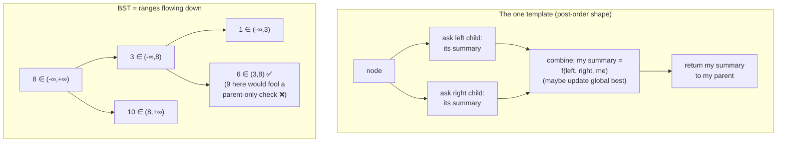

# Trees & BSTs — every tree question is "what do I need from my children?"; answer that and the recursion writes itself

**DSA track · Session 38 · [INTERVIEW-CRITICAL]**

## TL;DR

- The universal template: a function that **asks each child for a summary, combines them, and returns its own summary**. Depth, balance, diameter, path sums, subtree checks — all instances of one shape.
- The **BST invariant is about ranges, not parents**: every node in the left subtree < node < every node in the right subtree. Validate with `(lo, hi)` bounds passed down — comparing only to direct children is *the* classic wrong answer.
- **Inorder traversal of a BST is sorted order.** Kth-smallest, validation-by-monotonicity, BST-to-list — one fact, three problems.
- Know the traversals as *tools*: pre-order (serialize/copy), in-order (BST sorted), post-order (children-before-self — the combine step), level-order (BFS, [session 36](graphs_bfs_dfs.md)).
- The two celebrity problems interviewers actually ask: **LCA** (lowest common ancestor) and **diameter/path-sum family** — both are the template with a twist: information flows *up* while the answer may live at *any* node (track a nonlocal best).

## Mental Model



## What Actually Happens

**Watch one problem — diameter — get built from the template, then reuse the moves:**

1. **Ask "what summary does a parent need from a child?"** For diameter (longest node-to-node path): a parent needs each child's **height** (longest downward chain), because the best path *through me* = left height + right height. That question — not coding — is the whole design step.
2. **The answer might not pass through the root**, so keep a nonlocal `best` updated at every combine, while still returning the summary the parent needs:

```python
def diameter(root):
    best = 0
    def height(node):
        nonlocal best
        if not node:
            return 0
        L, R = height(node.left), height(node.right)
        best = max(best, L + R)          # answer candidate AT this node
        return 1 + max(L, R)             # summary FOR my parent
    height(root)
    return best
```

   The two different values — what you *report up* vs what you *record globally* — is the exact structure of max-path-sum, longest-univalue-path, and most "hard" tree problems. Name the pattern: **"return the chain, record the arch."**
3. **Balanced-tree check, same shape:** child summary = height, plus a sentinel (−1) that propagates "already unbalanced" up without recomputation. Subtree-of-another-tree, symmetric-tree: summary = "is identical/mirror," combined with `and`.
4. **BST validation via ranges:** each node must sit inside `(lo, hi)`; recursing left tightens `hi=node.val`, right tightens `lo=node.val`. The famous trap tree (root 8, left 3, left-right 9) passes every parent-child comparison and violates the range — say this example out loud when asked why the naive check fails. Alternative: inorder walk must be strictly increasing (keep `prev`) — same fact as kth-smallest.
5. **LCA, the celebrity:** post-order again — return "found p or q or an LCA below me"; if left and right both return non-null, *I* am the split point. BST version is easier and different: walk down using order — both smaller → go left, both bigger → go right, else you're standing on the answer. Giving *both* versions unprompted is a strong signal.
6. **Iterative inorder (know it cold — it's the recursion-limit escape and the BST-iterator problem):** push left spine, pop, hop right, repeat. BST Iterator (LC 173) is exactly this with the stack held in an object; amortized O(1) `next`, O(h) memory.
7. **Serialize/deserialize:** pre-order with null markers ("1,2,#,#,3") — order of emission = order of reconstruction; a queue/iterator over tokens rebuilds it in one pass. BSTs serialize without null markers (pre-order + range logic reconstructs) — a nice "why is BST special" follow-up.

## The Opinionated Take

- **Ban "traverse and collect into a list" as your first instinct.** It solves many tree problems in O(n) extra space and zero insight; interviewers read it as pattern-matching evasion. Reach for it only when the problem *is* about the sequence (BST → sorted list uses).
- **Write the recursive version first, always** — it maps 1:1 to the "child summary" design and is 3× shorter live. Mention the O(h) stack cost and the iterative fallback once; convert only if the interviewer pushes (skewed-tree h=n is the honest caveat).
- **For any "path" problem, say "return the chain, record the arch" before coding.** It front-loads the only subtle decision and inoculates you against the classic bug (returning `L+R` up the tree, which double-counts turns).
- Where trees stop being this doc: n-ary trees (same template, loop over children), tries (next session's territory if the audit demands), and balanced-BST *implementation* (red-black rotations — nobody asks you to implement; know they exist and that `sorted containers` / DB B-trees ([storage doc](../../db/postgres_internals_1_storage.md)) are the production forms).

## Interview Ammo

1. **"Validate a BST."** — Range-bounds recursion (or inorder-monotonic); *lead with why parent-child comparison fails* using the 8/3/9 counterexample. This question exists to catch the naive check.
2. **"Diameter / max path sum."** — The chain-vs-arch split: return single-side chain up, record two-side arch globally. Max-path-sum adds "clamp negative chains to 0" — say that line explicitly.
3. **"LCA of a binary tree (and of a BST)."** — General: post-order split-point logic. BST: ordered descent, O(h), no recursion needed. Offer both; state the "nodes guaranteed present" assumption and what changes if not.
4. **"Kth smallest in a BST."** — Inorder = sorted; iterative stack, decrement k on pop, stop early → O(h + k). Follow-up "frequent inserts?" → augment nodes with subtree counts (rank descent) — knowing the augmentation exists is the senior part.
5. **"Serialize/deserialize a binary tree."** — Pre-order + null markers + token queue; O(n) both ways. Follow-up: why BST needs no null markers.

## Practice Rep (60 min, pass/fail)

Timed, no notes: **98 Validate BST (15 min) → 543 Diameter (10 min) → 236 LCA (15 min) → 230 Kth Smallest (10 min) → 297 Serialize/Deserialize (bonus if time remains)**.

**Pass:** first four accepted in their boxes; 98 solved with ranges (not inorder) *and* you can state the counterexample tree from memory; 543 contains the chain/arch comment; 236 accepted without consulting the pattern.
**Fail:** 98 attempted via parent-child comparisons on the first submission, or 543 returning `L+R` up the tree (the double-count bug) at any point that reaches submission.

## Self-Check (5 questions, answers at bottom)

1. Construct the smallest tree where "every node > left child and < right child" holds but it's not a BST.
2. In diameter/max-path-sum, why must the value returned to the parent differ from the value recorded as a candidate answer?
3. Why is inorder traversal of a BST sorted — argue it from the invariant, not by example.
4. Two ways to find the LCA in a BST vs a general binary tree — what property does the BST version exploit and what's the complexity difference?
5. Your recursive solution crashes on a 10^5-node skewed tree. Why, and what are your two fixes ranked by interview practicality?

---

<details><summary>Answers</summary>

1. Root 8, left child 3, and 3's right child 9: 3<8 ✓, 9>3 ✓, but 9 sits in root's *left subtree* while being >8 — violating the subtree-range invariant that parent-child checks never see.
2. A parent can only extend a *single* downward chain (paths can't fork upward through it), so you return `1+max(L,R)`. But the best answer at this node uses *both* arms (`L+R`, the arch). Returning the arch up would let an ancestor build a forked "path" that isn't a path.
3. Invariant: all left-subtree keys < node < all right-subtree keys. Inorder emits left subtree entirely, then node, then right subtree — by induction each block is sorted internally and the invariant orders the blocks; concatenation of ordered blocks in order is sorted.
4. BST: compare values and descend one side (both < node → left; both > → right; else split point) — O(h), iterative, no extra state. General tree: post-order search returning found-markers, O(n) since order gives no direction. The BST version exploits keys *telling you where targets live*.
5. Python recursion limit (~1000) hit at depth 10^5 — skewed tree makes h=n. Fixes: (1) `sys.setrecursionlimit(2*10**5)` — one line, acceptable in interviews, say the stack-memory caveat; (2) rewrite iteratively with an explicit stack — more code, needed if the interviewer bans the limit bump or the environment can't take deep C-stack recursion.

</details>
