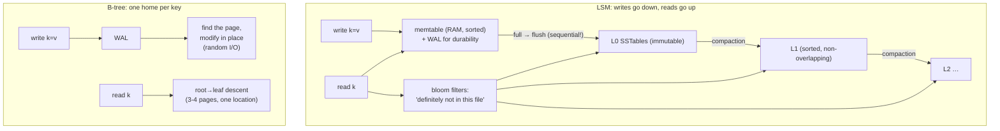

# LSM Trees vs B-trees — you're choosing which amplification to pay: write it twice now, or search for it later

**Level 10 · The Vault · Session 14 · [INTERVIEW-CRITICAL]**

## TL;DR

- **B-tree**: update pages in place (via WAL) → reads are O(log n) with one authoritative location per key; writes pay **random I/O** and page maintenance. Postgres, MySQL/InnoDB, SQLite.
- **LSM tree**: never update in place — buffer writes in a **memtable**, flush as immutable sorted files (**SSTables**), merge them later (**compaction**) → writes are sequential appends; reads may check *many* files. RocksDB, Cassandra/ScyllaDB, LevelDB, and (spiritually) Kafka.
- The trade in one sentence: **B-trees pay at read-optimized-write-time; LSMs defer the cost to compaction and read paths.** The three amplifications (write/read/space) can't all be minimized — pick two per workload.
- **Bloom filters** are why LSM point reads survive: a per-SSTable "definitely not here" check turns most file probes into memory lookups.
- Default to B-tree (it's what your relational world runs on). Reach for LSM when the workload is **write-heavy, append-mostly, or time-series at volume** — or when you adopt a system that already chose it (know what you inherited).

## Mental Model

## What Actually Happens

**One write and one read through each engine:**

1. **LSM write:** append to WAL (crash safety), insert into the in-RAM sorted memtable. Done — *no disk page was sought*. That's the entire write-throughput story: the disk only ever sees sequential appends. When the memtable fills (~64 MB), it's flushed as an immutable **SSTable** (sorted keys + sparse index + bloom filter).
2. **Compaction, the deferred bill:** L0 accumulates overlapping SSTables; background threads merge-sort them into L1, L1 into L2, dropping overwritten values and tombstoned deletes. **Write amplification**: each byte may be rewritten at every level (10–30× total). Compaction competes with foreground traffic for I/O — the classic LSM incident is "p99 spikes when compaction falls behind," and the classic tuning war is throughput-vs-latency via compaction style (leveled = read-friendly, tiered = write-friendly).
3. **LSM read:** check memtable → then, newest-to-oldest, each SSTable that *might* hold the key. Bloom filter says "definitely not" for most (~1% false positive), sparse index narrows the rest to a block. Point reads stay decent; **short range scans hurt** (must merge across levels); a missing-key read without blooms would be the worst case. **Read amplification** = files touched per read.
4. **Deletes are writes:** a tombstone marker shadows older values until compaction physically drops it. Consequences: deleted data occupies space (space amplification), and a mass-delete makes *reads slower* — pure LSM counterintuition worth saying aloud in interviews.
5. **B-tree write ([session 10](postgres_internals_1_storage.md) mechanics):** WAL first, then locate the leaf page and modify it in buffer cache; the page eventually flushes — a *random* write, plus page splits when full. Under massive insert load, the working set of dirty pages exceeds cache → random I/O storm. This is precisely the wall LSMs were built to avoid.
6. **B-tree read:** one descent, one authoritative location, predictable latency — no merge, no bloom, no compaction lottery. Range scans ride the sibling-linked leaves beautifully. This read predictability is why OLTP defaults to B-trees.
7. **Where each shows up in your actual stack:** Postgres/MySQL = B-tree. Cassandra/ScyllaDB, RocksDB (inside Kafka Streams state stores, CockroachDB, TiKV, many ML feature stores) = LSM. **Kafka itself** = the LSM idea taken pure: append-only segments, no in-place anything, "compaction" as retention/dedup (`../system-design/data/event_driven_kafka.md`). Elasticsearch segments + merges = same shape for search.

## The Opinionated Take

- **Default: B-tree, because your source of truth is relational.** You adopt LSM by adopting a *system* (Cassandra for write-scale, RocksDB embedded, ClickHouse-adjacent parts) — almost never by swapping engines under an existing app.
- **The honest LSM trigger is sustained write rate** (tens of thousands of writes/s per node, time-series/event firehoses, queue-like data) where B-tree random I/O and index maintenance become the bottleneck. If your writes fit comfortably in Postgres with partitioning ([session 13](postgres_internals_4_replication.md)), they weren't LSM-scale.
- **When you inherit an LSM system, budget for compaction ops**: monitor pending compactions, size for the I/O headroom, and treat "mysterious periodic p99 spikes" as compaction-first in triage. Teams that treat Cassandra like "fast Postgres" learn this during an outage.
- **Amplification vocabulary is the senior signal.** Write amp (bytes written to disk per logical byte), read amp (files/pages per read), space amp (disk per live byte). Every storage decision is a triangle among them; say the triangle.
- Where the dichotomy blurs: modern engines hybridize (InnoDB change buffering, Postgres fillfactor/HOT batching some pain; RocksDB leveled-vs-tiered tuning trading toward B-tree-ish reads). The mental model survives the blur.

## Interview Ammo

1. **"B-tree vs LSM — explain the trade."** — In-place page updates + random I/O + great reads vs sequential appends + compaction debt + multi-file reads. Land the one-liner: "you choose *when* to pay: at write time or at compaction/read time," then name the three amplifications.
2. **"Why is Cassandra so fast at writes?"** — Every write is memtable + sequential WAL append; no read-modify-write, no page seek, per-node. Follow with the bill: compaction I/O, read path complexity, tombstones.
3. **"How does an LSM read not check every file?"** — Newest-first ordering + per-SSTable bloom filters ("definitely absent" in RAM) + sparse indexes; leveled compaction bounds the number of candidate files per level.
4. **"Why do deletes make Cassandra reads slower?"** — Tombstones are writes that shadow data across levels until compacted away; reads must collect and reconcile them. Mass deletes = tombstone scans = the famous anti-pattern (don't queue in Cassandra).
5. **"Design storage for 1M sensor readings/sec."** — Say LSM-family or log-structured store (or Kafka → columnar), partition by time+sensor, expect compaction/merge budgeting, retention by segment drop — and contrast explicitly with why a single B-tree table dies (random index maintenance at 1M rows/s).

## Practice Rep (60 min, pass/fail)

Paper-plus-one-tool rep (no cluster needed): `pip install rocksdict` (RocksDB bindings) or use `sqlite3` as the B-tree control.

1. **Measure the shape:** write 1M small KVs to RocksDB and to SQLite (single table, single txn batches of 10k). Record wall time and — for RocksDB — `ls` the data dir before/after and count SST files; trigger/await compaction and count again.
2. **Read path:** time 10k random point reads on both; then 10k reads of *missing* keys on RocksDB (bloom filters at work — compare with `set_bloom_filter` disabled if the binding allows).
3. **The workload quiz (written, timed 15 min):** for each, pick engine-family and defend in ≤2 sentences using amplification vocabulary: (a) payments ledger with balance lookups; (b) IoT firehose, 500k inserts/s, queries = last-hour dashboards; (c) user-profile store, 95% reads; (d) message queue with 7-day retention; (e) audit log, write-once, rare regulator reads.

**Pass:** measurements recorded (write times, SST counts pre/post compaction, hit-vs-miss read times) and all 5 quiz answers use write/read/space amplification correctly — expected: (a) B-tree, (b) LSM/log, (c) B-tree (+cache), (d) log segments à la Kafka, (e) log/append with cheap cold storage.
**Fail:** any quiz justification that's vibes ("Cassandra is webscale") instead of amplification arithmetic.

## Self-Check (5 questions, answers at bottom)

1. Why are LSM writes fast even on the same disk where B-tree writes are slow?
2. What are the three amplifications, and which two does a leveled-compaction LSM optimize at whose expense?
3. Why does a bloom filter help point reads but do nothing for range scans?
4. A Cassandra cluster shows p99 latency spikes every ~20 minutes with no traffic change. First hypothesis and first graph?
5. Kafka has no B-tree and no random updates. Which half of this doc is it, and what plays the role of compaction?

---

Answers

1. They convert random I/O into sequential I/O: append to WAL + RAM memtable now, sort and merge later. B-trees must find and rewrite each key's page — seek-bound (or page-churn bound on SSD).
2. Write amp (disk bytes per logical write), read amp (files/pages per read), space amp (disk per live byte). Leveled compaction lowers read amp and space amp by aggressively rewriting data — paying with high write amplification.
3. It answers set membership ("is key k possibly in this file?") for a single key; a range scan needs *all* keys in an interval, so every level's overlapping SSTables must be merge-scanned regardless.
4. Compaction (or memtable flush) bursts stealing disk I/O/CPU from foreground reads. Graph pending compactions / compaction throughput against the latency spikes.
5. The LSM half, purified: append-only sorted-by-offset segments, immutable once written, reads by sparse offset index. Retention deletion and log compaction (keep-latest-per-key) play compaction's role — dropping/merging whole segments.

