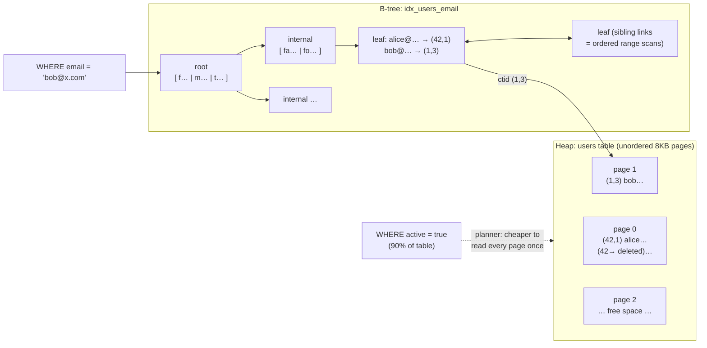

# Postgres Internals 1: Storage & B-trees — the planner doesn't ignore your index out of spite; your index doesn't help

**Level 10 · The Vault · Session 10 · [INTERVIEW-CRITICAL]**

## TL;DR

- A table (**heap**) is a bag of **8 KB pages**; rows (tuples) live wherever they fit, identified by `ctid = (page, slot)`. There is no ordering — `ORDER BY` without an index is always a sort.
- A **B-tree index** is a separate structure mapping key → ctid. Every index read that needs other columns then visits the heap page ("heap fetch") — index trips are only free when the index alone answers the query (**index-only scan**, and only for pages known all-visible).
- The planner picks among seq scan / index scan / bitmap scan **by estimated cost from statistics**, not by "index exists." When it estimates it will touch a large fraction of the table, seq scan genuinely is faster.
- The five classic "index doesn't help" cases: low selectivity, function/cast on the column, leading-wildcard `LIKE`, type mismatch, and wrong column order in a composite index (**leftmost-prefix rule**).
- Every `UPDATE` writes a whole new row version, and **every index on the table may need a new entry** (unless HOT applies) — indexes are a write tax, not free reads.

## Mental Model



## What Actually Happens

**`SELECT * FROM users WHERE email = 'bob@x.com'` with `idx_users_email`:**

1. Planner consults **statistics** (`pg_stats`: n_distinct, histograms, most-common values — refreshed by `ANALYZE`): email is unique → ~1 row → index scan wins by miles.
2. **B-tree descent:** root page → internal page → leaf, comparing keys. Depth for millions of rows: 3–4 pages. Each page is 8 KB; hot upper levels live in `shared_buffers`, so a lookup is typically 3–4 *cached* page reads + 1 heap page. This is why point lookups are ~sub-millisecond and *stay* that way as the table grows — O(log n) with a huge branching factor (~hundreds of keys per page).
3. Leaf entry holds the **ctid** → fetch heap page 1, slot 3 → check the tuple is visible to your snapshot (visibility lives in the *heap tuple header*, not the index — MVCC preview, [postgres_internals_2_mvcc.md](postgres_internals_2_mvcc.md)) → return the row.
4. **Now `WHERE active = true`** (90% of rows): index scan would mean, per matching entry, a leaf walk + a *random* heap page fetch — most pages fetched many times in random order. Seq scan reads every page exactly once, sequentially, with readahead. Planner picks seq scan and it's *right*. Selectivity, not existence, decides.
5. **The middle ground:** moderately selective predicates (say 2–10%) get a **bitmap scan** — scan the index, collect ctids into a page-ordered bitmap, then visit each heap page once, sequentially-ish. Recognize all three shapes in `EXPLAIN` output (deep dive: [postgres_internals_3_explain.md](postgres_internals_3_explain.md)).
6. **Composite index `(tenant_id, created_at)`:** B-tree entries sort by tenant_id, then created_at within it. `WHERE tenant_id = 7 AND created_at > X` → one contiguous leaf range: perfect. `WHERE created_at > X` alone → the created_at values are scattered across all tenants → index useless (**leftmost-prefix rule**). Order composite columns: equality filters first, then the range.
7. **Why `WHERE lower(email) = ...` skips your index:** the index stores `email`'s values; the planner can't use it for an expression on the column — unless you build the matching **expression index** (`ON users (lower(email))`). Same disease: `WHERE phone = 12345` against a `text` column (implicit cast), `LIKE '%@gmail.com'` (no left anchor to descend by).
8. **The write side:** `UPDATE users SET last_seen = now()` rewrites the full tuple (new version, new ctid). Normally every index gets a new entry pointing at it. If the changed column isn't indexed *and* the new version fits on the same page, Postgres does a **HOT update** — heap-only, indexes untouched. This is the argument for `fillfactor < 100` on hot-update tables and for not indexing frequently-updated columns casually.

## The Opinionated Take

- **Index for the query, not the column.** Design indexes from your `WHERE`/`JOIN`/`ORDER BY` shapes: equality columns first, one range column last, `INCLUDE` covering columns if you want index-only scans. An index per column "just in case" is a write tax with no reader.
- **Default to B-tree; know when you're wrong:** GIN for jsonb/array/full-text containment, BRIN for huge append-only tables queried by time ranges (tiny, brilliant, underused), partial indexes (`WHERE status = 'pending'`) for skewed hot subsets — often the single highest-leverage Postgres trick.
- **Deleted rows don't shrink anything.** DELETE/UPDATE leave dead tuples; VACUUM reclaims space *within* pages and updates the visibility map (which index-only scans depend on). A table that's 80% dead tuples does seq scans 5× slower than it should — bloat is a storage-layer performance bug (ops side: session 13).
- Where this doc's advice breaks: analytics scans over wide tables — that's columnar territory (`system-design/data/search_and_analytics.md`), not more B-trees.

## Interview Ammo

1. **"Why would Postgres ignore an index?"** — Lead with "the planner costs it against seq scan using statistics": low selectivity, expression/cast on the column, leading wildcard, leftmost-prefix violation, stale stats. Naming *stale `ANALYZE`* is the senior flourish.
2. **"How does a B-tree index actually find a row?"** — Root→internal→leaf descent (3–4 pages for millions of rows), leaf holds ctid, heap fetch for the tuple + visibility. Mention sibling-linked leaves enabling ordered range scans and `ORDER BY ... LIMIT` for free.
3. **"Index scan vs bitmap scan vs seq scan — when does each win?"** — By selectivity: ~<1% index, ~1–10% bitmap (page-ordered heap visits), large fractions seq (one sequential pass beats scattered random I/O).
4. **"How would you index `(tenant_id, status, created_at)` queries?"** — Equality columns first, range last: `(tenant_id, status, created_at)`; partial index if one status dominates the query load; `INCLUDE` payload columns for index-only scans. Explain leftmost-prefix while you're there.
5. **"Why do more indexes slow down writes, and what's HOT?"** — Every row version needs entries in every index; HOT updates skip index maintenance when no indexed column changed and the version stays on-page — which is why you leave headroom (fillfactor) and don't index churn columns.

## Practice Rep (60 min, pass/fail)

`docker run -d -p 5432:5432 -e POSTGRES_PASSWORD=x postgres:16`, then seed:

```sql
CREATE TABLE events (id bigserial PRIMARY KEY, user_id int, type text, body text, created_at timestamptz);
INSERT INTO events (user_id, type, body, created_at)
SELECT (random()*100000)::int, (ARRAY['click','view','purchase'])[1+(random()*2)::int],
       md5(random()::text), now() - (random()*interval '90 days')
FROM generate_series(1, 2000000);
CREATE INDEX idx_events_user ON events(user_id);
CREATE INDEX idx_events_type ON events(type);
ANALYZE events;
```

Predict the plan shape (seq / index / bitmap / index-only) **before** running `EXPLAIN (ANALYZE, BUFFERS)` on:

1. `WHERE user_id = 42`
2. `WHERE type = 'view'` (≈ a third of rows)
3. `WHERE created_at > now() - interval '1 day'` (no index exists — then create one, re-check)
4. `SELECT user_id FROM events WHERE user_id BETWEEN 100 AND 200` (why is/isn't it index-only? try after `VACUUM events`)
5. `WHERE user_id::text = '42'` (the cast trap)

**Pass:** ≥4/5 plan shapes predicted correctly; for each miss, one written sentence naming the mechanism (selectivity/visibility map/cast); and you fix #5 to use the index without changing the index (rewrite the predicate).
**Fail:** predictions written after running, or the #5 fix eludes you.

## Self-Check (5 questions, answers at bottom)

1. What is a ctid, and why does almost every index lookup end in a heap visit anyway?
2. Why is `WHERE status = 'active'` (95% of rows) *correctly* served by a seq scan?
3. Index on `(created_at, tenant_id)`, query filters `tenant_id = 7` with a `created_at` range. Good index? Why/why not?
4. What has to be true for an index-only scan to actually skip the heap?
5. A wide table gets `UPDATE ... SET view_count = view_count + 1` at 1k/s. Name two storage-layer consequences and one mitigation.

---

<details><summary>Answers</summary>

1. The physical address (page, slot) of a tuple version in the heap. Indexes store key→ctid only — the row's other columns *and its MVCC visibility information* live in the heap tuple, so you go there unless the index covers the columns and the page is all-visible.
2. Cost: index would do a random heap-page fetch per matching row (most pages hit repeatedly, out of order); one sequential pass reads each page once with readahead. Above a modest selectivity threshold, sequential wins arithmetically.
3. Bad for that query: entries are ordered by created_at first, so tenant 7's rows are scattered across the whole index — no contiguous range to walk. Flip it: equality column first `(tenant_id, created_at)`.
4. The index contains every column the query needs, *and* the heap pages involved are marked all-visible in the visibility map (otherwise per-row heap visibility checks are still required) — which is why a fresh bulk-loaded table needs a VACUUM before index-only scans shine.
5. Consequences: a new row version per increment (dead-tuple bloat, VACUUM pressure) and index-entry churn on every index unless HOT applies; also WAL volume. Mitigations: lower fillfactor to keep HOT viable / don't index the counter / batch increments, or move the counter to Redis and flush periodically.

</details>
