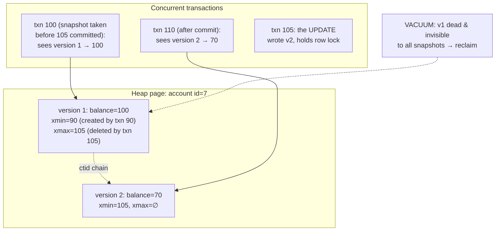

# Postgres Internals 2: MVCC & Locking — readers never block writers because "update" secretly means "insert plus obituary"

**Level 10 · The Vault · Session 11 · [INTERVIEW-CRITICAL]**

## TL;DR

- Postgres never updates in place: every `UPDATE`/`DELETE` creates a **new tuple version** / marks the old one dead via `xmin`/`xmax` transaction IDs on the tuple header. Each transaction reads through a **snapshot** that filters versions — that's MVCC.
- Consequence #1: **readers and writers never block each other.** Consequence #2: dead versions pile up — **VACUUM is not optional hygiene, it's the other half of the design.**
- Isolation levels in Postgres: **Read Committed** (default — snapshot per *statement*), **Repeatable Read** (snapshot per *transaction*), **Serializable** (RR + predicate tracking, may abort you). Dirty reads don't exist in Postgres at all.
- Read Committed's signature anomaly is the **lost update** (read-then-write races between statements). Fix with `SELECT ... FOR UPDATE`, atomic single statements, or optimistic version checks — same hierarchy as [threads_locks_queues.md](../fundamentals/concurrency/threads_locks_queues.md), one layer up.
- **Deadlocks are detected, not prevented**: Postgres waits `deadlock_timeout` (1 s), finds the cycle, kills one victim. Your job: consistent lock ordering + short transactions + retry logic.

## Mental Model

## What Actually Happens

**Two sessions race on `UPDATE accounts SET balance = balance - 30 WHERE id = 7`:**

1. Txn 105 (session A) finds the current version (v1: balance=100, `xmin=90, xmax=∅`), **stamps `xmax=105`** on it, and inserts v2 (balance=70, `xmin=105`). Nothing is overwritten. A holds the **row lock** on id=7 (implicit — any UPDATE takes it) until commit/rollback.
2. Meanwhile txn 100 (a long report started earlier) `SELECT`s id=7. Its snapshot says "txn 105 hadn't committed when I looked" → v1 is still visible to it → reads 100. **No blocking, no dirty read.** Visibility is computed per tuple: `xmin` committed-and-visible? `xmax` absent/uncommitted/invisible? Then you see it.
3. Session B runs the same UPDATE → must lock the same row → **blocks** waiting on A (writers do block writers). A commits. Now the fork in the road:
   - **Read Committed (default):** B re-fetches the *latest committed* version (v2, balance 70) and applies its update → 40. Sane here because the update is self-relative (`balance = balance - 30`, one atomic statement). But split it into `SELECT` then `UPDATE ... SET balance = 70-30` in app code and B computes from a stale read → **lost update** — the DB twin of your Python race.
   - **Repeatable Read:** B's transaction-wide snapshot still shows v1; updating a row that changed under the snapshot raises `ERROR: could not serialize access due to concurrent update`. Your app must **retry the transaction** — RR converts silent anomalies into loud errors.
4. **Serializable** goes further: it tracks read/write *predicate* dependencies (SSI) and aborts one transaction in any pattern that couldn't occur in some serial order — catching write-skew (two txns each read X, write Y based on it; classic: two doctors both go off-call because each saw "2 on call"). Costs: bookkeeping overhead + a retry rate. Every serializable app **must** have retry loops or it's just RR with extra steps.
5. **Deadlock:** A locks row 1 then wants row 2; B locks row 2 then wants row 1. Both wait. After `deadlock_timeout` Postgres walks the waits-for graph, finds the cycle, and aborts one (`ERROR: deadlock detected`), logging both queries. Prevention is boring and works: touch rows in a canonical order (`ORDER BY id` in the locking select / sort your batch updates), keep transactions short, never wait on external I/O mid-transaction.
6. **The bill arrives via VACUUM:** v1 is dead once no snapshot can see it. (Auto)vacuum reclaims dead tuples, maintains the visibility map (index-only scans, [session 10](postgres_internals_1_storage.md)), and — existentially — **freezes** old tuples so 32-bit transaction IDs never wrap around (wraparound = forced shutdown; it has taken down real companies). A long-running transaction pins the "oldest visible" horizon: nothing younger can be vacuumed, tables bloat, queries crawl. **Long-lived idle-in-transaction sessions are a cluster-wide hazard** — set `idle_in_transaction_session_timeout`.

## The Opinionated Take

- **Stay on Read Committed + explicit locking where it matters.** For the few read-then-decide-then-write flows, use `SELECT ... FOR UPDATE` (or a single atomic `UPDATE ... WHERE` with a rows-affected check). It's the lowest-surprise setup, and it's what your team already half-assumes.
- **Use Serializable when invariants span rows** (scheduling constraints, budget caps, uniqueness-ish rules across rows) *and* you're willing to build retries. When you'd be wrong: high-contention hot rows under SSI → abort storms; redesign the data (counters, queues) instead.
- **`SELECT ... FOR UPDATE SKIP LOCKED` is the job-queue cheat code** — workers grab unclaimed rows without herding on the same lock. Postgres-as-queue is legitimate to ~1k jobs/s; past that, a real queue (`system-design/data/event_driven_kafka.md`).
- **Treat `idle in transaction` as an incident, not a smell.** It blocks VACUUM globally. Alert on it (`pg_stat_activity`), timeout it.
- Deadlock errors and serialization failures are **retryable by design** — wrap write transactions in a bounded retry with jitter. Teams that don't do this "fix" deadlocks by removing the locking that made them correct.

## Interview Ammo

1. **"How does MVCC work in Postgres?"** — Tuple versions with xmin/xmax, snapshots filter visibility, readers never block writers, VACUUM reclaims. The senior add: name the *cost* (bloat, vacuum, wraparound) unprompted — MVCC is a trade, not magic.
2. **"Explain isolation levels and what Postgres actually gives you."** — RC = statement snapshot (lost updates possible in read-then-write app code), RR = txn snapshot (serialization errors on conflict — retry), Serializable = SSI catching write-skew (retry rate). Postgres has no dirty reads at any level; "Read Uncommitted" is RC in a trenchcoat.
3. **"Two requests decrement the same inventory row. What can go wrong, per level, and the fix?"** — Walk the race; fixes: atomic conditional UPDATE + rows-affected (best), `FOR UPDATE` (fine), optimistic `WHERE version = :v` (good for low contention). Bonus: `SKIP LOCKED` if it's really a work queue.
4. **"What is write-skew?"** — Two txns read overlapping data, each writes based on what it read, both commit, combined result violates an invariant no serial order would allow. On-call doctors / overlapping bookings. RR misses it; Serializable catches it via predicate tracking.
5. **"Why is a transaction that's been open for 6 hours dangerous even if it's only reading?"** — Its snapshot pins the vacuum horizon: dead tuples everywhere become unreclaimable → bloat, visibility-map decay, wraparound pressure. Also its locks (if any) age like milk.

## Practice Rep (60 min, pass/fail)

Same container as session 10. Open **two `psql` sessions side by side** and produce each phenomenon on demand:

1. **MVCC visibility:** A: `BEGIN; UPDATE accounts SET balance=70 WHERE id=7;` (no commit). B: `SELECT` → must still see 100, without blocking. Commit A; B sees 70. Then show `SELECT xmin, xmax, ctid FROM accounts WHERE id=7` before/after to expose the version machinery.
2. **Lost update:** at Read Committed, script the app-style `SELECT balance` → compute → `UPDATE ... SET balance = <computed>` interleaving across A and B so one decrement vanishes. Then fix it twice: `FOR UPDATE`, and atomic `UPDATE ... SET balance = balance - 30 WHERE balance >= 30` with rows-affected check.
3. **Serialization failure:** repeat the race under `BEGIN ISOLATION LEVEL REPEATABLE READ` and capture the `could not serialize` error.
4. **Deadlock:** A locks row 1 then row 2; B locks row 2 then row 1 (use `SELECT ... FOR UPDATE` with a sleep between). Capture `deadlock detected`, identify the victim, then demonstrate the ordering fix (both lock `ORDER BY id`) makes it impossible across 5 attempts.

**Pass:** all four phenomena reproduced *and* fixed where applicable, with the exact error messages and xmin/xmax observations pasted into a `mvcc_lab.md` log; you can state in one sentence each why the fix works.
**Fail:** any phenomenon you couldn't summon on demand — if you can't cause it, you don't control it.

## Self-Check (5 questions, answers at bottom)

1. Where does Postgres store the information that decides whether a row version is visible to your query?
2. Why doesn't a plain `SELECT` ever block behind an `UPDATE`, and what *does* block?
3. What's the difference between how Read Committed and Repeatable Read handle updating a row that changed since your snapshot?
4. Give the write-skew example and say which isolation level is the first to stop it.
5. Autovacuum is "keeping up" but a table is still ballooning with dead tuples. Name the two usual suspects.

---

Answers

1. In the heap tuple header — `xmin` (creating txn) and `xmax` (deleting/updating txn), evaluated against your snapshot (+ commit status). Notably *not* in indexes, which is why heap visits and the visibility map exist.
2. MVCC: the reader's snapshot just selects the older committed version — no lock needed. Blocking happens writer-vs-writer on the same row (row lock held until commit), and DDL (`ALTER TABLE`) vs everything.
3. RC waits for the lock, then re-reads the *newest committed* version and proceeds (statement-level snapshot). RR keeps its transaction snapshot and instead raises a serialization error — correctness pushed to your retry logic.
4. Two doctors each read "2 doctors on call," each removes themselves; both commit; 0 on call — no serial order allows it. Each txn's write wasn't read by the other, so RR passes it; **Serializable** (SSI) detects the dangerous read-write dependency cycle and aborts one.
5. (a) A long-running or idle-in-transaction session pinning the xmin horizon — vacuum runs but can't remove tuples younger than the oldest snapshot; (b) autovacuum thresholds/cost limits too conservative for the table's churn (it's "running" but throttled/infrequent for that table) — tune per-table `autovacuum_vacuum_scale_factor`/cost settings. (Also acceptable: unconsumed replication slot holding the horizon.)

