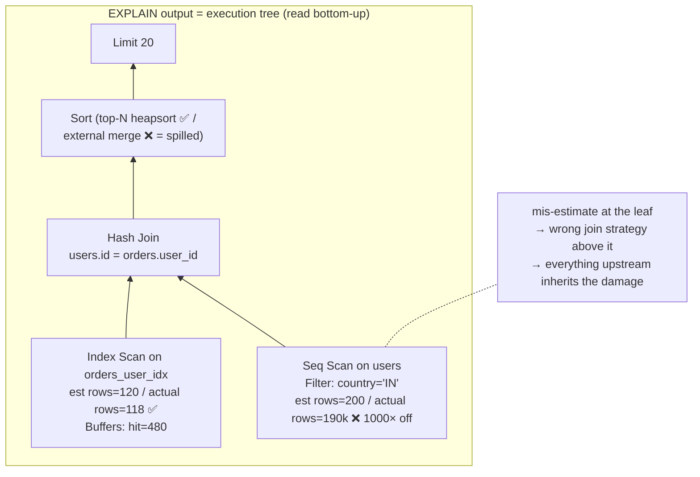

# Postgres Internals 3: Reading EXPLAIN ANALYZE — the plan is a tree of guesses; your job is finding where the guess went wrong

**Level 10 · The Vault · Session 12 · [INTERVIEW-CRITICAL]**
*Prereq: [postgres_internals_1_storage.md](postgres_internals_1_storage.md) — scan types and statistics.*

## TL;DR

- Read plans **inner-most node first, bottom-up**; each node feeds rows to its parent. `EXPLAIN` = estimates only; `ANALYZE` = actually runs it and shows reality next to the guess.
- The #1 diagnostic: compare **estimated `rows=` vs actual `rows=`** at each node. A 100×+ mismatch means stale/insufficient statistics — the planner chose a strategy for a table that doesn't exist.
- The three joins are workload answers, not alternatives: **Nested Loop** (small outer × indexed inner), **Hash Join** (one side fits in memory, equality), **Merge Join** (both sides sorted/large). A nested loop fed 500k outer rows is the classic catastrophe.
- Always add **`BUFFERS`**: `shared hit` = cache, `read` = disk. A "fast" query doing 400k buffer reads is a slow query on a cold cache — buffers are the honest cost, time is circumstantial.
- Red flags to scan for, in order: rows mis-estimate ≫10×, Seq Scan under a filter that discards ~everything, `Sort Method: external merge` (spilled to disk → raise `work_mem` or add an index), nested loop with huge `loops=`, `Rows Removed by Filter` in the millions.

## Mental Model



## What Actually Happens

**How the planner produced that tree, and how you audit it:**

1. **Planning:** for each table, the planner estimates predicate selectivity from `pg_stats` (histograms, MCVs, n_distinct), then costs every viable path — scan choices per table, join orders, join algorithms — and keeps the cheapest tree. Costs are abstract units built from knobs (`seq_page_cost=1`, `random_page_cost=4` — a spinning-disk-era default worth lowering to ~1.1 on SSDs; miscalibrated knobs = systematically wrong plans).
2. **`EXPLAIN (ANALYZE, BUFFERS)`** executes for real and annotates each node: `actual time=first..last rows=N loops=M`. **Multiply per-loop numbers by `loops`** — `actual time=0.05 rows=1 loops=80000` is 80k index probes ≈ 4 s hiding in plain sight.
3. **Audit pass 1 — find the lie:** walk leaves first, compare est vs actual rows. The mismatch is almost always at a leaf (filter selectivity) and everything above it inherits the wrong strategy. Classic causes: stale `ANALYZE`, correlated columns (city + country: planner multiplies independent selectivities → underestimates; fix with `CREATE STATISTICS`), skewed values beyond the MCV list, or expressions the planner can't estimate (`lower(email)`).
4. **Audit pass 2 — find the money:** `ANALYZE` shows where wall-time actually went (subtract children's time from the parent's). The slow node and the lying node are often different — fix the lie, the strategy above it flips, the slow node evaporates.
5. **Join choice walkthrough:** planner expected 200 users from the filter → nested loop over an index on orders would be perfect. Reality: 190k users → 190k index probes = disaster. With correct stats it would have hash-joined: seq-scan orders once, build a hash of users. This single pattern — *bad row estimate flips join strategy* — explains a plurality of "the query is suddenly slow" incidents. (The other plurality: a plan flip after autovacuum/ANALYZE ran, or data crossed a selectivity threshold.)
6. **Sorts and memory:** `Sort Method: quicksort Memory: 2MB` fine; `external merge Disk: 240MB` = the sort spilled: raise `work_mem` (per sort node, per connection — do the multiplication before setting it globally; 200 conns × 64MB sorts = you just sold your RAM), or feed the sort from an index that already provides the order.
7. **Buffers tell on caching:** `shared hit=48000 read=52000` on the "fast at 9am, slow at 3am" query = it's fast only when someone else already paid the disk I/O. Judge queries by buffers touched, not milliseconds observed.
8. **In production you don't get EXPLAIN for free:** `auto_explain` (log plans of statements > N ms) and `pg_stat_statements` (aggregate: which query *shape* burns the most total time — optimize by `total_exec_time`, not by the single slowest anecdote).

## The Opinionated Take

- **Fix statistics before touching the query.** `ANALYZE table`, extended statistics for correlated columns, `random_page_cost` sane for SSDs. Half of "query tuning" is making the planner's worldview true; rewriting SQL to trick a lying planner is technical debt with a fuse.
- **The reading order is a discipline, not a suggestion:** (1) est-vs-actual rows leaf-up, (2) time × loops, (3) buffers, (4) only then think about indexes/rewrites. Engineers who skip to "add an index" fix the wrong node constantly.
- **`LIMIT` is a plan-changer, not a decoration** — it makes the planner bet on "start fast" paths (index order, nested loops). The infamous `ORDER BY created_at LIMIT 20` on a filtered query can pick the created_at index and scan millions of rows *hoping* to find 20 matches. If a query is fast without LIMIT and slow with it, this is why.
- Where humility is due: the planner is right far more than you are. If it refuses your index, first assume its cost model knows something (selectivity, correlation, table bloat) — verify with stats, don't reach for `enable_seqscan=off` outside a debugging session.

## Interview Ammo

1. **"Walk me through debugging a slow query."** — The discipline: `EXPLAIN (ANALYZE, BUFFERS)` → est-vs-actual leaf-up → time×loops → buffers → then act (ANALYZE/extended stats, index shape, work_mem, rewrite). Narrating an *order* is what makes it a senior answer.
2. **"Nested loop vs hash vs merge join?"** — Small outer + indexed inner / equality + one side fits in work_mem / both pre-sorted or huge. Then the differentiator: "the planner picks by row estimates, so most join disasters are estimate disasters."
3. **"Query was fast yesterday, slow today, no deploy. What happened?"** — Plan flip: stats changed (autovacuum ANALYZE), data crossed a selectivity threshold, cache went cold, or a parameter value hit a skewed key. Check `pg_stat_statements` timeline + current plan vs expectation.
4. **"What does BUFFERS tell you that timing doesn't?"** — Deterministic work done (pages touched) vs circumstantial speed (cache state). Two runs, same buffers, 50× different time = caching, not the query.
5. **"`Rows Removed by Filter: 4,900,000` — what is it telling you?"** — The scan produced 5M rows to keep a handful: the predicate isn't reaching the scan efficiently → missing/unusable index (expression? leftmost prefix? type cast?) or a filter that should be pushed into a more selective index.

## Practice Rep (60 min, pass/fail)

Continue on the session-10 `events` table (2M rows). Seed the crime scene:

```sql
CREATE TABLE users (id serial PRIMARY KEY, country text, created_at timestamptz);
INSERT INTO users (country, created_at)
SELECT CASE WHEN random() < 0.9 THEN 'IN' ELSE 'US' END,
       now() - random()*interval '365 days' FROM generate_series(1,100000);
ANALYZE users; ANALYZE events;
```

Three queries — for each: predict the plan, run `EXPLAIN (ANALYZE, BUFFERS)`, then make it fast:

1. `SELECT * FROM events e JOIN users u ON u.id = e.user_id WHERE u.country='US' AND e.created_at > now()-interval '7 days';` — find the join strategy and whose estimate drives it.
2. `SELECT user_id, count(*) FROM events WHERE type='purchase' GROUP BY user_id ORDER BY count(*) DESC LIMIT 10;` — find the sort/scan cost; try a partial index `ON events(user_id) WHERE type='purchase'`.
3. The trap: `SELECT * FROM events ORDER BY created_at DESC LIMIT 5;` vs the same with `WHERE type='purchase' AND user_id < 100` added — explain the plan flip that LIMIT causes.

**Pass:** all three end under **50 ms** (warm cache) with the plan you *intended* (verify the node types); for each you can write the one-sentence "what the planner believed vs what was true"; and you correctly read `loops=` aloud on at least one nested-loop node (total probes, total time).
**Fail:** any query fixed by cargo-culting an index you can't justify from the plan output, or any est-vs-actual gap you noticed but can't explain.

## Self-Check (5 questions, answers at bottom)

1. In what order do you read a plan, and what's the first number pair you compare?
2. `actual time=0.08..0.09 rows=2 loops=150000` on an index scan node — how much work is this really?
3. Why can a bad row estimate at a leaf ruin the entire plan above it?
4. `Sort Method: external merge Disk: 512MB` — two distinct classes of fix?
5. Why is `pg_stat_statements` (total time by query shape) a better tuning compass than your slowest single query?

---

<details><summary>Answers</summary>

1. Bottom-up from the innermost/leaf nodes; first comparison is estimated `rows=` vs actual `rows=` per node — the mismatch locates the planner's wrong belief.
2. 150k probes × ~2 rows each ≈ 300k rows and ~12–13 s of node time (0.085 ms × 150k) — per-loop numbers must be multiplied by `loops`.
3. Join algorithm and join order are chosen from cardinality estimates; a 1000× underestimate makes the planner pick nested-loop-style "few rows" strategies that collapse when the real row count arrives. Errors compound multiplicatively up the tree.
4. (a) Give the sort more memory (`work_mem`, scoped to the session/query if possible), or (b) eliminate the sort: an index providing the needed order, or pre-aggregation. (Also honorable: sort fewer rows by filtering earlier.)
5. Aggregate impact: a 40 ms query running 500×/s costs more than a 9 s nightly report. `total_exec_time` ranks by what actually burns the database, and it captures plan regressions statistically instead of anecdotally.

</details>
