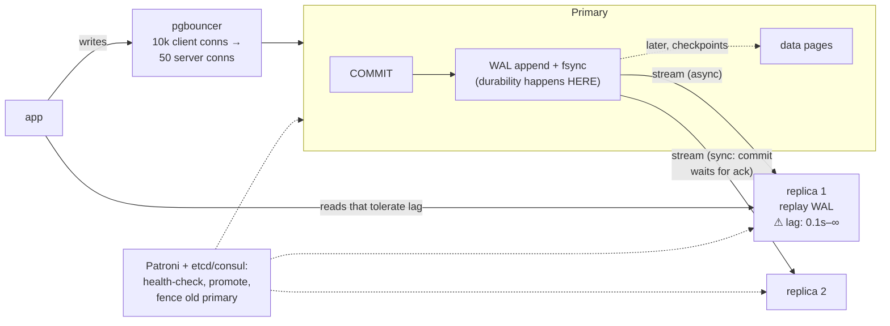

# Postgres Internals 4: WAL, Replication & Pooling — everything durable is a log first; everything scalable is a lag trade

**Level 10 · The Vault · Session 13 · [INTERVIEW-CRITICAL]**
*Pairs with `../system-design/database_scaling.md` (the design ladder) — this is the mechanics underneath it.*

## TL;DR

- The **WAL** (write-ahead log) is the source of truth: every change is appended + fsynced there *before* data pages change. Commit durability = WAL flush, nothing else. Crash recovery, replication, and PITR are all "replay the WAL."
- **Streaming replication ships WAL bytes** to replicas. Async (default) = fast commits, **replica lag** = stale reads + data-loss window on failover. Sync = no loss but you've coupled commit latency (and availability!) to the standby.
- **Failover is not built in.** Patroni/cloud orchestration does detection + promotion + fencing. The two failure classes to narrate: split-brain (old primary still accepting writes) and lost tail (async lag at crash).
- **pgbouncer exists because Postgres connections are processes** (~few MB + scheduling each; ~500 is already generous). `transaction` pooling mode is the production default — and it breaks session state (prepared statements, `SET`, advisory locks). Know why.
- **Partitioning** (declarative, by range/list/hash) = many physical tables behind one name: partition pruning for time-series queries, `DROP PARTITION` instead of million-row DELETEs. It is *not* sharding — still one server.

## Mental Model

## What Actually Happens

**One `COMMIT`, then a primary failure, end to end:**

1. Your transaction's changes are made to pages in shared_buffers *and* described as WAL records. `COMMIT` forces the WAL through to disk (`fsync`). The data pages themselves may stay dirty in memory for minutes — if the box dies, recovery replays WAL from the last **checkpoint**. Consequence: commit latency ≈ WAL flush latency; fsync lies (some disks/VMs ack early) are how databases lose data "impossibly."
2. **WAL senders** stream those records to replicas, which replay them continuously (physical replication: byte-level page changes; there's also **logical replication** — decoded row changes, usable across versions and for selective tables/CDC — cross-ref the outbox pattern, `../system-design/data/distributed_transactions.md`).
3. **Async reality:** replica applies the record 20–500 ms later (or minutes under heavy writes / long replica queries conflicting with replay). Any read hitting the replica meanwhile sees the past — the read-your-own-writes problem your stack already routes around (`../system-design/data/consistency_models.md`). Measure lag in *bytes and seconds*: `pg_stat_replication` (primary) + `pg_last_wal_replay_lsn()` (replica).
4. **Primary dies.** Patroni's health checks fail; it takes a distributed-lock decision via etcd (this is Raft in your stack — `../system-design/data/consensus_and_coordination.md`), picks the most-caught-up replica, promotes it (`pg_promote`), rewrites the service endpoint/VIP. Two things must be true or you get famous:
   - **Fencing:** the old primary, if merely partitioned (not dead), must be prevented from accepting writes — otherwise **split-brain**: two primaries, divergent WAL, a merge that no tool performs. This is why Patroni demotes on lost DCS lease (a lease + fencing-token argument, exactly the fencing doc's theory).
   - **Lost tail:** with async replication, commits acked to users in the last lag-window existed only on the dead primary. RPO > 0 by construction. If the business can't accept that: `synchronous_commit=on` + `synchronous_standby_names` — and now a standby hiccup stalls **all commits** on the primary, so you run 2+ sync standbys (`ANY 1 (...)`) to trade back some availability.
5. **Meanwhile, connections.** Every Postgres connection is a forked backend process; 2,000 app connections = 2,000 processes contending. asyncpg/SQLAlchemy pools help per-app-instance, but 40 pods × 50 pool size = 2,000 anyway. **pgbouncer** in `transaction` mode multiplexes: a server connection is borrowed per transaction, returned on commit — 10k client conns ride on ~50 server conns. The tax: anything that assumes a *session* breaks — session-level prepared statements, `SET` GUCs, advisory locks, `LISTEN/NOTIFY` (per-statement mode breaks even more; `session` mode fixes semantics but returns to the original problem). Modern drivers mostly cope (protocol-level prepared statement support in pgbouncer ≥1.21), but you must *know* the mode you run.
6. **Partitioning** enters when single tables get unwieldy: `PARTITION BY RANGE (created_at)` monthly → the planner prunes to relevant partitions (`WHERE created_at > now()-'7 days'` touches 1–2), autovacuum works on human-sized chunks, and retention is `DROP TABLE events_2024_01` (instant, no bloat) instead of a week-long DELETE+VACUUM. Cost: every unique constraint must include the partition key; cross-partition queries fan out. Still one machine — when the *write volume* outgrows the box, that's sharding, a different doc and a different life.

## The Opinionated Take

- **Run async replication + honest lag handling** (route only lag-tolerant reads to replicas; pin post-write reads to primary briefly). Choose sync only for genuinely can't-lose-a-row flows, and then budget the latency and the extra standby. Most teams claiming "we need sync" need an idempotent retry instead.
- **pgbouncer in transaction mode is table stakes for K8s deployments** — pods churn, pools multiply, Postgres processes don't scale. Put it beside the DB (or use RDS Proxy et al.), cap `max_connections` low (~100–200), and treat "pool exhausted" as backpressure, not a reason to raise the cap ([queueing theory says hi](../system-design/requests/queueing_theory.md)).
- **Never hand-roll failover.** Patroni (self-hosted) or the cloud's managed failover. The hard parts — lease management, fencing, exactly-one-promotion — are consensus problems; your bash script will solve them wrong on the night it matters.
- **Partition by time from day one on append-heavy tables** (events, logs, messages). Retrofitting partitioning onto a 2 TB live table is a project; starting with it is a line of DDL.
- Where this breaks: multi-region active-active writes — physical replication can't do it (single WAL timeline). That's logical replication with conflict handling, or a distributed SQL engine, or (usually) accepting a single write region (`../system-design/resilience/multi_region_dr.md`).

## Interview Ammo

1. **"How does Postgres not lose your data on crash?"** — WAL-before-data + fsync at commit; recovery = replay since checkpoint. Senior garnish: commit latency *is* WAL flush latency; checkpoints trade recovery time vs I/O spikes.
2. **"Async vs sync replication — the real trade?"** — Async: RPO = lag window, replicas serve stale reads. Sync: RPO 0, but commit latency += standby RTT and a dead standby can halt writes → quorum-style `ANY 1` of 2+. Frame as RPO/RTO/latency triangle, name numbers.
3. **"Walk me through a failover, including what goes wrong."** — Detection → consensus-backed promotion → fencing the old primary → client rerouting. Name split-brain and the async lost-tail explicitly; mention Patroni + etcd lease as the real-world mechanism.
4. **"Why pgbouncer if my ORM already pools?"** — Pools multiply per pod; Postgres backends are processes; transaction-mode multiplexing collapses 10k client conns to dozens of backends. Then volunteer the gotchas (session state, prepared statements, advisory locks) — that's the part that proves production experience.
5. **"When partitioning vs sharding?"** — Partitioning: one node, planner pruning, instant retention drops, vacuum sanity — solves *big table* problems. Sharding: many nodes — solves *big write-volume/dataset* problems, imports routing/rebalancing/cross-shard pain. Say "partition first, shard when the box runs out" and defend it.

## Practice Rep (60 min, pass/fail)

Docker-compose a primary + replica (bitnami/postgresql images make streaming replication ~10 lines of env vars) + pgbouncer:

1. **See the WAL:** `SELECT pg_current_wal_lsn()`, write 10k rows, watch the LSN advance; on the replica, `SELECT pg_last_wal_replay_lsn(), now()-pg_last_xact_replay_timestamp()` — record the lag.
2. **Make lag visible:** write on primary + immediately read on replica in a loop until you catch a stale read (add `pg_sleep` load or `wal_delay` if too fast). Record the staleness you observed.
3. **Failover drill:** kill the primary container, promote the replica (`pg_ctl promote` / `pg_promote()`), point a client at it, prove writes work. Write down: which committed-but-unreplicated rows would have been lost? (Engineer one: commit with replica paused, then kill.)
4. **pgbouncer modes:** through `transaction` mode, demonstrate one thing that works (plain transactions from 100 concurrent clients over 5 server connections — show `SHOW POOLS`) and one thing that breaks (session `SET application_name` / advisory lock visibility across "the same" connection).

**Pass:** recorded lag numbers; a caught stale read; a successful promotion with a written sentence on the exact data-loss window; the pgbouncer works/breaks pair demonstrated with output pasted. All four in a `replication_lab.md` log.
**Fail:** failover "worked" but you can't state what was lost and why, or you can't explain the pgbouncer breakage mechanism.

## Self-Check (5 questions, answers at bottom)

1. At the moment `COMMIT` returns, what is guaranteed to be on disk, and what isn't?
2. Why can a sync standby *reduce* availability, and what's the standard mitigation?
3. What is fencing, and what specifically goes wrong in a failover without it?
4. Why does pgbouncer's transaction mode break session-level prepared statements, and why doesn't that break most modern apps?
5. Your `events` table needs 13-month retention. Compare `DELETE WHERE created_at < ...` monthly vs dropping partitions, in terms of what you learned in sessions 10–11.

---

Answers

1. Guaranteed: the WAL records of the transaction (flushed/fsynced). Not: the data pages themselves — they're dirty in shared_buffers until checkpoint/background writer; recovery rebuilds them from WAL.
2. With `synchronous_standby_names`, every commit waits for the standby's ack — standby down or partitioned = primary commits hang. Mitigation: multiple candidates with quorum syntax (`ANY 1 (s1, s2)`), monitoring, and a documented decision to degrade to async in emergencies.
3. Guaranteeing the demoted primary cannot serve writes (kill it, block it, revoke its lease/VIP). Without it, a partitioned-but-alive old primary keeps accepting writes while the new one does too — split-brain: two divergent WAL histories, no automatic merge, manual data surgery.
4. The client's next transaction may run on a *different* backend process, which never saw the `PREPARE`/`SET`. Modern drivers/pgbouncer negotiate protocol-level prepared statements (or re-prepare per connection), and stateless-per-transaction apps (the K8s norm) never relied on session state anyway.
5. DELETE writes an xmax per row (session 11): millions of dead tuples, massive WAL + replication traffic, vacuum debt, index bloat — for days. `DROP PARTITION` unlinks a physical table: instant, ~zero WAL, zero bloat, indexes vanish with it. Time-partition append-heavy tables precisely to earn this.

