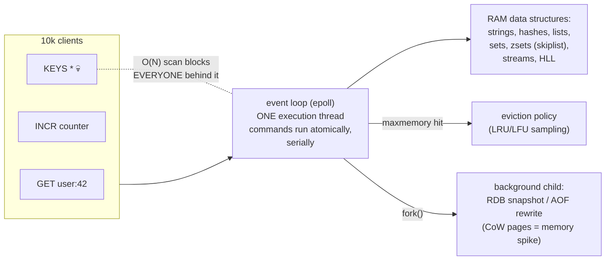

# Redis Internals — it's fast because it does one thing at a time; that same fact is every way it breaks

**Level 10 · The Vault · Session 15 · [INTERVIEW-CRITICAL]**
*Pairs with `../system-design/caching.md` (strategies) — this is the engine underneath.*

## TL;DR

- Redis executes commands on **one thread** over an epoll event loop ([familiar shape](../fundamentals/os/fds_sockets_epoll.md)): no locks, no races, every command atomic — and **any slow command blocks every client** (`KEYS`, `SMEMBERS` on a million-member set, big-key ops). I/O threads (6.0+) offload socket reads/writes only; execution stays single.
- Speed comes from RAM + O(1)/O(log n) data-structure commands, not magic: ~100k+ ops/s/instance; at pipeline scale, millions. **Latency budget thinking: anything O(N) is a production question, not a command.**
- Persistence is a dial, not a switch: **RDB** snapshots (fork + CoW, lose minutes on crash), **AOF** command log (`everysec` = lose ≤1 s), or both. Fork of a big instance = CoW memory spike + possible latency stall — sizing must leave headroom.
- **Eviction is policy, not overflow protection**: `maxmemory` + `allkeys-lru`/`volatile-ttl`/`allkeys-lfu`… choose per role — cache (evict freely) vs store (never evict, alert instead). The default `noeviction` turns a full cache into a write-erroring outage.
- Wrong-tool list: primary datastore for can't-lose data, queue with delivery guarantees (use Streams consciously or a real broker), search, large blobs, anything needing multi-key transactions across shards.

## Mental Model

## What Actually Happens

**A `GET`, a poisoned command, and a crash — through the engine:**

1. **`GET user:42`:** epoll reports the socket readable → command parsed → one hash-table lookup in RAM → reply buffered → next client. Microseconds. The single thread means *no* lock acquisition anywhere — that's why `INCR`, `SETNX`, `LPUSH` are atomic for free, and why Redis-based rate limiters and locks work at all (`../system-design/requests/rate_limiting.md`).
2. **Someone runs `KEYS *`** on 20M keys (or `SMEMBERS` on a giant set, `DEL` on a 5 GB hash, an unbounded `LRANGE`). It's O(N) *on the only execution thread*: every other client — including your health checks — queues behind it for the full duration. Dashboards show a latency wall at exactly that second. Replacements: `SCAN` cursors, `UNLINK` (lazy-free in background thread), `SSCAN`, bounded ranges. **`SLOWLOG GET` is the first command of any Redis incident.**
3. **Big keys are the chronic version:** one 2 GB hash means every operation touching it is slow, replication chokes on it, and eviction can't do anything useful. `redis-cli --bigkeys` finds them; the fix is design (shard the hash: `user:42:h1..hN`) not tuning.
4. **Persistence, RDB path:** `BGSAVE` forks ([CoW mechanics you measured in session 4](../fundamentals/os/processes_threads_scheduling.md)); the child serializes a frozen view while the parent keeps serving. Every parent write dirties pages → memory usage climbs toward 2× under heavy writes; on a 60 GB instance the fork itself can stall the loop tens–hundreds of ms (page-table copy). Crash between snapshots loses everything since the last one.
5. **Persistence, AOF path:** every write command appended; `appendfsync everysec` = at most ~1 s lost; the file grows until **AOF rewrite** (also a fork) compacts it. Real durability posture: RDB+AOF on, `everysec`, *and still don't* call it a system of record — a cache that persists ≠ a database with WAL discipline ([contrast deliberately](postgres_internals_4_replication.md)).
6. **Memory fills.** With `maxmemory 8gb` + `allkeys-lru`: Redis samples ~5 keys per eviction, evicts approximate-LRU until under the line. `volatile-*` variants touch only TTL'd keys — beware: if nothing has a TTL, `volatile-lru` degenerates to `noeviction` → writes start failing (`OOM command not allowed`) → this is the "our cache took down checkout" incident. LFU (4.0+) beats LRU under scan-pollution. Watch `evicted_keys` rate and **hit ratio** — an eviction storm quietly converts your cache into a miss machine and shifts full load to Postgres ([stampede country](../system-design/caching.md)).
7. **Replication + failover exist** (async replica, Sentinel/Cluster promotion) and lose acked writes on failover by design — which is exactly why a naive `SETNX` distributed lock isn't safe across failover, and fencing tokens re-enter (`../system-design/data/consensus_and_coordination.md`).

## The Opinionated Take

- **Run two Redises per system, conceptually: a cache and a store.** Cache: `allkeys-lfu`, aggressive maxmemory, RDB-only or nothing, losable by definition. Store (sessions, rate-limit counters, queues): `noeviction` + alerting at 80% memory, AOF everysec, replicas. Mixing the two postures on one instance is how "we evicted the sessions" happens.
- **Ban O(N) commands in code review, not in incident review**: `KEYS`, unbounded `LRANGE`/`SMEMBERS`/`HGETALL` on unbounded structures. Provide the `SCAN`-based helper in your shared lib so the lazy path is the safe path.
- **Pipeline or Lua when round-trips dominate**: 100 sequential GETs = 100 RTTs; one pipeline = 1. Lua/`MULTI` for atomic multi-step logic (your sliding-window rate limiter) — remembering the script itself blocks the loop while it runs.
- **When Redis is the wrong tool, say the real reason:** durability posture (async everything), single-thread latency coupling, RAM economics at scale, no query model. Streams are a fine light queue with consumer groups; the moment you need replay-for-days, ordering across partitions, or backpressure contracts — Kafka (`../system-design/data/event_driven_kafka.md`).
- Where the model is shifting: Redis 7+ I/O threads, Dragonfly/KeyDB multi-threaded clones, and Valkey. The interview-safe frame: "execution is single-threaded in mainline Redis; the ecosystem is attacking that constraint."

## Interview Ammo

1. **"Why is Redis fast?"** — RAM + O(1) structures + zero locking via single-threaded execution + epoll multiplexing. The senior close: "and that single thread is also its failure mode — one O(N) command is a global stall."
2. **"RDB vs AOF?"** — Snapshot-via-fork (fast restart, minutes of loss, CoW spike) vs command log (≤1 s loss at everysec, bigger files, rewrite forks). Production posture: both, and still not a system of record.
3. **"Your Redis latency spiked to 400 ms for 30 s. Triage."** — `SLOWLOG GET` (O(N) command? big key?) → `INFO` fork stats (BGSAVE/AOF-rewrite CoW stall?) → eviction storm (`evicted_keys`) → swap/network last. Ordered list = senior.
4. **"How does eviction actually work, and what's the default trap?"** — `maxmemory` + sampled approximate LRU/LFU; `noeviction` default errors on writes when full; `volatile-*` with no TTLs = same trap. Cache vs store policy split is the answer they want.
5. **"When would you *not* use Redis?"** — Can't-lose data (async replication + failover loses acks), large values/blobs, rich queries, strict queue semantics. Bonus: name the lock-on-failover problem and fencing tokens unprompted.

## Practice Rep (60 min, pass/fail) — break Redis three ways

`docker run -d -p 6379:6379 redis:7`. Seed 2M keys (`redis-cli --pipe` or a 10-line Python loop with pipelines). Baseline: `redis-benchmark -t get,set -q` numbers recorded.

1. **The blocking command:** while a client loops `GET`s (measure per-op latency continuously), run `KEYS *`. Record the latency wall (before/during, in ms). Repeat with `SCAN` in a loop — show the wall is gone.
2. **The big key:** build one hash with 1M fields; time `HGETALL` vs `HSCAN` iteration; run `redis-cli --bigkeys` and capture it flagging your monster. Then `DEL` it vs `UNLINK` it — measure the loop stall difference.
3. **The eviction storm:** set `maxmemory 100mb`, policy `volatile-lru`, keys **without TTLs** → demonstrate write failures (`OOM command not allowed`). Switch to `allkeys-lru`, write past the limit, watch `INFO stats | grep evicted` climb and your earlier keys vanish — then articulate which posture (cache/store) each config represents.

**Pass:** all three breakages reproduced with numbers (latency wall ms, HGETALL vs HSCAN timing, DEL vs UNLINK stall, OOM error text, evicted_keys delta) logged in `redis_lab.md`, each with a one-sentence "the fix in production is ___".
**Fail:** any breakage not reproduced, or a fix sentence that names a command without naming the *policy* (posture, review rule, sizing) behind it.

## Self-Check (5 questions, answers at bottom)

1. Why are `INCR`-based counters race-free in Redis with zero locking code?
2. Rank for a 32 GB write-heavy instance: what memory headroom does BGSAVE need and why?
3. `volatile-lru` is configured and memory is full, but writes are erroring instead of evicting. Why?
4. Why is `UNLINK` safe where `DEL` on the same key is an incident?
5. Your team wants Redis Streams instead of Kafka "to reduce ops." Give the two questions that decide it.

---

Answers

1. Single-threaded execution: commands are serialized by construction, so read-modify-write happens with nothing interleaved. The event loop is the lock.
2. Worst case approaches 2× (every page dirtied while the child snapshots CoW-shared pages) — plan real headroom (commonly ~50%+ free for write-heavy), or the box swaps/OOMs mid-BGSAVE. ([Session 4's CoW measurement, applied.](../fundamentals/os/processes_threads_scheduling.md))
3. `volatile-*` policies only evict keys *with TTLs set*; if writes never set expirations, the eviction candidate set is empty and Redis degrades to `noeviction` behavior → `OOM command not allowed`.
4. `DEL` reclaims the value synchronously on the execution thread — a multi-GB structure means everyone waits; `UNLINK` unlinks the key immediately and frees memory on a background lazy-free thread.
5. (a) Can you lose or re-deliver messages within a small window (Streams' replication/failover posture) — yes required for "no"? (b) Do you need long replay retention, cross-partition ordering control, and consumer-scaling semantics at high throughput? Yes → Kafka. Light fan-out with modest guarantees → Streams is legitimately fine.

