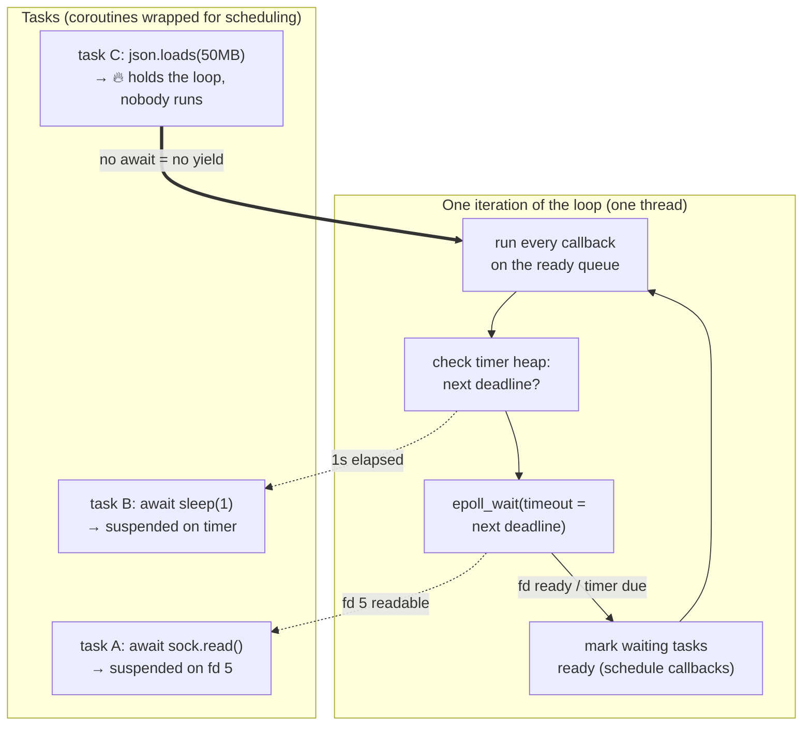

# The asyncio Event Loop — epoll with a scheduler on top; every failure mode is "someone didn't yield"

**Level 11 · The Race · Session 6 · [INTERVIEW-CRITICAL]**
*Prereq: [fds_sockets_epoll.md](../os/fds_sockets_epoll.md) — this doc assumes you know what `epoll_wait` is.*

## TL;DR

- The loop is literally: run all ready callbacks → compute next timer deadline → `epoll_wait(timeout=deadline)` → repeat. A coroutine is a resumable function; `await` on real I/O is the *only* place it gives the loop control back.
- **Cooperative** scheduling means there is no preemption: one callback doing 200 ms of CPU (or a sync `requests.get`) freezes *every* task on the loop. This is the #1 asyncio production failure.
- `async` doesn't make anything faster or concurrent by itself. Concurrency comes from `asyncio.gather`/`TaskGroup` creating multiple tasks whose *waits* overlap.
- Escape hatches for blocking work: `await loop.run_in_executor(None, fn)` / `asyncio.to_thread(fn)` — the block moves to a threadpool, the loop keeps spinning.
- Debug kit you should know cold: `PYTHONASYNCIODEBUG=1`, `loop.slow_callback_duration`, `py-spy dump`, and "coroutine was never awaited" warnings.

## Mental Model

## What Actually Happens

**`results = await asyncio.gather(fetch(a), fetch(b))` inside a FastAPI handler:**

1. `fetch(a)` called → returns a **coroutine object**; nothing has executed yet. (Forget to await it → nothing ever runs → the famous warning.) `gather` wraps both coroutines into **Tasks** — scheduling units with a callback registered on the loop's ready queue.
2. Loop runs task A's callback → the coroutine executes until `await client.get(...)` bottoms out in a socket read that would block. httpx/asyncio sets the socket non-blocking, registers the FD with the loop's selector (`epoll_ctl ADD`), attaches "resume task A" as the callback, and the coroutine **suspends** — a `yield` all the way up. Total cost: function-call-ish, no thread, no syscall beyond the epoll registration.
3. Loop runs task B the same way. Both requests are now in flight; both tasks suspended; the ready queue is empty.
4. Loop computes the nearest timer deadline (timeouts live in a heap) and parks in **`epoll_wait`** — the *only* place a healthy loop ever blocks, thread off the runqueue.
5. Response bytes for B arrive first → kernel buffers them → `epoll_wait` returns fd B → loop schedules "resume task B" → coroutine continues from the exact await expression, parses the response, finishes; its result is stored, `gather` decrements its counter.
6. Same for A; `gather` fulfills, the *handler's* task is rescheduled, your line after `await` runs. Two network waits overlapped on one thread — that, and only that, is the win.
7. **The failure mode:** replace one `await` with `time.sleep(0.2)` or CPU-heavy parsing. The coroutine never suspends → step 4 never happens → every other task (including heartbeats, other requests, websocket pings) waits the full 200 ms. Multiply by concurrency: p99 detonates while CPU looks modest. Nothing crashes; everything is just late — the worst kind of failure.
8. **The detection:** in debug mode the loop timestamps every callback; anything over `loop.slow_callback_duration` (default 100 ms) logs `Executing <Task ...> took 0.213 seconds`. In prod: `py-spy dump` shows the loop thread stuck inside your JSON parse instead of `epoll_wait` — instant diagnosis.
9. **The fix ladder:** truly async library > `asyncio.to_thread` for the blocking call > chunk CPU work with periodic `await asyncio.sleep(0)` (crude but honest) > move it out of the request path entirely (worker queue).

## The Opinionated Take

- **The event loop is an SLA you sign, not a speedup you receive.** You promise every callback finishes in single-digit milliseconds; the loop promises to multiplex thousands of connections. Break your half and the whole worker degrades — this framing is the correct interview one-liner.
- **`asyncio.to_thread` is not defeat.** A service that's 95% async with three legacy blocking calls wrapped in threads is production-correct. Purism ("rewrite the SDK async") is how deadlines die.
- **Cap your concurrency at creation time**: `TaskGroup` + `asyncio.Semaphore(n)` around outbound calls. `gather` on an unbounded list is a self-inflicted retry storm against your own dependencies.
- **Structured concurrency (`TaskGroup`, 3.11+) over bare `create_task`**: orphaned tasks swallow exceptions and leak; TaskGroup cancels siblings on failure and re-raises. Bare `create_task` needs a kept reference and a done-callback — most code has neither.
- Where async is the wrong tool: CPU-bound services, request concurrency under ~50 with blocking libs (threadpool `def` is simpler), and anything where the team won't police blocking calls — the discipline cost is real ([python_performance_model.md](../machine/python_performance_model.md)).

## Interview Ammo

1. **"How does asyncio work under the hood?"** — Coroutines suspend at `await`; the loop is ready-queue + timer-heap + `epoll_wait`. Tie it to epoll explicitly — "the loop blocks in exactly one place" — that's the senior tell.
2. **"What happens if a coroutine blocks the loop, and how do you find it in prod?"** — Everything on the worker stalls (p99 cliff, CPU modest); find via `py-spy dump` (loop thread not in `epoll_wait`), debug-mode slow-callback logs; fix via async lib / `to_thread` / offload.
3. **"`await` vs `gather` vs `create_task`?"** — Sequential await = no concurrency; gather/TaskGroup = overlap the waits; create_task = fire-and-forget with footguns (exception swallowing, GC of unreferenced tasks). Recommend TaskGroup and say why.
4. **"How do async DB connections work if there's only one thread?"** — Non-blocking sockets + protocol state machines (asyncpg): send query, suspend on fd, resume on readiness. One thread, N in-flight queries — but the *pool size* still caps real concurrency at the DB, tying into pgbouncer ([db/postgres_internals_4_replication.md](../../db/postgres_internals_4_replication.md)).
5. **"When would you NOT use asyncio?"** — CPU-bound work, low concurrency, blocking-only dependencies, or mixed teams without loop discipline. Saying "async is for overlapping many waits, and we didn't have many waits" is a strong senior answer.

## Practice Rep (60 min, pass/fail)

Build `loop_forensics.py`: a minimal aiohttp/FastAPI app with three endpoints — `/healthy` (`await asyncio.sleep(0.05)`), `/blocking` (`time.sleep(0.5)` **deliberately**), `/fixed` (same sleep via `asyncio.to_thread`).

1. Load `/healthy` with 20 concurrent requests (`asyncio` client script or `hey`) → record p50/p99 baseline.
2. While that load runs, hit `/blocking` 3 times. Record what happens to `/healthy` p99. Capture a `py-spy dump` during the stall showing the loop inside `time.sleep`.
3. Enable debug mode (`PYTHONASYNCIODEBUG=1`) and capture the `Executing ... took 0.5 seconds` log line.
4. Repeat step 2 against `/fixed` → show `/healthy` p99 unaffected.

**Pass:** all four artifacts in the file's docstring — baseline numbers, poisoned p99 (must show the ~500 ms contamination), the py-spy/debug-log evidence, and the fixed run — plus a 3-sentence incident-report paragraph you could paste in Slack.
**Fail:** any artifact missing, or the incident paragraph doesn't identify *why* unrelated requests slowed down.

## Self-Check (5 questions, answers at bottom)

1. Name the only place a healthy event loop blocks, and what it's waiting on.
2. Why does one 200 ms CPU callback hurt p99 of *unrelated* endpoints?
3. What's wrong with `asyncio.create_task(do_thing())` as a fire-and-forget, with no reference kept?
4. A dev "async-ified" a service and throughput didn't change. Give the two most likely reasons.
5. Your async service's p99 spikes but CPU is 30%. First diagnostic command, and what distinguishes the two likely verdicts?

---

Answers

1. `epoll_wait` (via the selector), waiting on FD readiness or the next timer deadline — everything else must be non-blocking.
2. Cooperative scheduling: while the callback runs, the loop can't dispatch anything — every suspended task's resumption is delayed by the full 200 ms, regardless of endpoint.
3. The task can be garbage-collected mid-flight (loop holds only a weak ref), and its exceptions vanish until teardown logs "exception was never retrieved." Use TaskGroup, or keep a reference + done-callback.
4. (a) The waits never overlapped — code still `await`s sequentially instead of gather/TaskGroup; (b) a blocking call inside the chain means it was never actually async — or the bottleneck was CPU/downstream all along.
5. `py-spy dump` on the worker. Loop thread parked in `epoll_wait` → the slowness is downstream (DB, upstream API). Loop thread inside your Python frame (parse, sleep, sync client) → blocked-loop bug, fix with async lib or `to_thread`.

