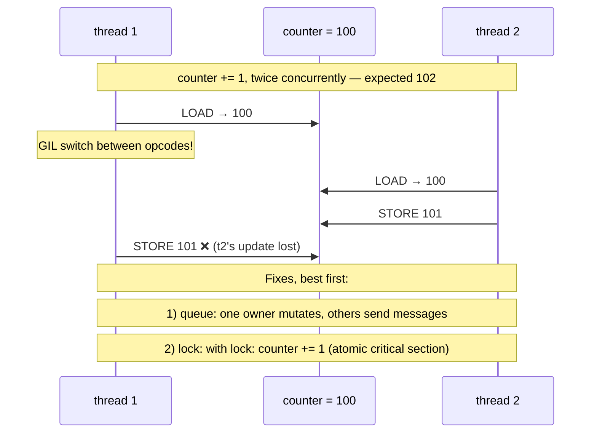

# Threads, Locks & Races — shared mutable state is the bug; queues are how adults share

**Level 11 · The Race · Session 7 · [INTERVIEW-CRITICAL]**

## TL;DR

- A race condition is a **read-modify-write interleaving**: two threads read the same old value, both write, one update vanishes. The GIL does **not** prevent this — it hands off between bytecodes ([cpython_internals.md](../machine/cpython_internals.md)).
- Races are probabilistic: they pass tests for months, then fire under production load. If it *can* interleave, at scale it *will*.
- The fix hierarchy: **(1) don't share** (message passing / queues), **(2) share immutably**, **(3) lock** — in that order. Locks are the last resort because they bring deadlock, contention, and forgotten-lock bugs.
- `queue.Queue` is a thread-safe, blocking, optionally-bounded pipe. Producer/consumer with a bounded queue gives you concurrency **and** backpressure in one primitive.
- Deadlock needs four conditions; you kill it in practice with **lock ordering** or **timeouts**. Same theory scales up to Postgres row locks ([db/postgres_internals_2_mvcc.md](../../db/postgres_internals_2_mvcc.md)) and distributed locks (`system-design/data/consensus_and_coordination.md`).

## Mental Model

## What Actually Happens

**A payments-shaped race, end to end:**

1. Flask/FastAPI sync app, threadpool of 40. Handler logic: `balance = get(uid); if balance >= amt: set(uid, balance - amt)` against a shared dict (or a DB without row locking — same disease, bigger blast radius).
2. Two withdrawal requests for the same user land on two threads. Both run `get(uid)` → both see 100. The OS (or GIL handoff) switches between the read and the write — remember, a switch can happen **between any two bytecodes**.
3. Both pass the `if`. Thread A writes 40. Thread B writes 70. Final balance: 70, after paying out 90 from a 100 balance. No exception, no log, no crash — **the failure is silent and the books are wrong.** This is why races are found by accountants, not by pytest.
4. **Why tests missed it:** the window is microseconds wide. Under test concurrency (~2 requests) the interleaving may occur once per 100k runs. Under Black Friday load it occurs per minute. Probabilistic bugs demand *structural* fixes, not "we ran it 10 times."
5. **Fix 1 — locking:** `with user_locks[uid]: ...` makes check-then-act atomic. Now the costs arrive: every request for that user serializes (contention); two code paths taking two locks in opposite orders eventually deadlock (thread A holds lock-X wants lock-Y; B holds Y wants X; both wait forever). Discipline required: single global lock order, smallest possible critical section, never call unknown code (callbacks, I/O) while holding a lock.
6. **Fix 2 — don't share:** one **owner thread** consumes `commands: queue.Queue`; handlers `put(("withdraw", uid, amt, reply_q))`. All mutation is single-threaded → races impossible by construction, no locks anywhere. The queue's internal lock is somebody else's tested problem.
7. **Bounded queue = free backpressure:** `Queue(maxsize=1000)` makes producers block (or fail fast with `put_nowait`) when the consumer falls behind — overload becomes visible latency at the edge instead of memory growth in the middle. The same argument as `system-design/requests/backpressure_load_shedding.md`, one process down.
8. **In real systems the shared state usually lives in the DB**, and the same three fixes reappear wearing production clothes: `SELECT ... FOR UPDATE` (lock), `UPDATE ... SET balance = balance - amt WHERE balance >= amt` (atomic single statement — don't share the read), or a per-user Kafka partition (queue/single owner). Recognizing the isomorphism is the senior skill.

## The Opinionated Take

- **Default to queues.** Producer/consumer with a bounded `queue.Queue` covers 90% of legitimate thread communication, is impossible to deadlock in the simple form, and gives backpressure for free. Locks are for tiny, hot, well-understood critical sections.
- **If you must lock:** one lock order documented in a comment, `with` statement always (a raised exception between `acquire` and `release` is a permanent deadlock), no I/O under the lock, and prefer one coarse lock until contention *measurably* hurts — fine-grained locking is where deadlocks breed.
- **`threading.Lock` timeouts are a legitimate crutch**: `acquire(timeout=5)` + log + fail turns "system frozen at 3 a.m." into "one error logged." Purists sneer; on-call engineers sleep. (Same philosophy as lock leases in distributed systems.)
- **Atomic-looking ≠ atomic.** `dict[k] = v` is thread-safe in CPython (single bytecode, C-level op); `dict[k] += 1`, check-then-insert, and any read-then-write is not. When in doubt, `dis` it — or just don't share.
- Where "don't share" breaks: genuinely hot shared counters/caches at high frequency — then you want a lock-striped or atomic structure, and in Python honestly you want that state in Redis anyway.

## Interview Ammo

1. **"What's a race condition? Give a concrete example."** — Lost update via read-modify-write interleaving; tell the balance story with the exact interleaving. Bonus: "the GIL doesn't help — atomicity ends at bytecode boundaries."
2. **"How do you fix it?"** — The hierarchy: eliminate sharing (queue/single owner) > immutable data > lock. Leading with "restructure so there's nothing to lock" *is* the senior answer; leading with `Lock()` is the mid-level one.
3. **"What's a deadlock and how do you prevent it?"** — Cycle of hold-and-wait (four Coffman conditions if pressed). Practical kills: global lock ordering (breaks the cycle), timeouts (breaks the infinite wait), one coarse lock (avoids multiple locks entirely).
4. **"Why is a bounded queue better than an unbounded one?"** — Unbounded queues convert overload into hidden memory growth and unbounded latency; bounded queues surface it as backpressure where the producer can react. "Queues don't add capacity, they buy time" — cross-reference queueing theory.
5. **"How does this thinking map to your database?"** — Same three fixes: `FOR UPDATE` row locks (+ same deadlock rules, DB detects and kills one victim), atomic single-statement updates, or serialize-by-key via partitioned consumers. Interviewers love the cross-layer map.

## Practice Rep (60 min, pass/fail)

Write `race_lab.py` with three phases:

1. **Cause it:** shared `counter`, two threads, each doing `counter += 1` 500k times. Run 5×; record results (should reliably lose updates; if not, add a `sleep(0)` inside the loop to widen the window and note why that works).
2. **Fix it twice:** (a) `threading.Lock`; (b) restructure — each thread counts privately, merge at the end (or push increments through a `queue.Queue` to a single consumer). Verify both give exactly 1,000,000, 5 runs each.
3. **Deadlock on demand:** two locks, two threads acquiring in opposite order (add tiny sleeps to force it). Demonstrate the hang, then fix by (a) ordering, and separately (b) `acquire(timeout=1)` + logged failure.

**Pass:** phase 1 demonstrably loses updates (recorded numbers); both fixes exact 5/5; deadlock reliably reproduces then provably can't occur under the ordering fix (explain *why* ordering kills the cycle in one comment). All observations as comments in the file.
**Fail:** couldn't reproduce the race or the deadlock, or the ordering explanation doesn't mention the wait cycle.

## Self-Check (5 questions, answers at bottom)

1. The GIL means only one thread runs at a time. Why doesn't that make `counter += 1` safe?
2. Rank the three race fixes and justify the ordering.
3. What two rules prevent essentially all deadlocks in application code?
4. Why does a bounded queue between web handlers and a slow worker improve *behavior under overload*, not just correctness?
5. Your service uses `SELECT balance` then `UPDATE balance = :new` in app code. What's the bug, and give two fixes at the SQL layer?

---

Answers

1. `+= 1` is three bytecodes (LOAD, BINARY_OP, STORE); the GIL can switch threads between them, so two threads can LOAD the same stale value. The GIL guarantees interpreter integrity, not application atomicity.
2. Don't share (single owner + messages — races impossible by construction) > share immutably (nothing to corrupt) > lock (works, but imports deadlock, contention, and human error). Prefer structural impossibility over runtime discipline.
3. A single documented lock-acquisition order (no cycles → no deadlock) and never holding a lock across I/O or unknown code. Timeouts as the safety net.
4. When the worker lags, `put()` blocks/fails at the producer — latency and errors appear at the edge where callers can shed, retry, or degrade, instead of the process ballooning memory and dying later. Overload becomes a signal instead of a crash.
5. Check-then-act race across two statements: concurrent requests read the same balance (lost update / double spend). Fixes: `SELECT ... FOR UPDATE` inside the transaction (pessimistic lock), or a single atomic conditional statement `UPDATE ... SET balance = balance - :amt WHERE id = :uid AND balance >= :amt` and check rows-affected (or optimistic versioning).

