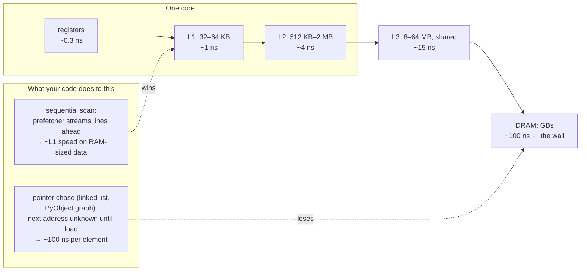

# CPU & Memory Model — the CPU is fast and RAM is far away; every performance mystery is a cache story

**Level 7 · The Interpreter · Session P3**

## TL;DR

- A modern core executes an instruction in ~0.3 ns but a **main-memory fetch costs ~100 ns** — 300× worse. The cache hierarchy (L1 ~1 ns, L2 ~4 ns, L3 ~15 ns) exists to hide that gap, and it only works if your access pattern cooperates.
- Memory moves in **64-byte cache lines**, not bytes. Touch one byte, get 63 neighbors free — sequential access is effectively prefetched; pointer-chasing pays full latency per hop.
- **Stack vs heap is an access-pattern distinction, not just a lifetime one:** the stack is a hot, contiguous, always-in-L1 bump allocator; the heap is scattered allocations found through pointers. That's *why* stack is "fast."
- Python makes everything a heap story: every object is a heap-allocated box reached via pointer, so a `list` of ints is a pointer array to scattered `PyObject`s — one cache miss per element. NumPy's speed is **layout** (contiguous machine values) before it's C.
- Two threads writing to different variables on the **same cache line** fight for line ownership ("false sharing") — a silent 10–100× slowdown with zero logical contention.

## Mental Model

## What Actually Happens

**`sum(my_list)` over 10 million Python ints vs `np.sum` over the same values — byte level:**

1. **The Python list's layout:** `my_list` is one contiguous C array — of *pointers*. Each element points at a ~28-byte `PyObject` int box allocated on the heap whenever it happened to be created. Adjacent list slots ≠ adjacent memory.
2. **Per element, the interpreter must:** load the pointer (cheap — the pointer array is sequential, prefetcher handles it), then **dereference it** — a load from an address the CPU couldn't predict. If that object isn't in cache: ~100 ns stall, full stop, out-of-order machinery drained. Then read the type pointer (another dependent load), find `nb_add`, extract the value, box the running total (a heap *write*). The adds are noise; the misses are the bill.
3. **Refcounting seasons it:** `Py_INCREF`/`DECREF` *write* to each object's header, so every visited line becomes dirty and must eventually be written back — touching read-only-looking data still generates memory traffic (the same effect that breaks fork CoW in [cpython_internals.md](cpython_internals.md)).
4. **NumPy's version:** 10 M `int64`s = one 80 MB contiguous block. The loop is compiled machine code doing sequential 64-byte-line loads; the hardware **prefetcher** detects the stride and issues loads ~10 lines ahead, so data arrives before it's needed. SIMD chews 4–8 values per instruction. Effective cost per element: ~0.1–0.3 ns vs ~5–30 ns. The 20–100× gap is layout + prefetch + SIMD, in that order.
5. **The stack, meanwhile:** every C function call bumps `rsp`, and the same few KB of stack get reused so hot they *never leave L1*. "Stack allocation is fast" = it's a pointer bump into always-warm cache; "heap allocation is slow" = allocator bookkeeping *plus* the future misses of scattered placement. The second cost dominates and is paid at *use* time, so profilers blame the wrong line.
6. **Matrix traversal order, the classic:** summing a NumPy 2-D array by rows (C-order, contiguous) streams; by columns strides 8·ncols bytes, using 8 of every 64 fetched bytes and defeating the prefetcher — 5–10× slower for identical arithmetic. Same data, same big-O, different physics.

## The Opinionated Take

- **Optimize memory layout before algorithms once big-O ties.** An O(n) pointer chase loses to an O(n log n) scan over contiguous data at realistic n. Arrays of primitives > arrays of boxed objects > linked anything. In Python this cashes out as: NumPy/arrow columns for bulk data, and don't build million-element lists of tiny objects (`__slots__`/dataclass-of-arrays if you must).
- **In pure Python, don't micro-optimize for cache — change representation.** Interpreter overhead (~30–100 ns/op) swamps a single miss; loop rearrangement won't save you. The winning move is always "get the loop out of Python" ([python_performance_model.md](python_performance_model.md)) — and *then* layout decides how fast the compiled path runs.
- **Know false sharing exists; fix it by padding or per-thread accumulation.** Per-thread counters in one array/struct sharing a 64-byte line = cores ping-ponging line ownership. Mostly a C-extension/threaded-runtime concern, but it's a favorite senior-signal question.
- Rules of thumb worth memorizing: cache line 64 B; L1 ~1 ns / L2 ~4 ns / L3 ~15 ns / RAM ~100 ns; sequential RAM scan ~10–30 GB/s; Python object overhead ~28 B for an int, ~50–100 B per dict entry.

## Interview Ammo

1. **"Why is iterating a linked list so much slower than an array of the same n?"** — Array: sequential lines + prefetch, most touches ~L1. List: each `node.next` is a dependent load at an unpredictable address, ~100 ns each, and prefetching is impossible because the next address doesn't exist until the current load returns.
2. **"Why is NumPy 100× faster than a Python loop — beyond 'it's C'?"** — Layout: contiguous unboxed values (one line per 8 int64s, prefetchable, SIMD-able) vs pointer-array-to-scattered-boxes with a miss and refcount writes per element. C with NumPy's job but Python's layout would still crawl.
3. **"Row-major matrix, column-wise sum is 8× slower — same big-O. Explain."** — Stride defeats spatial locality: 8 useful bytes per 64-byte line and the prefetcher can't help; row-wise uses all 64 and streams. Fix: traverse in storage order, or transpose once if column access dominates.
4. **"What's false sharing, and how do you spot and fix it?"** — Independent variables on one cache line written by different cores force exclusive-ownership ping-pong (MESI). Symptom: multithreaded scaling collapses with no lock contention; perf counters show remote-cache traffic. Fix: pad to 64 B or accumulate per-thread and merge.
5. **"Why is stack allocation 'free' compared to heap?"** — Pointer bump, no bookkeeping, and — the part most answers miss — the top of stack is permanently L1-resident, while heap objects land cold and scattered, so the heap's real cost is future misses, not the `malloc` call.

## Practice Rep (60 min, pass/fail)

Pure measurement, local machine, predictions in writing first:

1. **Layout gap (20 min):** sum 10 M values three ways — Python list of ints, `array.array('q')` via `sum()`, `np.sum` on int64. Predict the ratios, then time (`time.perf_counter`, best of 5). Explain each gap in one sentence naming the mechanism (boxing/misses, unboxed-but-interpreted, contiguous+SIMD).
2. **Stride cliff (20 min):** `a = np.zeros((8192, 8192))`; time `a.sum(axis=1)` vs `a.sum(axis=0)`, then the same on `np.asfortranarray(a)`. Predict which flips and why.
3. **Pointer chase (20 min):** build a 1 M-node chain two ways — nodes allocated sequentially vs the same nodes linked in `random.shuffle`d order — and time a full traversal of each. Same objects, same count, only placement-vs-order differs. Predict the slowdown factor.

**Pass:** all predictions on the right side (which is faster) *before* running; measured list-vs-numpy gap ≥ 20×; stride and shuffle effects reproduced and each explained in one sentence using "cache line," "prefetch," or "dependent load" correctly.
**Fail:** any prediction skipped, or an explanation that says "C is fast" without a memory mechanism.

## Self-Check (5 questions, answers at bottom)

1. Rank and rough-cost: register, L1, L2, L3, DRAM. Where's the cliff that dominates real workloads?
2. Why does the hardware prefetcher help an array scan but not a linked-list traversal?
3. A Python `list` of 10 M ints: describe the actual memory layout and where the cache misses come from during `sum()`.
4. Two threads increment two *different* counters and scaling is worse than one thread. Diagnose and give two fixes.
5. Why do "stack fast, heap slow" claims survive even though `malloc` itself is only ~20 ns?

---

Answers

1. ~0.3 ns / ~1 ns / ~4 ns / ~15 ns / ~100 ns. The L3→DRAM step is the wall — everything above it is single-digit ns; missing to DRAM is an order-of-magnitude event.
2. Prefetchers predict *address patterns* (fixed strides). An array scan has one; a list's next address is data — unknown until the current load completes — so every hop is a full-latency dependent load.
3. A contiguous array of pointers (itself prefetch-friendly) pointing at ~28-byte `PyObject` boxes scattered across the heap. The dereference per element misses cache for any list bigger than L3, and refcount updates dirty each touched line besides.
4. False sharing: the counters share a 64-byte line, so each write forces the other core's copy invalid (MESI ping-pong). Fix: pad each counter to its own line, or keep per-thread locals and merge at the end.
5. Because the cost isn't the allocation call — it's locality. The stack's few KB are permanently in L1 and contiguous; heap objects are cold and scattered, so their price is paid as misses at every later use, spread across the profile where nobody attributes it to allocation.

