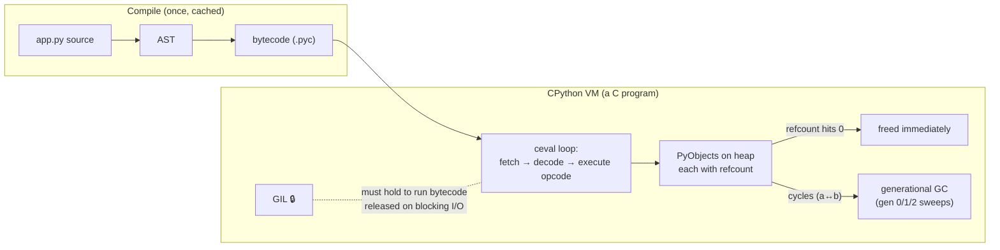

# CPython Internals — Python never runs your code; a C program runs a bytecode VM, and the GIL exists to protect its refcounts

**Level 7 · The Interpreter · Session 1 · [INTERVIEW-CRITICAL]**

## TL;DR

- Your `.py` is compiled to **bytecode** (cached as `.pyc`), then a giant C `switch` loop (`ceval.c`) interprets it one opcode at a time. `dis.dis()` shows you the truth.
- Every value is a heap-allocated `PyObject` with a **reference count**. Memory is freed the instant the count hits 0 — the "garbage collector" only exists to catch **reference cycles**.
- The **GIL** makes refcount updates thread-safe cheaply: only one thread executes bytecode at a time per process. It is *not* a lock on your data.
- Threads still work great for I/O because CPython **releases the GIL on blocking syscalls** — and well-behaved C extensions (numpy, psycopg) release it during heavy work too.
- Python 3.13+ ships an optional **free-threaded build** (PEP 703); it's still not the default in 2026. Interview answer: "the GIL is being removed, gradually and opt-in."

## Mental Model

## What Actually Happens

Walk through `c = a + b` where `a`, `b` are ints:

1. **Compile time** (import time, once): the function body becomes a code object. `dis.dis(f)` shows roughly `LOAD_FAST a → LOAD_FAST b → BINARY_OP + → STORE_FAST c`.
2. **`LOAD_FAST a`**: pushes a *pointer* to the `PyObject` onto the VM's value stack and increments its refcount. No copy — Python variables are names bound to objects.
3. **`BINARY_OP +`**: the eval loop calls `PyNumber_Add`, which dispatches through the type's `nb_add` slot. A *new* int object is allocated (refcount 1) unless it's a small int (−5..256 are interned singletons — this is why `is` on small ints "works" and then betrays you).
4. **`STORE_FAST c`**: binds the name, decrements the refcount of whatever `c` pointed to before. If that hits 0, it's freed *right now*, synchronously — `__del__` runs here, not "sometime later."
5. **Thread switching**: while running bytecode, a thread holds the GIL. Every 5 ms (`sys.getswitchinterval()`) the holder is asked to release it so another thread can run. On a **blocking syscall** (socket read, file read, `time.sleep`), CPython releases the GIL *before* the call — this is the entire reason threaded I/O works.
6. **Cycles**: `a.ref = b; b.ref = a; del a, b` — refcounts never hit 0. The generational GC tracks *container* objects in three generations; when gen-0's allocation surplus crosses a threshold (~700), it sweeps young objects, promoting survivors. Full gen-2 sweeps are the expensive, rare ones.
7. **Memory doesn't always return to the OS**: small objects come from pymalloc arenas; a freed object returns memory to the *pool*, not necessarily to the OS. RSS staying high after a big job is normal, not a leak.

## The Opinionated Take

- **Use threads for I/O without guilt.** "Python threads are useless" is wrong; they're useless for *pure-Python CPU work*. For CPU, reach for `multiprocessing`/`concurrent.futures.ProcessPoolExecutor`, or a GIL-releasing library (numpy, polars) — covered in [python_performance_model.md](python_performance_model.md).
- **`x += 1` is not thread-safe.** It's LOAD → BINARY_OP → STORE; the GIL can hand off between opcodes. The GIL protects the *interpreter*, not your invariants. You still need locks/queues ([threads_locks_queues.md](../concurrency/threads_locks_queues.md)).
- **Trust refcounting for cleanup, not `__del__` for correctness.** PyPy and free-threaded builds don't free promptly. Use context managers for resources.
- **Don't disable the GC reflexively.** The Instagram "gc.disable()" story is real but their workload was fork-heavy CoW; measure first. Where this advice breaks: long-running processes with heavy object churn can see gen-2 pause spikes — `gc.freeze()` after warmup is the surgical tool.

## Interview Ammo

1. **"Why doesn't threading speed up CPU-bound Python?"** — One GIL per process; only one thread runs bytecode at a time. It's released on blocking I/O and inside GIL-releasing C extensions, which is why threads help I/O and numpy-heavy code but not pure-Python loops. Escape hatches: processes, C extensions, now free-threaded builds.
2. **"How does Python manage memory?"** — Refcounting as the primary mechanism (immediate, deterministic frees), a generational cycle collector for the one case refcounting can't handle, pymalloc arenas underneath. Senior add-on: arenas mean RSS ≠ live objects.
3. **"What does the GIL actually protect?"** — Interpreter internals, chiefly refcount updates (non-atomic increments would corrupt under races). It does *not* make compound operations on your data atomic.
4. **"Is `d[k] += 1` thread-safe?"** — No: read-modify-write across multiple opcodes. `dis` it to prove it. Fix: lock, or design it away with a queue/single writer.
5. **"What changed with PEP 703 / free-threading?"** — Optional `--disable-gil` build since 3.13: biased refcounting + per-object locks; single-thread perf tax; extensions must opt in. It's a migration, not a switch.

## Practice Rep (60 min, pass/fail)

**Predict-then-verify, in a Linux container or local venv.** Create `rep_cpython.py` and *write your predictions as comments BEFORE running anything*:

1. `dis.dis` a 3-line function (`def f(a, b): c = a + b; return c * 2`) — predict the opcode sequence first.
2. Predict the output of `sys.getrefcount(x)` for: a fresh list, the same list after `y = x`, the int `5`.
3. Predict whether `a is b` for `a, b = 256, 256` and `a, b = 257, 257` (as separate script lines, not REPL).
4. Build a cycle, `del` both names, prove the objects survive until `gc.collect()` (use a `weakref` callback as the witness).
5. Benchmark `sum(range(50_000_000))` split across 1 thread vs 4 threads vs 4 processes — predict the ranking and rough ratios first.

**Pass:** all 5 predictions written before execution; ≥4 correct, and for any miss you can write one sentence explaining *why* the real behavior differs. Benchmark explanation must use the words "GIL," "bytecode," and "syscall" correctly.
**Fail:** ran anything before predicting, or can't explain a miss.

## Self-Check (5 questions, answers at bottom)

1. When exactly is a Python object's memory released, and what's the one case that mechanism can't handle?
2. Your threaded scraper gets a 5× speedup despite the GIL. Why?
3. Why can `x += 1` lose updates under threads even though the GIL exists?
4. A worker's RSS stays at 2 GB after processing a huge batch, but `len(gc.get_objects())` is small. Leak?
5. What does the generational hypothesis claim, and how does CPython's GC exploit it?

---

Answers

1. The instant its refcount hits 0 (deterministic, synchronous). Reference cycles never hit 0 — that's what the generational cycle collector exists for.
2. Blocking socket reads release the GIL, so threads overlap their *waiting*. The GIL only serializes bytecode execution.
3. It compiles to LOAD / BINARY_OP / STORE — multiple opcodes; the GIL can switch threads between them, so two threads can both LOAD the same old value.
4. Probably not: pymalloc arenas and the allocator hold freed memory in pools; RSS doesn't shrink back to baseline. Confirm with `tracemalloc`/object counts, not RSS.
5. Most objects die young. New containers start in gen 0, which is swept often and cheaply; survivors are promoted to gens 1 and 2, swept progressively rarely.

