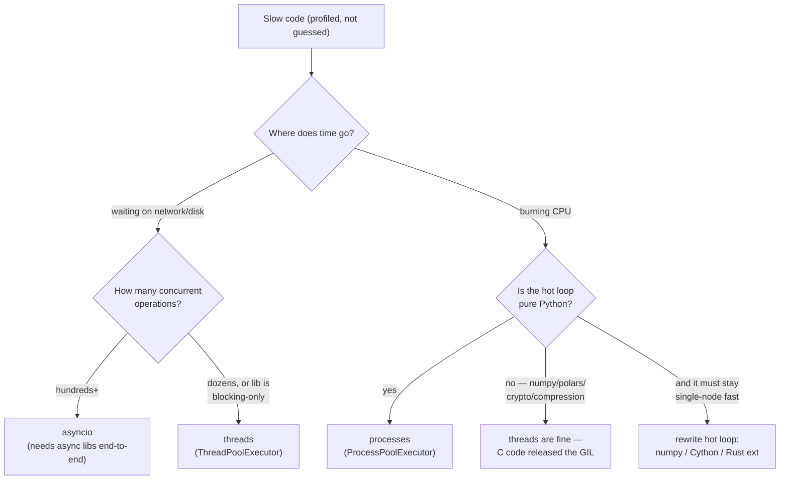

# Python Performance Model — name the bottleneck first; picking the concurrency tool is a lookup table, not an art

**Level 7 · The Interpreter · Session 2 · [INTERVIEW-CRITICAL]**

## TL;DR

- Two questions decide everything: **(1) I/O-bound or CPU-bound? (2) Does the hot code hold the GIL?** Answer those and the tool picks itself.
- I/O-bound, many concurrent waits → **asyncio**. I/O-bound but the library is blocking-only → **threads**. CPU-bound pure Python → **processes**. CPU-bound numeric → **numpy/polars/C extension** (they release the GIL; threads become fine).
- **Profile before choosing.** `py-spy top --pid` on the live process, `cProfile` for scripts. The bottleneck is wrong in your head more often than not.
- In FastAPI: a blocking call inside `async def` freezes *every* request on that worker. Sync `def` endpoints get a threadpool and are often the honest choice.
- Concurrency ≠ parallelism: asyncio gives you 10k concurrent *waits* on one core; it gives you zero extra compute.

## Mental Model

## What Actually Happens

Trace one FastAPI worker under load, endpoint written as `async def` but calling `requests.get()` (blocking):

1. Request A arrives; the event loop runs your coroutine. It hits `requests.get()` — a **blocking socket read that never yields to the loop**. The loop is now a spectator; it can't schedule anything.
2. Requests B–Z arrive. uvicorn's loop can't run their handlers — they queue. p99 explodes from 50 ms to seconds. One bad call froze the whole worker. (The loop-side mechanics: [asyncio_event_loop.md](../concurrency/asyncio_event_loop.md).)
3. Same endpoint as sync `def`: Starlette runs it in a **threadpool** (default 40 threads). Each blocking call parks a thread; the GIL is released during the syscall, so 40 requests proceed concurrently. Not glamorous, correct.
4. Same endpoint with `httpx.AsyncClient`: the read becomes `await` → the coroutine suspends → the loop runs other handlers → epoll reports the socket ready → coroutine resumes. Thousands of concurrent waits on one thread.
5. Now the CPU-bound case: the handler parses a 50 MB JSON. asyncio does *nothing* for this — the parse holds the GIL and the loop for its full duration. `ProcessPoolExecutor` moves it to another process (own GIL, own core) at the cost of pickling the payload across. If the parse were numpy/polars work, the C code releases the GIL and a *thread* pool would be enough — no pickling tax.

The profiling step that precedes all of this: `py-spy dump --pid <worker>` shows where every thread is stuck *right now*; `py-spy top` samples the live process with no code changes. For scripts, `cProfile` + `snakeviz`. Rule: no concurrency decision without a flame graph or top-functions table in hand.

## The Opinionated Take

- **Default FastAPI stance: `async def` only when the whole call chain is async** (asyncpg/SQLAlchemy-async, httpx, aioredis). One stray blocking call in async context is worse than an all-sync service — sync degrades linearly, blocked-loop degrades catastrophically.
- **Threads are underrated in Python.** For "call 30 slow APIs" or "GIL-releasing numeric work," `ThreadPoolExecutor` is 5 lines and correct. Reach for asyncio when concurrency is in the hundreds+, or you need websockets/streaming.
- **Processes are a tax, not a triumph:** pickling costs, no shared memory by default, fork-safety landmines with open connections. Pay it only for pure-Python CPU work you can't push into a library.
- **The best optimization is usually not concurrency**: it's a better query, a cache, or numpy-ifying a loop (10–100× beats "4 cores = 4×" every time).
- Where this breaks: sub-interpreters (PEP 734) and free-threaded builds are eroding "CPU → processes." Watch, but don't build on them for production advice in 2026.

## Interview Ammo

1. **"asyncio vs threads vs multiprocessing — when?"** — Give the two-question framework (I/O vs CPU; GIL held or released), then the table. Senior signal: mention GIL-releasing C extensions as the reason threads work for numpy-heavy loads.
2. **"Your async FastAPI service has terrible p99 under load. Debug it."** — Suspect a blocked loop: `py-spy dump` the worker, look for sync DB/HTTP calls inside `async def`; confirm with `loop.slow_callback_duration`. Fix: async driver or move to `def`/`run_in_executor`.
3. **"Why is multiprocessing sometimes *slower*?"** — Pickle/IPC overhead dominates small tasks; startup cost; CoW breaks under refcount writes (touching an object dirties its page). Batch work into chunks that amortize the tax.
4. **"How would you make this CPU-heavy endpoint scale?"** — Ladder: profile → algorithmic fix → vectorize/library → offload to worker queue (don't do 30 s of CPU inside a request at all) → horizontal scale. Naming the queue offload before "more cores" is the senior answer.
5. **"Concurrency vs parallelism?"** — Concurrency = structure (many pending things, possibly one core: asyncio). Parallelism = simultaneous execution (needs multiple cores: processes). Threads in Python: concurrency always, parallelism only while the GIL is released.

## Practice Rep (60 min, pass/fail)

Three provided workloads — implement each three ways (threads ×4, processes ×4, asyncio where applicable) and measure wall time:

1. **CPU:** `sum(i*i for i in range(20_000_000))` split into 4 chunks.
2. **I/O:** fetch `https://httpbin.org/delay/1` 20 times (or a local `asyncio` server with `sleep(1)` to dodge flaky networks).
3. **Numeric:** `numpy` matmul of two 2000×2000 arrays, 8 times.

*Before running:* write a predicted ranking for each workload. Record results in a 3×3 table in the script's docstring.

**Pass:** all 9 measurements recorded; at least one workload shows ≥5× improvement over its worst strategy; your one-line "why" per row correctly invokes GIL-held vs GIL-released vs event-loop reasoning; predictions ≥7/9 directionally right.
**Fail:** any cell empty, or a "why" that doesn't survive [cpython_internals.md](cpython_internals.md).

## Self-Check (5 questions, answers at bottom)

1. A teammate adds `async` to every function "for speed." What actually improved?
2. Why do threads give real parallelism for numpy matmul but not for a pure-Python loop?
3. Your `ProcessPoolExecutor` version is 3× slower than serial for many tiny tasks. Why?
4. When is a sync `def` FastAPI endpoint the *better* engineering choice than `async def`?
5. What tool tells you where a live, misbehaving production worker is spending time, without redeploying?

---

Answers

1. Likely nothing — possibly worse. `async` without `await`-ing truly async I/O adds overhead and risk of blocking the loop. Speed comes from overlapping waits or adding cores, not the keyword.
2. numpy's C kernels release the GIL for the duration of the computation, so 4 threads use 4 cores. A pure-Python loop holds the GIL for every bytecode instruction.
3. Per-task pickling + IPC + scheduling overhead exceeds the work itself. Fix by chunking tasks or staying serial.
4. When the call chain has any blocking dependency (sync SQLAlchemy, boto3, an old SDK): the threadpool absorbs the blocking safely, whereas one blocking call in `async def` stalls every request on the worker.
5. `py-spy` (`top`/`dump`) — sampling profiler, attaches to a running PID, no code change or restart.

