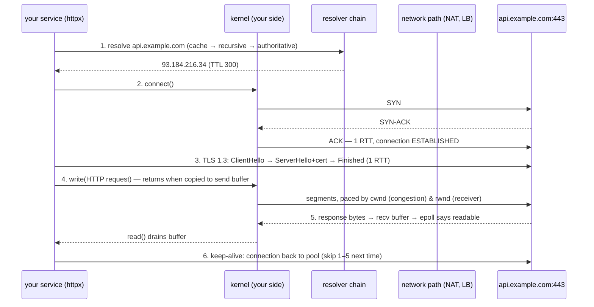

# TCP Request Walkthrough — narrate every hop from `httpx.get()` to first byte, or you don't actually know networking

**Level 9 · The Wire · Session 8 · [INTERVIEW-CRITICAL]**

## TL;DR

- The canonical senior question is "what happens when you call an API?" — the answer is a **pipeline you narrate**: DNS → TCP handshake → TLS handshake → HTTP bytes → kernel buffers → close. Each stage has a latency cost and a distinct failure signature.
- **DNS first**: stub resolver → OS cache → recursive resolver → root/TLD/authoritative. Typically cached (~0–1 ms); cold can be 20–120 ms. In K8s, it's CoreDNS + `ndots:5` search-path amplification — a real production tax.
- **TCP = 1 RTT** (SYN → SYN-ACK → ACK) before any data. **TLS 1.3 adds 1 more RTT** (1.2 added two). This is *why* connection reuse matters: a pooled connection skips all of it (`system-design/requests/connection_management.md`).
- Data transfer is governed by **kernel buffers + flow control (receiver's window) + congestion control (network's window)**. Your `write()` returning ≠ delivered; it means "copied into the send buffer."
- Failure signatures to memorize: **connection refused** = RST, port closed (service down). **Timeout on connect** = SYN dropped (firewall/security group/wrong IP). **Timeout mid-request** = upstream slow or death by half-open connection.

## Mental Model

## What Actually Happens

`await client.get("https://api.example.com/v1/users/42")`, stage by stage:

1. **DNS.** The stub resolver checks caches (in-process, OS/systemd-resolved), then asks the configured recursive resolver (`/etc/resolv.conf` — in K8s that's CoreDNS). Cold path: recursive walks root → `.com` TLD → example.com's authoritative server, caches per TTL. K8s gotcha worth telling in interviews: default `ndots:5` means `api.example.com` first gets tried as `api.example.com.default.svc.cluster.local.` and friends — up to 4–5 wasted queries per lookup unless you use FQDNs (trailing dot) or tune `ndots`. You get back an IP; with both A and AAAA, happy-eyeballs may race v6/v4.
2. **TCP handshake.** `connect()` sends SYN with your ephemeral source port (this 4-tuple `src_ip:src_port → dst_ip:443` *is* the connection's identity). Server's kernel: SYN queue → SYN-ACK → your ACK → accept queue ([fds_sockets_epoll.md](../os/fds_sockets_epoll.md)). One RTT; nothing app-level has happened. Mumbai→us-east-1 RTT ≈ 190 ms — the handshake alone can dwarf your handler time, which is the entire case for pooling and for regional deployment.
3. **TLS 1.3.** ClientHello (supported ciphers, SNI = hostname — this is how one LB serves many certs, and it leaks the hostname unless ECH) → ServerHello + certificate + key share → both derive session keys → Finished. 1 RTT. Client verifies the cert chain up to a trusted root CA and checks the hostname (details + mTLS: `system-design/security/infrastructure_security.md` §2). 0-RTT resumption exists; replay-safety caveats make it a "know it, name it" feature.
4. **Request bytes.** httpx serializes headers+body; `write()` copies into the kernel **send buffer** and returns. The kernel segments it (MSS ≈ 1460 B), and two windows govern pacing: the receiver's advertised window (**flow control** — don't drown the peer) and the congestion window (**congestion control** — don't drown the path; starts small via slow-start, grows per ACK, collapses on loss). Lost segments are retransmitted via dup-ACKs/timeouts — TCP's reliability is *retransmission + ordering*, paid in latency variance (this is HOL blocking at the TCP layer — the HTTP/2-vs-3 hinge in `connection_management.md`).
5. **In between** sit middleboxes: your NAT/conntrack (rewrites the 4-tuple, keeps state), their L4/L7 load balancer (`system-design/load balancer.md`). Every stateful box has an **idle timeout** — the classic production bug: a pooled connection idle 350 s, NAT forgot it at 300 s, next request sends bytes into a black hole → hangs until client timeout. Fix: TCP keepalives / pool `max_idle` under the smallest middlebox timeout.
6. **Response.** Server writes; bytes land in *your* recv buffer; epoll marks the FD readable; the event loop resumes your coroutine ([asyncio_event_loop.md](../concurrency/asyncio_event_loop.md)); httpx parses status line, headers, body per `Content-Length`/chunked framing.
7. **Reuse or close.** HTTP keep-alive returns the connection to the pool — the next request skips stages 1–3 entirely (that's ~2 RTT + DNS saved). Actual close: FIN/ACK each way; whoever closes first holds TIME_WAIT ~60 s (why servers, not clients, should usually initiate close, and why port-exhaustion bites aggressive clients).

## The Opinionated Take

- **Memorize the RTT arithmetic, it prices every architecture decision:** new HTTPS connection = DNS + 1 RTT (TCP) + 1 RTT (TLS) ≈ 2×RTT+; pooled connection = 0 extra. Cross-region RTT ~150–250 ms; same-AZ ~0.5–2 ms. "Chatty service across regions" loses to "one batched call" by arithmetic, not opinion.
- **Blame layers in order, with tools:** DNS (`dig`, resolution time) → connect (`nc -vz host 443`, tells refused-vs-timeout) → TLS (`openssl s_client -connect`) → HTTP (`curl -w` timing breakdown). Refused = service/port down; connect-timeout = firewall or routing; slow first-byte = the app, not the network. This triage script is an interview answer *and* a runbook.
- **Set TCP keepalive / pool idle limits explicitly** on anything long-lived crossing a NAT or LB. The silent-idle-drop bug recurs in every company; pre-empting it in a design review is cheap senior credibility.
- Where the model shifts: HTTP/3/QUIC folds transport+TLS into one handshake over UDP and kills TCP-level HOL — the *stages* survive, the round-trip count shrinks (details already in `connection_management.md`).

## Interview Ammo

1. **"Walk me through what happens when your service calls an external API."** — The 7 stages above, in order, with the RTT count and one failure mode each. Differentiator: kernel buffers and the two windows — most candidates jump DNS→"HTTP happens."
2. **"Connection refused vs connection timeout — what's the difference and what do each tell you?"** — Refused = RST came back: host reachable, port closed → service down/wrong port. Timeout = SYN vanished: firewall/SG drop, wrong IP, or dead host → network/config problem. Different pages, different teams.
3. **"Why is the first request to a host slow and the rest fast?"** — Cold DNS + TCP + TLS ≈ 2 RTT + resolution; then keep-alive pooling amortizes it. Mention TLS resumption and preconnect as the optimizations.
4. **"How does TCP decide how fast to send?"** — min(receiver window, congestion window); slow-start → congestion avoidance; loss shrinks cwnd. Consequence: throughput ∝ window/RTT — long fat pipes need big windows; short bursts never leave slow-start.
5. **"Your K8s service shows 100–300 ms of unexplained latency on outbound calls, sometimes."** — DNS: cold CoreDNS lookups + `ndots` search amplification (or conntrack races). Evidence: resolution-time metrics, fix via FQDN/trailing dot, `ndots:1`, NodeLocal DNSCache. Extremely real, extremely senior.

## Practice Rep (60 min, pass/fail)

In a Linux container (`nicolaka/netshoot` has everything: `tcpdump`, `dig`, `curl`, `openssl`):

1. `tcpdump -w /tmp/cap.pcap host example.com &` then `curl -v https://example.com` (force fresh: no pool). Stop the capture.
2. Read it back (`tcpdump -r /tmp/cap.pcap -nn`) and **annotate every packet group** in a text file: DNS query/response, SYN/SYN-ACK/ACK, ClientHello/ServerHello, application data records, FIN sequence. Match each to the mermaid stage number.
3. `curl -w '%{time_namelookup} %{time_connect} %{time_appconnect} %{time_starttransfer}\n' -o /dev/null -s https://example.com` twice (cold + warm-ish) — map each timing gap to a stage; check they agree with the pcap.
4. Failure signatures: `curl` against a closed port on a reachable host (refused) and against a dropping firewall or unroutable IP like `10.255.255.1` (timeout). Save both error outputs.

**Pass:** every packet group in the capture annotated with the correct stage; the four `curl -w` deltas correctly attributed (namelookup=DNS, connect−namelookup=TCP RTT, appconnect−connect=TLS, starttransfer−appconnect=server think time); refused-vs-timeout distinction written in one sentence each.
**Fail:** any packet group you can't name, or timings attributed to the wrong stage.

## Self-Check (5 questions, answers at bottom)

1. Count the round trips before the first byte of HTTP request data leaves your machine, for a cold HTTPS connection (TLS 1.3).
2. What uniquely identifies a TCP connection, and why does NAT care?
3. `write()` returned successfully but the client never received the data. Name two legitimate ways.
4. What are the *two* windows limiting TCP send rate, and whom does each protect?
5. Requests through your connection pool occasionally hang for exactly your client-timeout after ~5 min of idle. Diagnosis and fix?

---

Answers

1. ~2 (+DNS if cold): 1 RTT TCP handshake + 1 RTT TLS 1.3. (TLS 1.2: 3 total; QUIC: 1 combined; resumed 0-RTT: data in the first flight.)
2. The 4-tuple (src IP, src port, dst IP, dst port). NAT rewrites the source pair and must keep a state entry per connection to route replies — which is why NAT/conntrack table timeouts and exhaustion break long-lived or numerous connections.
3. (a) `write` only copies to the kernel send buffer — the peer/network can die before delivery; (b) a stateful middlebox (NAT/LB) silently expired the idle connection, so segments went nowhere until retransmission timeout. (Also valid: receiver crashed before app-level read.)
4. Receiver's advertised window (flow control — protects the *peer's* buffer) and congestion window (congestion control — protects the *network path*). Effective rate ~ min(rwnd, cwnd)/RTT.
5. A middlebox idle timeout (NAT/LB ~300 s) is dropping pooled connections without RST; first reuse sends into a black hole and waits for the client timeout. Fix: pool idle-lifetime below the middlebox timeout, and/or enable TCP keepalive probes; retry-once-on-stale-connection as the safety net.

