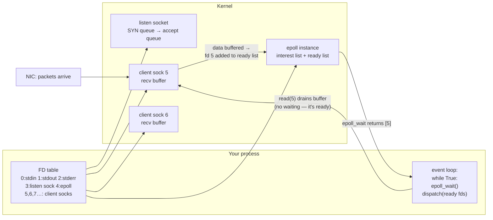

# FDs, Sockets & epoll — everything is a file descriptor, and an event loop is just `epoll_wait` inside a while-loop

**Level 8 · The Kernel · Session 5 · [INTERVIEW-CRITICAL]**

## TL;DR

- A **file descriptor** is an integer index into your process's FD table, pointing at a kernel object (file, socket, pipe, timer…). One API — `read`/`write`/`close` — over all of them. That uniformity is what makes event loops possible.
- A listening socket and a connected socket are **different objects**: `accept()` pops a completed connection off the listen socket's **accept queue** and hands you a *new* FD per client.
- Blocking `read()` parks your whole thread. The alternative: mark FDs non-blocking and ask the kernel **"which of these are ready?"** — that's `select`/`poll` (O(n) per call) vs **`epoll`** (register once, O(ready) per call).
- An event loop = `while True: events = epoll_wait(); dispatch(events)`. asyncio, uvicorn, nginx, Redis, Node — all this exact shape. ([asyncio_event_loop.md](../concurrency/asyncio_event_loop.md) builds directly on this doc.)
- FDs are a **finite resource** (`ulimit -n`). "Too many open files" is a leak or an un-raised limit, and it's always at 3 a.m.

## Mental Model

## What Actually Happens

**One HTTP request against a single-threaded epoll server, syscall by syscall:**

1. **Setup:** `socket()` → FD 3. `bind(3, :8000)`, `listen(3, backlog=511)`. The backlog sizes the **accept queue** — completed handshakes waiting for you to `accept()` them. `epoll_create1()` → FD 4 (yes, the epoll instance is itself an FD). `epoll_ctl(4, ADD, 3, EPOLLIN)` registers interest: "tell me when the listen socket is readable."
2. **The loop blocks** in `epoll_wait(4)` — the thread is off the runqueue, costing nothing ([processes_threads_scheduling.md](processes_threads_scheduling.md)).
3. **Client connects.** The kernel does the TCP handshake *by itself* — SYN arrives → SYN queue; final ACK arrives → moved to accept queue. Only now is FD 3 "readable," and `epoll_wait` returns. Note what "readable on a listen socket" means: *a connection is ready to accept.* If the accept queue overflows (slow server), new connections get dropped/SYN-ACK retries — that's overload showing up *before* your code runs.
4. `accept(3)` → **FD 5**, the connected socket, which you set `O_NONBLOCK` and register: `epoll_ctl(4, ADD, 5, EPOLLIN)`.
5. **Request bytes arrive** and sit in FD 5's kernel **receive buffer**. epoll puts FD 5 on the ready list; `epoll_wait` returns it. `read(5)` copies bytes from kernel buffer to your buffer *without blocking* — the data was already there. That's the trick of readiness-based I/O: you only ever read when reading is free.
6. **You write the response.** `write(5)` copies into the kernel **send buffer** and returns — delivery is the kernel's problem. If the client is slow and the send buffer fills, `write` would block (or return `EAGAIN` non-blocking) — now you register `EPOLLOUT` and wait for writability. This is backpressure at the socket level.
7. `close(5)` decrements the kernel object's refcount and frees the FD number for reuse. Forget this under an error path and you leak one FD per failed request — `ls /proc/<pid>/fd | wc -l` climbing is the smoking gun.
8. **Why not `select`?** `select`/`poll` pass the *entire* FD set into the kernel every call and scan it — O(n) per wakeup, 1024-FD limit for `select`. epoll keeps the interest list *in the kernel* across calls and returns only ready FDs: O(ready). At 10k connections where 50 are active, that's the whole ballgame. (macOS/BSD equivalent: `kqueue`; Python's `selectors` module picks the right one.)
9. **Level- vs edge-triggered:** level (default) = "fd 5 is readable" repeats while data remains — forgiving. Edge = fires once per *new* data — you must drain to `EAGAIN` or lose wakeups. nginx uses edge; asyncio uses level; you should use level unless benchmarks say otherwise.

## The Opinionated Take

- **Event loops are for many mostly-idle connections** — the 10k-websockets case, where per-connection threads would burn memory and switches for sockets that are 99% silent. For 40 concurrent busy requests, a threadpool is simpler and just as fast. Don't cargo-cult the loop.
- **Raise `ulimit -n` deliberately in prod** (container images often default to 1024 soft) and alert on FD count per process. An FD leak is the only leak that takes down a healthy-CPU, healthy-memory service.
- **Backlog and accept-queue overflow are real tuning knobs** but they're the *symptom* dial — if the accept queue overflows, the fix is capacity/shedding (`system-design/requests/backpressure_load_shedding.md`), not a bigger queue.
- Where the model breaks: `epoll` is readiness-based and regular *files* are always "ready" — that's why asyncio can't do true async disk I/O and why `io_uring` (completion-based) exists. Know the name; don't claim production experience you don't have.

## Interview Ammo

1. **"What happens, at the syscall level, when a request hits your API?"** — The walkthrough above: kernel handshake → accept queue → `accept` → new FD → epoll readiness → non-blocking read → send-buffer write. Distinguishing listen-socket vs connected-socket earns senior credit.
2. **"What is an event loop, really?"** — `while True: ready = epoll_wait(); run callbacks for ready fds`. Single thread, never blocks except in `epoll_wait`, therefore any callback that blocks freezes everything — which sets up the asyncio session.
3. **"select vs poll vs epoll?"** — select: fixed 1024 bitmap, O(n) scan, set rebuilt per call. poll: no 1024 cap, still O(n) per call. epoll: stateful kernel-side interest list, O(ready) wakeups, plus edge/level modes. Then say when it *doesn't* matter: n < ~100.
4. **"Server accepts connections but responses stall under load — where do you look?"** — Send buffers full (slow clients / no backpressure), accept queue vs app queue distinction, FD exhaustion, or one blocking callback in the loop. Naming kernel-side queues separately from app-side queues is the senior move.
5. **"Why can't epoll make disk reads async?"** — Files are always readable per epoll's model; readiness is meaningless for them. Thread pools (what asyncio does for files) or io_uring's completion model are the answers.

## Practice Rep (60 min, pass/fail)

Build `echo_server.py` (~30 lines, stdlib `selectors` only — no asyncio): single thread, non-blocking listen socket, echo every line back to any number of concurrent clients.

1. Verify with two simultaneous `nc localhost 8000` sessions typing interleaved lines.
2. In a Linux container, run it under `strace -f -e trace=network,epoll_ctl,epoll_wait,read,write,close python echo_server.py`, connect, send one line, disconnect.
3. In comments at the bottom of the file, paste the strace excerpt and annotate **every** syscall from connect to close with one phrase each.
4. Kill a client mid-session; confirm the server survives and the FD count (`ls /proc/<pid>/fd`) returns to baseline.

**Pass:** both `nc` clients echo correctly and simultaneously on one thread; every syscall in the trace annotated correctly (accept-queue and recv-buffer must appear in your annotations); FD count provably returns to baseline after disconnects.
**Fail:** used asyncio/threads, any unexplained syscall, or FDs that never return to baseline.

## Self-Check (5 questions, answers at bottom)

1. What does "readable" mean on a listening socket vs a connected socket?
2. Your process shows 4,090 FDs and `ulimit -n` is 4,096. What breaks first, and what's the likely bug class?
3. Why does `write()` usually return instantly even though the client is on a slow network — and when does it stop returning instantly?
4. Why is epoll O(ready) while poll is O(registered)?
5. Where did the TCP handshake happen relative to your `accept()` call, and why does that matter under overload?

---

Answers

1. Listening: a completed connection sits in the accept queue (`accept` won't block). Connected: bytes sit in the receive buffer (`read` won't block).
2. Next `accept()`/`open()`/`socket()` fails with `EMFILE` ("Too many open files") — new connections rejected while existing ones work. Bug class: FD leak on an error path (socket/file not closed in `finally`/context manager).
3. `write` copies into the kernel send buffer and returns; the kernel drains it at the client's pace. It stops being instant when the buffer fills (slow client) — blocking write stalls, non-blocking returns `EAGAIN`, and you need `EPOLLOUT`-based backpressure.
4. epoll's interest list lives in the kernel across calls; arriving data pushes the FD onto a ready list, and `epoll_wait` just hands over that list. poll re-submits and re-scans the entire FD array every call.
5. The kernel completed it before you ever saw the connection — `accept` only dequeues the result. Under overload the accept queue fills and the *kernel* starts refusing/dropping handshakes, so users see connection errors even though your code never got a chance to shed load.

