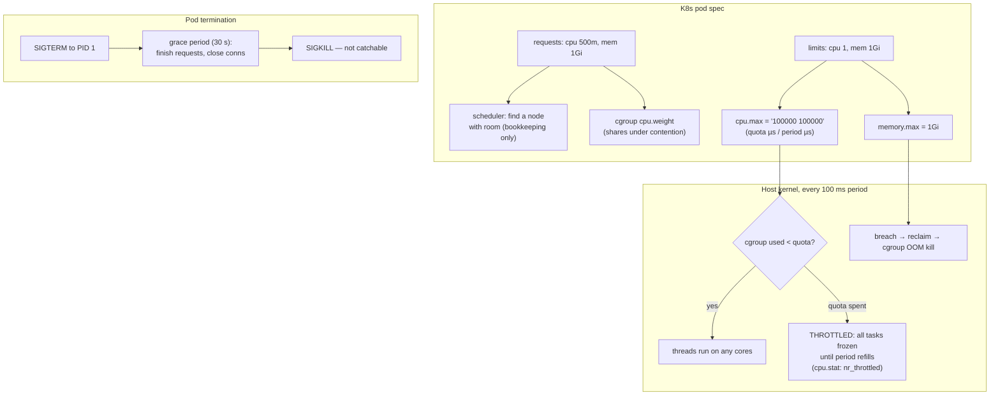

# Signals, cgroups & K8s Limits — your pod's "resources" are a bandwidth quota and a kill threshold, nothing like a smaller machine

**Level 8 · The Kernel · Session P2**

## TL;DR

- A container is **not** a VM: it's ordinary processes wearing namespaces (what you can *see*) and **cgroups v2** (what you can *use*). There's no guest kernel; `kubectl exec` drops you into a process tree on the shared host kernel.
- `limits.cpu: "1"` does **not** mean "one CPU's speed." It means a CFS **bandwidth quota**: 100 ms of CPU time per 100 ms period, spendable on *any number of cores* — 8 busy threads burn it in 12.5 ms and everything freezes for 87.5 ms. That freeze is your p99.
- `limits.memory` is a kill threshold, not a slowdown: breach `memory.max` after reclaim fails → SIGKILL, exit 137 (mechanics in [virtual_memory_oom.md](virtual_memory_oom.md)).
- **Requests** are scheduling + proportional weight (`cpu.weight`, contention-only); **limits** are hard ceilings. CPU is compressible (throttle), memory is not (kill) — treat them completely differently.
- Pod shutdown is a **signal contract**: SIGTERM → `terminationGracePeriodSeconds` (default 30 s) → SIGKILL. If PID 1 in your container ignores SIGTERM (default for PID 1!), every deploy is a hard kill.

## Mental Model

## What Actually Happens

**A FastAPI pod (`limits.cpu: "1"`, 4 uvicorn workers) during a deploy + a load spike, kernel's-eye view:**

1. **Startup accounting.** kubelet creates a cgroup under `/sys/fs/cgroup/kubepods.slice/...` and writes: `cpu.weight` from requests, `cpu.max = 100000 100000` (quota µs per period µs) from the CPU limit, `memory.max` from the memory limit. Your 4 workers are just tasks charged to this cgroup — the scheduler from [processes_threads_scheduling.md](processes_threads_scheduling.md) still runs them; the cgroup adds a group-level meter.
2. **The spike.** All 4 workers go CPU-busy (JSON serialization, say) on a 16-core node. Linux happily runs them on 4 cores *in parallel* — burning the 100 ms quota in 25 ms of wall time. The CFS bandwidth controller dequeues the whole cgroup: **every thread, including ones mid-request, freezes for 75 ms**. `cpu.stat` increments `nr_throttled` and adds to `throttled_usec`. Average CPU graph reads "60%, healthy"; p99 grows 75 ms cliffs. This is the single most-missed production diagnosis in container land.
3. **Why averages lie:** throttling is evaluated per 100 ms period. You can be throttled in 30% of periods while *average* utilization sits far below the limit — the spikes inside each period are what spend the quota. The metric that tells the truth: `container_cpu_cfs_throttled_periods_total / container_cpu_cfs_periods_total`.
4. **The deploy.** kubelet sends **SIGTERM to PID 1 only**. Two traps: (a) PID 1 ignores unhandled SIGTERM by default (kernel rule — no default handlers for init), so a shell-script entrypoint that doesn't `exec` your server means the signal hits the shell and dies there; (b) your server must *stop accepting* but *finish in-flight* — uvicorn/gunicorn handle SIGTERM gracefully, but only if the signal reaches them. `exec` in entrypoint scripts, or `tini` as PID 1, is the fix.
5. **Grace period races the endpoint removal.** Pod deletion also removes the pod from Service endpoints — *concurrently*, not before. For a few hundred ms, traffic still arrives at a pod that's shutting down. The boring, correct fix: a `preStop` sleep of 3–10 s so the endpoint update propagates before the server stops accepting.
6. **30 s later** (or `terminationGracePeriodSeconds`): SIGKILL to everything still alive in the cgroup. Requests in flight vanish mid-byte. If your graceful drain legitimately needs 60 s (long-poll connections, big uploads), you must *say so* in the pod spec — the default doesn't care.

## The Opinionated Take

- **Set CPU requests, skip CPU limits for latency-sensitive services.** Requests give you proportional fairness under contention (`cpu.weight`) and burst headroom when the node is idle; limits buy you throttling cliffs to protect against a problem (noisy neighbor) that weight already handles. When this breaks: strict multi-tenancy or chargeback environments where the ceiling *is* the contract — then set the limit and size workers to fit inside it (workers ≈ quota, not ≈ node cores).
- **Memory: requests = limits, always** (argued in [virtual_memory_oom.md](virtual_memory_oom.md) — incompressible resources get Guaranteed QoS).
- **Every container gets a real PID 1 story.** `exec` your process in the entrypoint or use `tini`. If you can't say what handles SIGTERM in your container, the answer is "nothing," and every rollout is data loss roulette.
- Rules of thumb: default grace 30 s; exit 137 = SIGKILL (OOM or grace expiry — check `OOMKilled` to tell them apart), 143 = clean SIGTERM exit; throttled-period ratio >5% deserves a ticket; uvicorn workers ≤ ceil(cpu limit).

## Interview Ammo

1. **"CPU limit 2, average utilization 40%, p99 spikes. Why?"** — CFS quota throttling: bursts inside 100 ms periods exhaust the quota; all threads freeze until refill. Prove with `nr_throttled`/`throttled_usec` (or the Prometheus ratio); fix by removing the limit, raising it, or capping concurrency to fit the quota.
2. **"What's actually inside a K8s CPU/memory limit?"** — cgroup v2 files: `cpu.max` (quota/period bandwidth), `cpu.weight` (from requests, contention-proportional), `memory.max` (reclaim-then-kill threshold). Requests schedule; limits enforce.
3. **"Requests vs limits — when would you set them differently per resource?"** — CPU: requests yes, limits usually no (compressible; weight handles fairness). Memory: requests = limits (incompressible; avoid overcommit-then-evict). Name QoS classes: Guaranteed / Burstable / BestEffort and that eviction order follows them.
4. **"Your app loses requests on every deploy. Walk through the shutdown path."** — SIGTERM to PID 1 (does it even reach the server? `exec`/tini), graceful drain vs endpoint-removal race (`preStop` sleep), grace period vs real drain time, SIGKILL at the deadline. Four distinct failure points, each with a one-line fix.
5. **"Container exits 137 but memory graphs look fine. What else is 137?"** — SIGKILL has two common senders: cgroup OOM (check `OOMKilled: true`) and kubelet's grace-period expiry on shutdown. A slow-draining app that blows the grace period 137s on every rollout with zero memory pressure.

## Practice Rep (60 min, pass/fail)

Docker on any Linux host (or a Mac via Docker Desktop — cgroup files visible inside the container at `/sys/fs/cgroup`). Predictions first:

1. **See the knobs (10 min):** `docker run -it --rm --cpus=1 -m 256m python:3.12 bash`; `cat /sys/fs/cgroup/cpu.max`, `memory.max`, `cpu.stat`. Map each value back to the flags.
2. **Cause throttling (25 min):** inside, run a 4-thread busy-loop (`multiprocessing` with 4 procs, spin 30 s). Predict the wall-time slowdown factor vs unlimited, then compare `cpu.stat` `nr_throttled`/`throttled_usec` before/after. Re-run with 1 process — predict whether throttling still occurs.
3. **Signal contract (25 min):** write a 15-line Python server that traps SIGTERM, logs "draining," sleeps 5 s, exits 0. Run it three ways: as `CMD ["python", "server.py"]`, behind a non-exec shell script, and behind `sh -c "exec python server.py"`. `docker stop` each (10 s grace). Record exit codes and whether "draining" printed.

**Pass:** throttling reproduced with `nr_throttled` > 0 and slowdown within 2× of your prediction; the three shutdown runs produce the expected split (exec paths: drain + 0/143; non-exec shell: no drain, 137) and you can say why in one sentence each.
**Fail:** any prediction skipped, or you can't explain the non-exec 137 using the words "PID 1."

## Self-Check (5 questions, answers at bottom)

1. `limits.cpu: "2"` on a 16-core node with 8 busy threads — describe one 100 ms period in the life of this cgroup.
2. Which cgroup file does `requests.cpu` map to, and when does it have any effect at all?
3. Why is memory handled with a kill and CPU with a freeze? What property of the resource forces this?
4. Your entrypoint is `#!/bin/sh\npython server.py`. What happens on `kubectl delete pod`, exactly, and what two one-line fixes exist?
5. What's the difference between exit codes 137 and 143, and what are the *two* common causes of 137?

---

Answers

1. The 8 threads run in parallel on 8 cores and spend the 200 ms quota in 25 ms; the bandwidth controller freezes the entire cgroup for the remaining 75 ms; repeat every period. Wall-clock: 25 ms on, 75 ms off.
2. `cpu.weight`. Only under CPU contention on the node — it sets the proportional share when runnable tasks exceed cores; on an idle node it does nothing (you can use the whole machine).
3. CPU is compressible: delaying a task loses time, not state. Memory is not: you can't "give back" pages a process depends on without its cooperation, so past the reclaimable cache the only enforcement is killing the process.
4. SIGTERM goes to `sh` as PID 1, which has no handler and (as PID 1) ignores it; nothing drains; 30 s later SIGKILL nukes the tree — exit 137 every deploy. Fixes: `exec python server.py` in the script, or `tini`/`dumb-init` as the entrypoint.
5. 143 = 128+15, clean exit after SIGTERM (graceful). 137 = 128+9, SIGKILL — either cgroup OOM (`OOMKilled: true`) or the kubelet's grace-period deadline on a pod that didn't drain in time.

