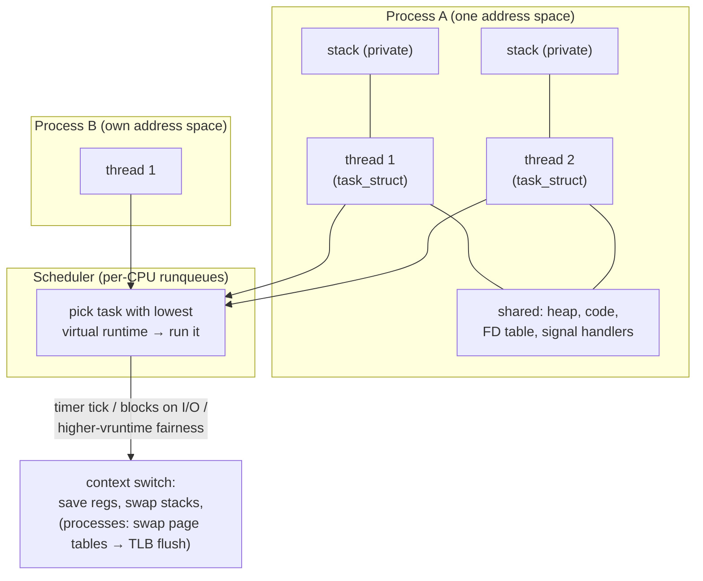

# Processes, Threads & Scheduling — to Linux both are just tasks; the only question is what they share

**Level 8 · The Kernel · Session 4 · [INTERVIEW-CRITICAL]**

## TL;DR

- Linux has one unit of execution: the **task** (`task_struct`). "Process" and "thread" are both created by `clone()` — the flags decide what's shared (threads share the address space, FD table, signal handlers; processes get copies).
- `fork()` is cheap because of **copy-on-write**: parent and child share physical pages until one writes. `exec()` then replaces the image. This pair is how every process you've ever started came to exist.
- A **context switch** costs ~1–5 µs directly, but the real bill is indirect: trashed CPU caches and TLB. Thousands of runnable threads means you pay it constantly — this is *why* event loops exist.
- The scheduler (CFS, now EEVDF) gives each runnable task a fair share by **virtual runtime** — no fixed time slices, no priorities you can usually feel. What you *can* feel: K8s CPU limits are CFS **throttling**, not "a slower CPU."
- Blocked ≠ scheduled: a thread waiting on I/O costs ~8 MB virtual stack and a kernel object, but zero CPU. 10k *waiting* threads is memory pressure; 10k *runnable* threads is a switching catastrophe.

## Mental Model

## What Actually Happens

**`uvicorn main:app --workers 4` from keystroke to serving:**

1. Your shell `fork()`s. The child is a byte-for-byte *logical* copy of the shell — but physically, both point at the same pages, all marked read-only. Only when either side writes does the kernel copy that one page (**copy-on-write** page fault). Cost of fork: microseconds, not proportional to memory.
2. The child calls `exec("uvicorn")`: address space thrown away, replaced by the Python binary's image. (fork+exec split is why you can set up pipes/redirects *between* the two calls.)
3. Uvicorn master `fork()`s 4 workers. Each worker imports your app; CoW means the interpreter's pages start shared — until Python's refcounting *writes to every object's header*, dirtying pages. (This is the classic "CoW doesn't help CPython much" gotcha, and why `gc.freeze()` exists.)
4. Each worker starts threads (e.g., a threadpool). `clone(CLONE_VM | CLONE_FILES | CLONE_SIGHAND ...)` — same address space, new stack, new `task_struct`. To the scheduler, all of it is just tasks in per-CPU runqueues.
5. **Scheduling:** each task accumulates *virtual runtime* as it runs. The scheduler always runs the task that has had the least. A task blocks on `epoll_wait` → moved off the runqueue entirely (costs nothing) → the socket becomes readable → task made runnable again, and since its vruntime lagged while sleeping, it typically preempts soon. I/O-bound tasks are thus *automatically favored* — no tuning needed.
6. **The switch itself:** timer interrupt fires → kernel saves registers and stack pointer, picks the next task, restores its state. Same-process thread switch keeps the page tables; cross-process switch swaps `CR3` → TLB entries invalidated → the next thousands of memory accesses each risk a page-table walk. That invisible cache/TLB repopulation is 5–10× the direct cost.
7. **In a K8s pod with `limits.cpu: "1"`:** the container's cgroup gets a CFS quota of 100 ms per 100 ms period. Four busy threads burn it in 25 ms → **all four are frozen for the remaining 75 ms**. Your p99 shows mysterious 75 ms cliffs while average CPU looks fine. (Full story: `linux_cgroups_k8s_limits.md`, post-Aug ladder.)

## The Opinionated Take

- **Processes for isolation, threads for sharing, and be honest about which you need.** Crash containment, memory leaks, GIL escape → processes. Cheap shared state, GIL-releasing work → threads. Ten thousand concurrent waits → neither; that's the event loop's job ([fds_sockets_epoll.md](fds_sockets_epoll.md)).
- **Don't fear 200 blocked threads; fear 200 runnable ones.** Threadpools sized ~40–100 for blocking I/O are fine and boring. If load means they're all *computing*, you've built a context-switch furnace — cap workers ≈ cores for CPU work.
- **Set K8s CPU *requests* always; think hard before *limits*.** Requests drive scheduling and fair-share weight; hard limits buy you predictable throttling cliffs. When this advice breaks: multi-tenant clusters where a runaway pod can starve neighbors — then limits are the contract.
- Rules of thumb worth memorizing: context switch ~1–5 µs (+cache fallout), thread default stack 8 MB virtual (Linux), fork ~100 µs, syscall ~100 ns – 1 µs.

## Interview Ammo

1. **"Process vs thread?"** — Senior version: both are `clone()`d tasks; a thread shares the address space/FDs/signals, a process doesn't. Everything else (isolation, crash blast radius, IPC cost, CoW) *follows from what's shared*. Bonus: Python adds the GIL so threads ≠ CPU parallelism there.
2. **"What actually happens during a context switch, and why is it expensive?"** — Registers + stack swap (~µs), plus page-table swap and TLB flush for cross-process, plus cold caches after. The indirect cost dominates.
3. **"Why does an event loop beat one-thread-per-connection at 10k connections?"** — Not memory alone: per-connection threads that become runnable in bursts cause switch storms and cache thrash; one loop thread + epoll turns 10k waits into one blocked task.
4. **"Your pod has CPU limit 1, four threads, and weird 50–90 ms latency spikes at moderate load. Diagnose."** — CFS quota throttling: quota exhausted early in the period, everything freezes until refill. Check `container_cpu_cfs_throttled_periods_total`. Fix: raise/remove limit, or match worker count to quota.
5. **"Why is fork fast even for a 4 GB process, and when does that break?"** — CoW shares pages until write. Breaks when the child (or parent) writes broadly — e.g., CPython refcounts dirtying every touched page — or with `MAP_POPULATE`/huge dirty heaps; and `fork` from a threaded process is a deadlock minefield (only async-signal-safe code until `exec`).

## Practice Rep (60 min, pass/fail)

In a Linux container (`docker run -it --rm python:3.12 bash` — install `procps`). Write predictions first, then measure:

1. **Context-switch cost:** two threads ping-ponging a token via two `queue.Queue`s, 100k round trips → derive µs per handoff. Then the same with two *processes* and `multiprocessing.Pipe`. Predict which is slower and by roughly what factor.
2. **Memory:** start 100 sleeping threads vs 100 sleeping `multiprocessing` processes; compare RSS (`ps -o rss` / `smem`) and explain virtual-vs-resident for the 8 MB stacks.
3. **CoW:** allocate a 500 MB `bytearray`, fork, measure child RSS before and after the child writes to every 4096th byte. Predict both numbers.

**Pass:** all three experiments produce recorded numbers; thread-vs-process handoff factor and both CoW numbers predicted within 5× before running; you can explain each result in one sentence using "runqueue," "TLB/page table," or "copy-on-write" correctly.
**Fail:** any experiment skipped or any result you can't explain without hand-waving.

## Self-Check (5 questions, answers at bottom)

1. What, concretely, does a thread share with its siblings that a child process doesn't?
2. Why does a cross-process context switch cost more than a same-process thread switch even though both save/restore registers?
3. Why do I/O-bound tasks get good latency under CFS without any priority tuning?
4. `fork()` returns in 80 µs on a 6 GB Java heap. How? And what makes the "free" copy start costing?
5. Your service has 300 threads and low CPU, yet is healthy. Your colleague says "300 threads is way too many." What's the missing distinction?

---

Answers

1. The address space (heap, code, globals), the file-descriptor table, and signal handlers. Own: stack, registers, kernel task identity.
2. The page-table base register swap invalidates the TLB, so subsequent memory accesses pay page-table walks, and the new process finds cold CPU caches. Thread switches keep the same address space, so TLB and much of the cache survive.
3. A task that sleeps accumulates no virtual runtime; when it wakes, its vruntime is behind everyone else's, so the scheduler runs it promptly. Fairness by vruntime automatically favors tasks that mostly wait.
4. Copy-on-write — the child shares all physical pages read-only. It starts costing on writes (each dirties a page → real copy) — refcounting/GC languages dirty pages just by *reading* object graphs, eroding the sharing.
5. Runnable vs blocked. 300 threads parked in I/O waits cost memory and kernel objects but no scheduling pressure. 300 *runnable* threads on 8 cores would be a context-switch and cache-thrash problem.

