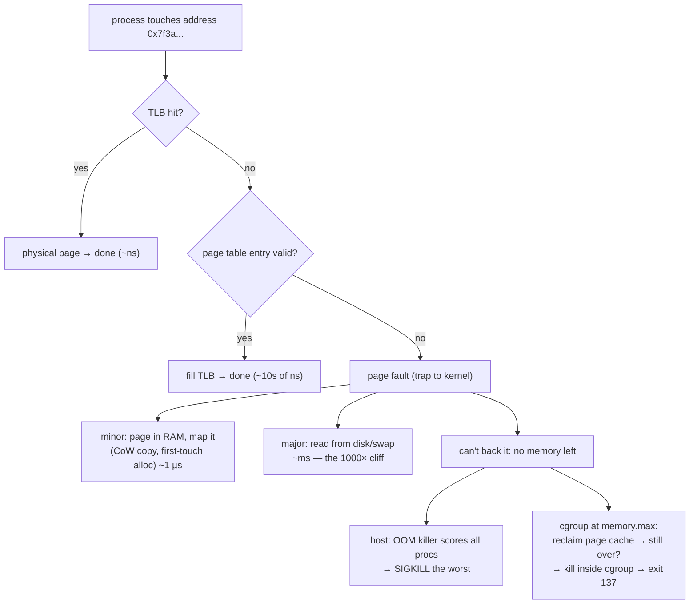

# Virtual Memory & OOM — your process was never using the memory it thinks it has, until suddenly the kernel disagrees

**Level 8 · The Kernel · Session P1**

## TL;DR

- Every process sees a private, flat address space that is a **lie maintained per-access** by page tables + TLB. Memory is materialized in 4 KB pages, on first *write* (demand paging), not at `malloc` time.
- **VSZ is a promise, RSS is reality.** Linux overcommits: `malloc(10 GB)` succeeds on an 8 GB box; you find out you lied when a page fault can't be backed — that's when the **OOM killer** picks a victim.
- A **page fault** is not an error: minor faults (page exists, mapping doesn't) cost ~1 µs; major faults (go to disk/swap) cost milliseconds — a 1000× cliff that shows up as mystery latency.
- In containers, OOM is **cgroup-local**: exceed `memory.max` and the kernel kills the biggest task *in the cgroup* — exit code 137, `OOMKilled` in `kubectl describe`. The node can have 50 GB free while your pod dies.
- The **page cache counts against your cgroup** (it's reclaimable, but reclaim pressure = latency first, kill second). "My app only uses 300 MB, why is the container at 1.9 GB" is usually cache, and usually fine.

## Mental Model

## What Actually Happens

**`data = bytearray(2 * 2**30)` in a pod with `limits.memory: "1Gi"`, step by step:**

1. glibc's allocator asks the kernel for 2 GB via `mmap`. The kernel creates a **VMA** (virtual memory area) — a bookkeeping entry, ~200 bytes. No RAM is allocated. VSZ jumps 2 GB; RSS moves ~0. With default overcommit (`vm.overcommit_memory=0`), the kernel says yes to nearly anything.
2. CPython's `bytearray` zero-fills the buffer, i.e., **writes every page**. Each first write to a page traps: minor page fault → kernel grabs a free physical 4 KB page, zeroes it, maps it, charges it to the pod's **cgroup memory counter**. RSS climbs write-by-write. (Same mechanism as CoW-after-fork in [processes_threads_scheduling.md](processes_threads_scheduling.md) — CoW faults are minor faults.)
3. At ~1 GB charged, the cgroup hits `memory.max`. The kernel doesn't kill yet — it first tries **reclaim inside the cgroup**: drop clean page cache, write back dirty pages, push anon pages to swap if the cgroup allows it. Your process doesn't see an error; it sees each allocation getting *slower* (direct reclaim runs in your allocation path). This is the "weird latency right before death" phase.
4. Reclaim can't find enough. The cgroup OOM killer runs: scores tasks in the cgroup by RSS (mostly), sends **SIGKILL** — not catchable, no cleanup, no finally-blocks. The container runtime reports exit 137 (128+9); kubelet stamps `OOMKilled` and restarts per policy. Nothing in your app logs, because your app never got a say.
5. What Python never saw: `MemoryError`. That only happens when the *allocation call itself* fails — rare under overcommit. **You don't get exceptions from overcommit; you get killed.**
6. The read path has its own cliff: touch a page that was swapped out (or a `mmap`ed file page not yet in cache) → **major fault** → block the thread for a disk round trip. `ps -o min_flt,maj_flt` and `container_memory_working_set_bytes` vs `container_memory_usage_bytes` (usage minus mostly-cache) tell you which world you're in — kubelet's OOM eviction decisions use **working set** (usage minus inactive file cache), not raw usage.

## The Opinionated Take

- **Set K8s memory `requests` = `limits`.** Memory is not compressible — a CPU-throttled pod is slow, a memory-over-limit pod is dead. Guaranteed QoS avoids being first against the wall under node pressure. When this breaks: batch jobs with a known spike where you deliberately gamble on burst headroom.
- **Watch working set, alert on it, ignore VSZ entirely.** VSZ-based dashboards produce false pages ("uvicorn uses 8 GB!" — it's thread stacks and arenas, all virtual). RSS/working-set trending toward the limit is the only signal that predicts a 137.
- **Disable swap intuitions in containers: there usually is none.** K8s defaults swap off, so "it'll just get slow" doesn't happen — anon memory is unreclaimable and you go straight from reclaim-stall to kill. Size limits for the real peak, not the average.
- Rules of thumb: page = 4 KB; minor fault ~1 µs; major fault ~0.1–10 ms; a Python process's baseline RSS ~15–30 MB before your code does anything; exit 137 = SIGKILL = almost always OOM.

## Interview Ammo

1. **"Your pod keeps restarting with exit code 137. Walk me through diagnosis."** — 137 = SIGKILL; check `kubectl describe pod` for `OOMKilled`, then working-set trend vs `memory.max`. Distinguish leak (monotonic climb) vs spike (load-correlated) vs cache-mistaken-for-usage (usage high, working set fine). Fix accordingly: leak → profile, spike → raise limit or shed load, cache → nothing is wrong.
2. **"Why did `malloc` succeed for more memory than the machine has?"** — Overcommit: `malloc`/`mmap` create address space, not memory; pages materialize on first write. The failure moved from allocation time to access time, where the OOM killer, not an error code, handles it.
3. **"RSS vs VSZ vs working set?"** — VSZ = mapped address space (promises), RSS = resident pages (includes shared libs, counts them per-process), working set = what the kernel/kubelet consider "can't cheaply reclaim" (usage minus inactive cache) — the one evictions and OOM decisions actually use.
4. **"App latency degrades for ~30 s, then the pod dies. What happened?"** — Direct reclaim: cgroup at limit, every allocation path doing synchronous cache eviction/writeback before the OOM kill finally fired. The degradation *is* the memory pressure warning; `memory.pressure` (PSI) shows it explicitly.
5. **"Does the JVM/Python `MemoryError` fire before the OOM killer?"** — Usually no. The runtime only errors if its own allocation call fails or its heap cap (`-Xmx`) is hit. With overcommit, the kernel kill arrives first unless the runtime's cap is set *below* the cgroup limit — which is exactly why you set `-Xmx`/arena caps ~75–80% of `memory.max`.

## Practice Rep (60 min, pass/fail)

In a memory-limited container (`docker run -it --rm -m 512m python:3.12 bash`, install `procps`). Predictions in writing first:

1. **Demand paging:** allocate `bytearray(300 * 2**20)` but *don't write past construction* vs `mmap` 300 MB anonymous and touch nothing. Record VSZ/RSS for both (`ps -o vsz,rss,min_flt`). Predict all four numbers first.
2. **Fault accounting:** write one byte every 4096 bytes across the mmap'ed region; predict the minor-fault delta and RSS delta, then measure.
3. **Die on purpose:** allocate-and-write in a loop toward 600 MB inside the 512 MB container. Record: does Python raise `MemoryError` or get killed? Capture the exit code from the shell (`echo $?`) and the kernel's view (`dmesg | tail` on the host or `docker inspect` → `OOMKilled: true`).

**Pass:** all predictions within 2× before running; the kill experiment produces exit 137 + `OOMKilled: true` and you can narrate steps 1–4 of the walkthrough above from your own numbers; you can state why no Python exception fired.
**Fail:** any prediction skipped, or you can't explain the VSZ/RSS gap without the words "page" and "first write."

## Self-Check (5 questions, answers at bottom)

1. Why does RSS climb during a zero-fill of a fresh allocation but not during the allocation call itself?
2. Minor vs major page fault — mechanism and rough cost of each?
3. The node has 40 GB free. Your pod was OOMKilled anyway. Explain.
4. Why does kubelet use "working set" instead of raw memory usage for eviction decisions?
5. What sequence of kernel behaviors does a process experience in the last 30 seconds before a cgroup OOM kill, and how would you observe it?

---

Answers

1. Allocation creates a VMA (address-space bookkeeping only). Zero-filling writes each page, and each first write triggers a minor fault that materializes a physical page — that's what RSS counts.
2. Minor: page is in RAM (or trivially available) but unmapped for this process — kernel fixes the page table, ~1 µs. Major: content must come from disk/swap — the thread blocks for the I/O, ~0.1–10 ms.
3. OOM is evaluated per-cgroup: the pod exceeded its own `memory.max`, so the kernel killed within the cgroup. Node-level free memory is irrelevant to a cgroup-limit breach.
4. Raw usage includes page cache the kernel could drop instantly; killing/evicting based on it would punish healthy pods doing file I/O. Working set subtracts inactive file cache, approximating memory that reclaim can't cheaply recover.
5. Direct reclaim in the allocation path (latency degrades, PSI `memory.pressure` rises), cache dropped, swap-out if permitted, then SIGKILL of the highest-scoring task. Observe via PSI, `min_flt/maj_flt`, working-set-vs-limit graphs, then `dmesg` oom-kill report.

