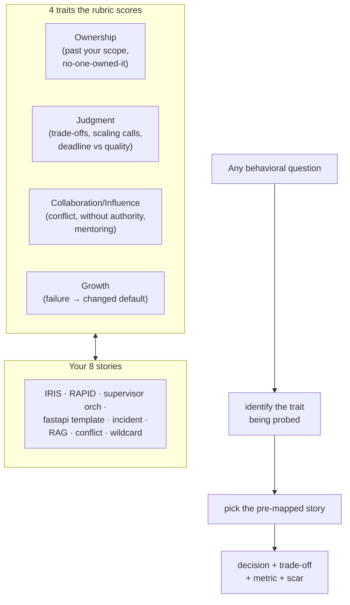

# Senior Behavioral Themes — the rubric behind the questions; map your 8 stories to it and the round is pre-won

**Level 16 · The Final Boss · Session 35 · [INTERVIEW-CRITICAL]**
*Companion to [star_story_bank.md](star_story_bank.md) — that doc builds the stories; this one maps them to what senior rounds actually score.*

## TL;DR

- Senior/staff behavioral rounds test four traits under different disguises: **ownership, judgment under trade-offs, collaboration/influence, and growth-from-failure.** Every question is one of these wearing a scenario.
- The level bump from mid to senior is **scope of agency**: mid-level answers describe doing the task well; senior answers describe *changing what the team does*, deciding under ambiguity, and owning outcomes past your own code.
- Your job here is coverage-mapping: confirm your 8 stories collectively hit all four traits, and pre-decide which story answers which theme so retrieval is instant.
- The universal senior tell across all themes: **"I decided X over Y because Z, it cost W, and here's what I'd change."** Decision + trade-off + measured outcome + reflection.
- Red flags that sink senior candidates: no "I" (only "we"), no numbers, no failures (or blame-shifted ones), and conflict stories where you were simply right and they were simply wrong.

## Mental Model

## What Actually Happens

The four themes, what each is really measuring, and the failure mode:

1. **Ownership.** Prompts: "something outside your role," "a problem nobody owned," "went above and beyond." *Measuring:* do you extend your boundary toward the outcome, or stop at your ticket? Senior signal: you noticed a gap nobody assigned you, took it, and drove it to done — including the unglamorous follow-through (docs, rollout, on-call). *Failure mode:* a story where "ownership" = worked extra hours on your own assigned task (that's diligence, not ownership).
2. **Judgment under trade-offs.** Prompts: "hardest technical decision," "deadline vs quality," "a scaling decision," "a decision you reversed." *Measuring:* can you reason about costs, not just pick the shiny option? Senior signal: named alternatives, an explicit trade (shipped the 80% solution to hit a date, with a written plan to pay the debt — and you *did*), and awareness of what would've changed the call. *Failure mode:* every decision presented as obviously correct; no tension = no judgment demonstrated. Interviewers *want* the story where it was genuinely close.
3. **Collaboration & influence.** Prompts: "disagreed with a senior/manager," "convinced a team without authority," "conflict with a coworker," "mentored someone." *Measuring:* do you move people and outcomes without a title, and disagree productively? Senior signal: you sought the other side's reasoning, used data over volume, and — critically — *committed and executed well even when you lost*. Mentoring: you leveled someone up measurably, not "I helped a junior." *Failure mode:* conflict stories where you win by being right; interviewers read that as "can't collaborate with peers who disagree."
4. **Growth from failure.** Prompts: "biggest failure," "an incident you caused," "feedback that stung," "what would you do differently." *Measuring:* is your seniority made of scars or just tenure? Senior signal: you own it without deflection, extract a *systemic* lesson (a process/default you changed, not "I'll be more careful"), and it's a real failure with real stakes. *Failure mode:* the fake-humble failure ("I care too much"), or blaming circumstances/other people. This theme is where authenticity is most tested.

**The delivery mechanics that apply to all four** (from [star_story_bank.md](star_story_bank.md)): 90-second unprompted answer, "I" with decision verbs, one number minimum, one scar, and let follow-ups pull depth. The themes tell you *which* story; the STAR format tells you *how* to tell it.

## The Opinionated Take

- **Map, don't memorize.** You have 8 stories; make a 4×8 grid (trait × story) and mark which stories serve which theme. Most stories serve 2–3 traits — a good incident story hits ownership *and* judgment *and* growth. The grid is the deliverable, and it means no question is a cold start.
- **Deliberately over-invest in one strong conflict story and one strong failure story** — these are the two themes candidates fake most, so genuine ones stand out hardest. If your conflict story ends with "and I was right," it's not a conflict story; find one where you lost and executed anyway, or where the synthesis beat both original positions.
- **Quantify ownership and mentoring** — the two softest-sounding themes need the hardest numbers ("adopted by 3 teams," "cut their PR review cycle from 4 days to 1," "on-call pages −70%"). Soft theme + hard number = credibility.
- **Match the company's vocabulary the night before.** If they publish leadership principles, re-tag your grid to their words (Amazon "Ownership"/"Dive Deep," etc.) — same stories, their language. When this breaks: startups with no published values — then default to the four traits here.

## Interview Ammo

*(The disguises — recognize the trait, deploy the mapped story.)*

1. **Ownership:** "outside your role" / "nobody owned it" / "above and beyond" → the story where you took an unassigned gap to done. Metric: what would've happened if you hadn't.
2. **Judgment:** "hardest call" / "deadline vs quality" / "a decision you'd reverse" → the close-call trade with named alternatives, the debt you took on, and that you actually repaid it.
3. **Influence without authority:** "convinced a team" / "drove adoption" → the wildcard/template story: data, not title, moved them; adoption number as proof.
4. **Conflict:** "disagreed with someone senior" → the disagree-productively story where you sought their reasoning; ideally you lost or synthesized, and committed fully.
5. **Mentoring:** "leveled someone up" / "raised the bar" → measurable growth in another person + a practice you institutionalized (review checklist, template).
6. **Failure:** "biggest failure" / "an incident" → the real one, owned cleanly, with a *systemic* changed default and the metric of the blast radius.

## Practice Rep (60 min, pass/fail)

1. (25 min) **Build the 4×8 coverage grid:** traits (ownership/judgment/collaboration/growth) × your 8 [story slots](star_story_bank.md). Mark every trait each filled story credibly serves. Identify gaps — any trait with <2 strong stories is a hole to fill this week.
2. (25 min) **Stress-test the two hardest themes:** deliver your conflict story and your failure story out loud, recorded. Conflict must NOT end in "I was right." Failure must name a systemic changed default, not a personal-virtue platitude.
3. (10 min) **Self-grade against red flags:** any all-"we" answer? any story with zero numbers? any failure that's actually a humblebrag? any conflict you won by correctness?

**Pass:** grid complete with every trait covered by ≥2 stories; both recordings clear the theme-specific traps (conflict not self-righteous, failure genuinely systemic); zero red flags on self-grade.
**Fail:** any trait with <2 stories (unfillable question in the real round), or the conflict/failure recordings hit the exact traps this doc names.

## Self-Check (5 questions, answers at bottom)

1. What single dimension separates a mid-level answer from a senior one across all four themes?
2. Why is a conflict story ending in "and I was proven right" a weak answer, and what shape is strong?
3. Which two themes do candidates most often fake, and how do you make yours read as genuine?
4. Why do ownership and mentoring stories specifically need hard numbers?
5. You're asked a theme you have no strong story for. What went wrong upstream, and what's the fix?

---

Answers

1. Scope of agency: mid-level = executed the assigned task well; senior = changed what the team/system does, decided under ambiguity, owned outcomes beyond your own code. Same events, but the senior framing centers decisions and their blast radius.
2. It signals you equate disagreement with a contest you must win — a collaboration risk. Strong shape: you genuinely sought their reasoning, disagreed with data, and either lost-and-committed-fully or the two views synthesized into something better than either. Productive disagreement > being right.
3. Conflict and failure. Genuine markers: conflict where you didn't simply win; failure with real stakes, clean ownership (no deflection), and a *systemic* changed default rather than "I'll be more careful." Specific numbers and unflattering detail read as real.
4. They sound soft, so unquantified they read as self-congratulation. A number ("adopted by 3 teams," "cut their review cycle 4×") converts a claim into evidence — the hardest proof for the softest-sounding traits.
5. Upstream: the coverage grid had a hole you didn't fill — a trait with <2 stories. Fix now: bridge from your closest story by re-framing which decisions it emphasizes (many stories serve a theme they weren't built for if you foreground the right Action lines); fix properly: mine a real story for that trait before the next round.

