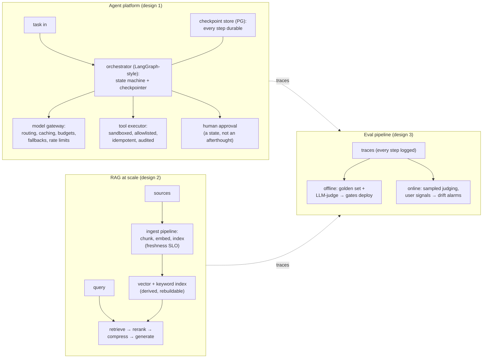

# AI System Design Stories — your home turf, weaponized: three designs you've actually built, told like interviews want them

**Level 13 · The Arena · Session 27 · [INTERVIEW-CRITICAL]**
*This doc doesn't teach you agents/RAG/evals — `../../ai/` already does. It converts what you know into interview-shaped 10-minute designs with the same guarantee-first discipline as sessions 23–26, plus your real war stories as evidence.*

## TL;DR

- You'll get one of three prompts: **"design an agent platform," "design RAG over N million docs," "how do you know your LLM system works?"** Each has a canonical skeleton below. Your edge: you can attach *lived* details (IRIS, RAPID, supervisor orchestration) where other candidates recite blog posts.
- The framing that elevates all three: **an LLM system is a distributed system where one component is slow, expensive, and nondeterministic.** Every pattern from the Arena applies — queues, idempotency, timeouts, fallbacks — plus a new axis: quality is a *measured SLO*, not a vibe.
- Agent platform pivots: state/checkpointing (crash = resume, not restart), tool-call sandboxing + the [lethal trifecta](../../ai/llm_agent_security.md), cost/latency budgets per task, humans-in-the-loop as a first-class state.
- RAG-at-scale pivots: ingestion as a *pipeline with freshness SLOs*, retrieval quality as a measured funnel (recall@k before generation quality), and the index as [derived data — rebuildable](canonical_2_feed_notifications.md).
- Eval pivot: **offline evals gate deploys, online evals catch drift** — the CI/CD analogy lands with every interviewer. Trace-level observability ([llm_observability.md](../../ai/quality/llm_observability.md)) is what makes either possible.

## Mental Model

## What Actually Happens

### Design 1 — agent platform (the supervisor-orchestration story, formalized)

1. **Requirements first, like any Arena design:** tasks are multi-step (minutes, not ms), touch real tools (DBs, APIs, email), must survive crashes mid-task, cost real money per step, and fail nondeterministically. Set SLOs in three currencies: latency (p95 task completion), cost (₹/task budget), **quality (eval pass rate — treat it as an SLO, this is the sentence that separates you)**.
2. **The orchestrator is a durable state machine.** Each agent step = state transition; **checkpoint every transition** (your LangGraph checkpointer work — say Postgres, say why: transactional with your business state). Crash/redeploy mid-task → resume from last checkpoint, **not** restart (a restarted agent re-sends the email — this is [idempotency](../data/idempotency_retries.md) wearing an agent costume, and tool calls carry idempotency keys for exactly that reason).
3. **The model gateway is your connection pool + circuit breaker, LLM-flavored:** provider routing and fallback chains (primary → cheaper/backup on 429/timeout), prompt caching, per-tenant token budgets (denial-of-wallet is real — [cost_engineering.md](../../ai/inference/cost_engineering.md)), and **timeouts with budgets propagated** like any distributed call chain. Streaming vs batch paths for interactive vs background tasks.
4. **Tool execution is the security boundary.** Allowlisted tools per agent role; schema-validated args ([tool_use.md](../../ai/building/tool_use.md)); sandboxed side effects; and the [lethal-trifecta rule](../../ai/llm_agent_security.md) applied architecturally: an agent reading untrusted content loses either external-communication tools or private-data access — *by config, not by prompt*. Say "prompt injection is handled in the architecture because it can't be handled in the prompt" — instant credibility.
5. **Humans-in-the-loop as a state:** high-risk actions park the state machine in `awaiting_approval` (checkpoint holds; notification pipeline pings the approver — [session 24's machinery](canonical_2_feed_notifications.md)); approval resumes the graph. Because state is durable, "park for 3 days" is free.
6. **Multi-agent = supervisor/worker with the same rules** ([agent_architectures.md](../../ai/building/agent_architectures.md)): supervisor owns the plan-state; workers are stateless-ish executors with scoped toolsets; worker output is *untrusted input* to the supervisor (validate like any service boundary). Your war story slots here — what the supervisor pattern bought you (isolation of flaky steps, per-worker model routing) and what it cost (latency stacking, context-passing tax).

### Design 2 — RAG at scale (the IRIS/RAPID story, formalized)

1. **Reframe immediately: RAG is two systems** — an *ingestion pipeline* (async, throughput-shaped) and a *query path* (sync, latency-shaped) — sharing an index. Most RAG failures are ingestion failures wearing a retrieval costume (stale/missing/badly-chunked docs).
2. **Ingestion:** source connectors → parse → chunk (structure-aware; chunking is where quality is won or lost — your contextual-compression experience) → embed (batched, the [throughput economics](../../ai/inference/serving_throughput.md)) → upsert to vector+keyword index. Declare a **freshness SLO** ("docs searchable within 15 min") and measure lag like any [pipeline consumer](../data/event_driven_kafka.md). Deletes/ACL changes must propagate (the compliance question interviewers love — retrieval must be permission-filtered *at query time*, not index time, or leavers' docs leak).
3. **Query path as a funnel with per-stage metrics:** query rewrite (HyDE/multi-query — your actual tools) → hybrid retrieve (vector + BM25, k≈50) → rerank (cross-encoder, k→5) → compress → generate with citations. **Measure recall@k per stage on a golden set** — "if the right doc isn't in the top-50, nothing downstream can save you; so I debug retrieval with retrieval metrics, not by reading generations." That sentence is the senior tell for the whole prompt.
4. **The index is derived data** — rebuildable from sources, so: blue/green index rebuilds for embedding-model upgrades (never in-place migrate embeddings; version the index), and cache posture rules apply ([redis_internals.md](../../db/redis_internals.md) thinking).
5. **Scale numbers to volunteer:** 10M docs × ~10 chunks × 1536-dim fp16 ≈ 300 GB vectors → sharded HNSW or IVF+PQ compression; embedding refresh cost = why you version rather than re-embed on every model bump.

### Design 3 — eval pipeline ("how do you know it works?")

1. **The CI/CD analogy up front:** offline evals are unit/integration tests (golden set + graders **gating deploys** of prompts/models/retrieval configs); online evals are monitoring (sampled LLM-judge + user signals + drift alarms). No prompt change ships without the offline gate — "prompts are code" ([prompt_engineering.md](../../ai/building/prompt_engineering.md)).
2. **Grading tiers by cost** ([evals.md](../../ai/quality/evals.md)): exact/code checks (structure, citations resolve, tool-call validity) → LLM-judge with rubrics (faithfulness, relevance) → human review for the disagreement set (which also *calibrates* the judge — judges drift too).
3. **The trace is the unit** ([llm_observability.md](../../ai/quality/llm_observability.md)): every agent step, retrieval set, and token count logged; production failures become replayable eval cases — **the flywheel: incident → trace → golden-set case → regression gate.** Close with cost/quality/latency as the three-way SLO dashboard per route.

## The Opinionated Take

- **Tell these as distributed-systems designs, not AI demos.** Checkpointing, idempotent tools, budget propagation, derived-data indexes — the interviewer hiring a senior AI engineer is testing whether the systems discipline survives contact with LLMs. Yours does; make it audible.
- **Lead with the quality-as-SLO framing in all three prompts** — it's the single highest-leverage sentence, and almost nobody says it.
- **Spend your war stories at decision points, not as biography:** "we chose supervisor/worker because X; it cost us Y" beats two minutes of project context. One scar per design ([star_story_bank.md](../../interview/star_story_bank.md) discipline — these three designs should each map to a filled slot).
- Where your home-turf advantage breaks: training-infra prompts (GPU cluster design, distributed training) are a different specialty — redirect honestly to serving/agent/RAG ground rather than bluffing.

## Interview Ammo

1. **"Design a platform where agents do multi-step work with real-world side effects."** — Durable state machine + checkpoints, idempotent/fenced tool calls, model gateway with budgets/fallbacks, HIL as a state, trifecta-driven tool scoping. Guarantee-first: "resumable, auditable, budget-bounded."
2. **"An agent sent a customer email twice. Walk the incident."** — Crash between tool call and checkpoint → resume re-executed the step: at-least-once, so the email tool needed an idempotency key (and now does); show the trace, add the regression eval. This *exact* story shape demonstrates three docs at once.
3. **"RAG quality is 'bad.' Debug it."** — Funnel triage with metrics per stage: golden-set recall@50 (ingestion/chunking?) → post-rerank recall@5 → faithfulness of generation given correct context. Never start by reading outputs and tweaking prompts.
4. **"How do you ship a prompt change safely?"** — Offline gate (golden set + judge, diffed against baseline) → canary route with online sampled judging → rollback trigger on quality SLO. "Prompts are code with a nondeterministic compiler — so the tests live outside the prompt."
5. **"When would you fine-tune instead?"** — The decision framework from [lora_peft.md](../../ai/training/lora_peft.md): prompting → RAG (knowledge) → fine-tune (form/behavior at volume) — with cost/iteration-speed/eval-burden trade-offs, and "I'd need the eval set *first* regardless."

## Practice Rep (60 min, pass/fail)

Three recorded 10-minute deliveries, cold-prompted (shuffle the order, use the [Simulator](../System%20Design%20Challenge%20Simulator.md) or a timer):

1. "Design an agent platform for a bank's back office." 2. "Design search+answers over 10M internal docs." 3. "Your CEO asks: how do we know the AI is getting better, not worse?"

Each must contain: the quality-as-SLO sentence, one guarantee-first opening, one war-story-at-a-decision-point (≤30 s), one number (cost, recall@k, freshness SLO), and one volunteered failure mode with its mitigation.

**Pass:** all 3 recordings ≤11 min with all five elements present (tally them while re-listening); the agent design explicitly handles the crash-mid-side-effect case; the RAG design names a per-stage metric; the eval design lands the offline-gates/online-monitors split.
**Fail:** any delivery that spends >1 min on project biography, or an agent design where "the prompt tells it to be careful" carries security weight.

## Self-Check (5 questions, answers at bottom)

1. Why is a checkpointed agent step still not safe to resume without idempotent tool calls?
2. Map the lethal trifecta to a concrete tool-scoping decision in a customer-support agent.
3. Your RAG system answers correctly from a doc that was deleted for compliance last week. Which component failed, and what's the architectural fix?
4. Why must the LLM-judge itself be evaluated, and against what?
5. An interviewer asks "exactly-once agent actions?" — give the answer that reuses session 16 verbatim, then the agent-specific addition.

---

Answers

1. Resume re-executes the step *after* the last checkpoint; if the side effect fired before the crash-point, it fires again — checkpointing bounds *where* you resume, idempotency keys make the re-execution harmless. Durability and idempotency solve different halves (exactly the outbox/consumer split from session 16).
2. The support agent reads customer messages (untrusted input) and can query account data (private data) — so it must NOT hold open outbound channels (arbitrary email/URL fetch): reply-templates only, or a human gate on free-form sends. Two of three trifecta legs present → architecturally remove the third.
3. Ingestion's delete/ACL propagation path — and relying on index-time permissions at all. Fix: tombstone propagation with a freshness SLO for deletes (stricter than for adds), plus query-time permission filtering as the backstop so the index is never the access-control authority.
4. It's a model with its own drift, bias (position, verbosity, self-preference), and failure modes. Calibrate against a human-labeled disagreement set; track judge-human agreement over time; re-calibrate when the judge's underlying model changes.
5. "Exactly-once delivery is impossible; we build at-least-once with idempotent processing for exactly-once *effect*" — plus the agent addition: the retry isn't just network-level, it's *semantic* (a resumed graph or a re-planned step can re-attempt an action via a different path), so idempotency keys must attach to the *business intent* (e.g., `refund:order-7`), not the individual tool call.

