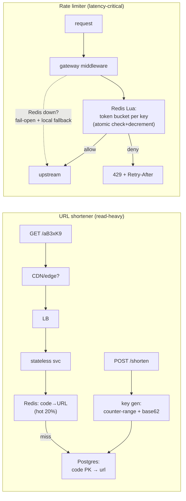

# Canonical Design 1: URL Shortener + Distributed Rate Limiter — the two openers; win them on trade-off talk, not features

**Level 13 · The Arena · Session 23 · [INTERVIEW-CRITICAL]**
*Format note for all Arena docs: two worked designs per session. Read = 30 min; rep = re-derive one against `../System Design Challenge Simulator.md` in 25 min.*

## TL;DR

- Both are **screening designs**: the interviewer knows every answer; they're grading your *process* — requirements → numbers → simple design → scaling story → failure modes. Volunteer the trade-offs before being asked.
- URL shortener pivots on exactly two decisions: **how keys are generated** (counter+base62 vs random+collision-check) and **read-path caching** (it's a 100:1 read-heavy redirect machine). Everything else is garnish.
- Rate limiter pivots on: **algorithm** (token bucket, say why), **where state lives** (Redis, atomic via Lua), and **the distributed accuracy trade** (per-node vs central vs sync'd — pick approximate-but-fast and defend it).
- Numbers to have loaded: shortener — 100M new/month ≈ 40 writes/s, 4k redirects/s, 6-char base62 = 56B keyspace. Limiter — decision must add **<1–2 ms**; one Redis instance ≈ 100k ops/s → shard by key when past it.
- Both end the same senior way: "here's what breaks first and what I'd measure" — cache stampede on a viral link; hot-key on a single abusive API key.

## Mental Model

## What Actually Happens

### Design A — URL shortener (walk this order out loud)

1. **Requirements (2 min):** shorten, redirect (301 vs 302 — pick 302 if analytics matter, say why: 301 is cached by browsers, you lose the hit), optional TTL/custom alias. Non-functional: 100M new URLs/month, 100:1 read:write, p99 redirect <50 ms, redirects must survive DB trouble.
2. **Estimate (2 min):** writes ≈ 100M/2.6M s ≈ **40/s** (trivial). Reads ≈ **4k/s** average, 5–10× peak. Storage: 100M × ~500 B ≈ 50 GB/yr — one Postgres, partitioned later, no sharding drama; *say* "this fits one primary + replicas, I won't shard preemptively" ([capacity method](../resilience/capacity_estimation.md)).
3. **Key generation — the decision the interview hinges on.** Options: (a) hash the URL (md5→6 chars): collisions + same-URL-same-code semantics questions; (b) random 6-char + retry-on-collision: fine at low occupancy; (c) **counter + base62** (my pick): a ticket server / DB sequence hands each app instance a **range** (e.g., 1M IDs) it burns through locally — no per-request coordination, no collisions by construction, keys get longer only when the counter does. Weakness to volunteer: sequential codes are enumerable → mix in a per-ID secret permutation (or just accept it; scan-ability is rarely a real threat — saying *that* is senior). Cross-ref: [id_generation.md](../data/id_generation.md) — this is Snowflake-lite.
4. **Read path:** `GET /aB3xK9` → Redis `code→url` (hot subset; 20% of keys serve 90% of hits) → miss → Postgres PK lookup → backfill cache with TTL. p99 dominated by one Redis hop. A viral link is a **hot key + stampede** risk: singleflight/lock-on-miss so one miss rebuilds ([caching.md's stampede kit](../caching.md)); a truly viral code belongs in CDN/edge cache with a short TTL — a 302 from the edge is the endgame.
5. **Failure modes to volunteer:** Redis down → DB absorbs 4k/s point lookups on PK (survivable — *know* that it's survivable, that's why you estimated); a range-holding app instance dies → its unissued IDs are lost forever (harmless — gaps don't matter, say so); DB primary fails → redirects keep working from cache + replicas (reads), shortening degrades — graceful, acceptable, stated.
6. **Extensions they'll poke:** analytics (don't count synchronously — emit event to Kafka, aggregate offline), custom aliases (unique constraint, first-write-wins), expiry (TTL column + lazy delete on read + batch sweeper — never a synchronous scan).

### Design B — Distributed rate limiter

1. **Requirements:** per-API-key and per-IP limits, e.g. 100 req/s sustained with bursts; the check sits **on the request path of every call** → the limiter's own latency budget is ~1–2 ms; smooth limiting (no fixed-window edge bursts); works across N gateway nodes.
2. **Algorithm (pick, don't survey):** **token bucket** — refill rate = sustained limit, capacity = burst allowance; O(1) memory per key, natively burst-friendly. Mention sliding-window-log as the precise-but-memory-hungry alternative and fixed-window's double-burst-at-boundary flaw in one sentence each, then move on ([algorithms already in rate_limiting.md](../requests/rate_limiting.md)).
3. **State placement — the real question.** Per-node in-memory: fastest, but N nodes × 100/s = N×limit actual (only OK behind consistent-hash routing). Central Redis: accurate, +1 network hop, and the bucket update **must be atomic** — read-modify-write from N gateways is a [textbook race](../../fundamentals/concurrency/threads_locks_queues.md) → **Lua script** computes refill+check+decrement server-side in one atomic step (single-threaded Redis is the lock, [redis_internals.md](../../db/redis_internals.md)). My pick: Redis+Lua, because accuracy across nodes is usually the point of *distributed* limiting.
4. **The Lua bucket, narrated:** keys `bucket:{apikey}` storing `tokens, last_refill_ts`; script: elapsed = now−last; tokens = min(capacity, tokens + elapsed×rate); if tokens ≥ 1 → decrement, allow; else deny with the math for `Retry-After`. TTL on the key = idle cleanup for free.
5. **Scale + hot keys:** 100k decisions/s saturates one Redis → shard buckets by key hash (each key's state lives whole on one shard — no cross-shard consistency needed, which is why this shards trivially). One abusive key hammering one shard is the hot-key case: a local **pre-filter** (approximate per-node bucket that only consults Redis when near the limit) cuts 90% of Redis traffic for well-behaved keys.
6. **Failure policy — always volunteer it:** Redis unreachable → **fail-open** (allow + log + alarm) for product APIs (availability > perfect limiting), fail-closed only for abuse-critical edges (login, OTP). Degrade to per-node local buckets during the outage — approximate limiting beats none. Return `429` + `Retry-After` so well-behaved clients back off properly ([idempotency_retries.md](../data/idempotency_retries.md) contract).

## The Opinionated Take

- **Open every design with numbers or drown.** The 2-minute estimate (40 writes/s! 50 GB/yr!) is what licenses every simplification after it — "this fits one Postgres" is a *conclusion*, not a guess. Skipping estimation is the #1 mid-level tell.
- **Pick one option and defend it; survey ≤1 sentence per rejected alternative.** "We could use A, B, or C…" with no verdict reads as junior. The verdict-with-stated-weakness ("counter+base62; yes it's enumerable; here's why I don't care") reads as senior.
- **Name the failure mode before the interviewer does** — stampede, hot key, Redis-down policy. It converts the follow-up gauntlet into a conversation you're leading.
- When this format breaks: staff+ interviews where the prompt is deliberately ambiguous ("design rate limiting *for our platform*") — then the requirements interrogation *is* the interview; spend 10 minutes there, not 2.

## Interview Ammo

1. **"301 or 302 for the redirect?"** — 302 if you want analytics/mutability (301 gets cached by browsers permanently → you never see repeat hits); 301 if you want to shed traffic. State the trade, pick per requirements.
2. **"How do you avoid key collisions at scale?"** — Don't have them: pre-allocated counter ranges per instance + base62. No coordination per request, no birthday math. Random+retry is acceptable; hashing needs collision handling — know why you didn't pick them.
3. **"Fixed window vs sliding vs token bucket?"** — Fixed: 2× burst at boundaries. Sliding log: exact, O(requests) memory. Token bucket: O(1), bursts by design, industry default. Then: "the accuracy question matters less than where the state lives."
4. **"Your rate limiter's Redis dies — what happens?"** — Stated policy: fail-open + local approximate fallback + alert for product traffic; fail-closed for auth/OTP. "I choose availability over enforcement for most endpoints, and I choose it *in advance*."
5. **"How does the shortener handle a link going viral?"** — Hot key: edge/CDN cache with short TTL serving the 302, singleflight on cache miss, and the observation that one key can't be sharded — replication (cache tiers), not partitioning, absorbs hot reads.

## Practice Rep (60 min, pass/fail)

Two timed rounds against [`System Design Challenge Simulator.md`](../System%20Design%20Challenge%20Simulator.md) (or a wall + voice recorder):

1. **25 min: re-derive the rate limiter** from a cold prompt ("design rate limiting for a public API") — requirements (≤3 min), estimate, architecture, Lua-atomicity point, shard story, failure policy. Record it.
2. **15 min: shortener lightning round** — answer, out loud, the 5 Interview Ammo questions plus "how would you add analytics?" without opening the doc.
3. **10 min: self-grade** the recording against this checklist: numbers stated before architecture? one verdict per decision with a named weakness? failure modes volunteered unprompted? Retry-After/429 contract mentioned?

**Pass:** the 25-min recording covers all six segments with numbers preceding architecture, and self-grade finds ≥3 of 4 checklist items present; lightning round ≥5/6 answered without notes.
**Fail:** architecture before estimation, any decision presented as an unranked option list, or failure modes only appearing when the checklist reminded you.

## Self-Check (5 questions, answers at bottom)

1. Why is a ticket-server range allocation better than a per-request global counter?
2. Where exactly is the race condition in a naive Redis rate limiter, and what makes Lua the fix?
3. A shortener code is enumerable (sequential base62). Construct the actual threat, then argue whether it matters.
4. Why does the rate limiter shard trivially while the viral short link can't be sharded at all?
5. What's your Redis-down policy for the limiter and why does it differ by endpoint class?

---

Answers

1. One network round-trip per *million* IDs instead of per request: instances allocate a range (atomic increment by 1M), then mint locally at memory speed. Coordination cost amortizes to ~zero; instance death just wastes a harmless gap.
2. GET tokens → compute → SET tokens is read-modify-write across concurrent gateways: two readers see the same token count and both allow. Lua executes the whole refill+check+decrement inside single-threaded Redis — serialized by the event loop, atomic by construction.
3. Threat: crawl codes to discover private URLs. It matters only if short links are treated as secrets (they shouldn't be — no auth-bearing URLs); mitigate with a keyed permutation of the counter or random keys if the product genuinely promises unguessability. Saying "the mitigation is cheap but the threat model is usually empty" is the senior answer.
4. Limiter state is per-key and self-contained — hash keys across shards, every decision touches one shard. The viral link is *one* key with massive read demand: partitioning can't split a single key; you replicate it outward (Redis → CDN edge) instead. Partition for many keys, replicate for hot ones.
5. Fail-open with local approximate fallback for product APIs (a minute of unenforced limits is cheaper than a minute of 100% 429s), fail-closed for abuse-magnet endpoints (login, OTP, signup) where unlimited traffic is itself the incident. The class difference is the cost asymmetry of the two errors.

