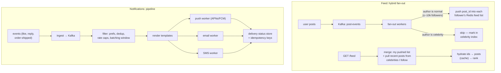

# Canonical Design 2: News Feed + Notification System — both are fan-out problems; the answer is always "hybrid, split by cardinality"

**Level 13 · The Arena · Session 24 · [INTERVIEW-CRITICAL]**

## TL;DR

- Both designs are the same underlying question — **one event, N interested parties: do you do the work on write, on read, or split?** Learn the fan-out vocabulary once, deploy it twice.
- Feed: **fan-out-on-write** (push to follower feed caches at post time — fast reads, write amplification) vs **fan-out-on-read** (assemble at request time — no write amp, slow reads). The senior answer is the **celebrity hybrid**: push for normal users, pull for high-follower accounts, merge at read.
- Numbers that force the design: 10M DAU, avg 200 follows, celebrity = 10M followers. One celebrity post under pure push = 10M cache writes; one page load under pure pull = merge 200 timelines. Neither survives alone.
- Notifications: a **pipeline, not a service** — ingest event → preference/dedup/rate-limit filter → template render → per-channel delivery workers (push/email/SMS) with per-channel retry + idempotency. The hard 20%: dedup, batching ("7 people liked…"), user rate caps, and delivery-status tracking.
- Both lean on infrastructure you've already got docs for: Kafka for the event spine (`../data/event_driven_kafka.md`), Redis lists/zsets for feed caches, idempotency keys for delivery (`../data/idempotency_retries.md`).

## Mental Model

## What Actually Happens

### Design A — news feed

1. **Requirements:** follow graph, post, personalized reverse-chron(-ish) feed; p99 feed load <200 ms; 10M DAU, ~1 post/user/day (~115/s avg, 10× peak), ~10 feed loads/user/day (~1.2k/s, this is **read-heavy but write-amplified** — the interesting kind). Consistency: your own post appears instantly to *you* (read-your-writes); followers within seconds is fine — say this eventual-consistency call out loud ([consistency_models.md](../data/consistency_models.md) discipline).
2. **The core decision.** Pure fan-out-on-read: feed load = fetch 200 followees' recent posts, merge, rank — 200 random reads per page load × 1.2k/s = the DB dies; caching helps but the merge stays hot. Pure fan-out-on-write: post → insert post_id into every follower's precomputed feed (Redis list, capped ~800 entries) — reads become one list fetch (fast!), but a 10M-follower account turns one post into 10M writes over minutes (stale + queue-clogging). **Hybrid:** fan-out-on-write for authors under a follower threshold (~10k), fan-out-on-read for the few thousand celebrity accounts; read path = `my pushed list ∪ recent posts of celebrities I follow`, merged and ranked. Work scales with the *median* case, celebrities cost per-reader-merge only.
3. **Write path mechanics:** post lands in Postgres (source of truth) + Kafka event; fan-out workers consume, look up follower lists (sharded, cached), `LPUSH + LTRIM` into follower feed caches. Idempotent by post_id (workers will redeliver — [at-least-once, as always](../data/idempotency_retries.md)). Feed caches are **disposable derived data** — rebuildable from the graph + posts, which is what makes Redis acceptable here (cache posture, [redis_internals.md](../../db/redis_internals.md)).
4. **Read path mechanics:** fetch my feed list (ids) → hydrate from post cache (multi-get; misses → DB) → light ranking → return page + cursor. Cursor = (timestamp, post_id) keyset pagination, never OFFSET ([storage doc's index logic](../../db/postgres_internals_1_storage.md) applies).
5. **Failures to volunteer:** fan-out lag (feed staleness — measurable, alertable: consumer lag); a user with a cold/empty cache (fallback to on-read assembly — the pull path *is* your recovery path, a hidden benefit of hybrid); hot post hydration (one viral post_id in every feed → post cache replication, not sharding — same lesson as [the viral short link](canonical_1_shortener_ratelimiter.md)).

### Design B — notification system

1. **Requirements:** multiple triggers (social, transactional), multiple channels (push/email/SMS/in-app), user preferences + quiet hours, no duplicates, no spamming (rate caps + batching), delivery tracking. Scale: say 50M notifications/day ≈ 600/s avg — the pipeline is throughput-boring; **the design is all in the semantics**.
2. **Ingest:** producers emit domain events to Kafka; the notification service owns turning *events* into *notifications* (decoupling: order-service doesn't know about push tokens). One topic per event class; partition by user_id → per-user ordering for free ([Kafka partitioning](../data/event_driven_kafka.md)).
3. **The filter stage is the product:** per-user preferences (channel opt-ins, quiet hours — a Postgres row, cached), **dedup** (event_id idempotency + semantic dedup "already notified about this comment thread in the last hour"), **rate cap** (token bucket per user per channel — [the same Lua bucket from session 23](canonical_1_shortener_ratelimiter.md)), and **batching**: hold social events in a short window (Redis zset per user, flushed by timer) to emit "Priya and 6 others liked your post" instead of 7 pings. Transactional events (OTP, order-shipped) bypass batching entirely — say this split explicitly.
4. **Delivery:** per-channel worker pools consuming per-channel queues — isolation so an APNs slowdown doesn't back up email ([bulkheads, backpressure_load_shedding.md](../requests/backpressure_load_shedding.md)); provider calls wrapped in retries with idempotency keys; hard bounces/token-invalidations fed back to prune the target list. Delivery status (sent/delivered/opened) written to a tracking store — it powers both "don't re-send" and the metrics that prove the system works.
5. **Failures to volunteer:** provider outage (queue depth grows → shed lowest-priority class first — marketing before OTP, priority queues); duplicate delivery on worker crash (at-least-once + provider idempotency keys; for SMS/OTP prefer at-most-once and say why: duplicate OTP costs money and trust, lost OTP has a user-visible retry path); thundering herd from a bulk trigger ("everyone you know joined!") — pre-shard the blast into paced batches.

## The Opinionated Take

- **Say "hybrid" early and derive it, don't arrive at it.** The fan-out trade is famous; the differentiation is showing the *threshold arithmetic* (10k followers × 115 posts/s vs merge cost per read) rather than reciting "Twitter does hybrid."
- **Feeds are derived data; treat the cache as rebuildable or you'll design it as a database** — wrong durability posture, wrong failure story. The pull path doubles as disaster recovery; design it in.
- **In notifications, fight for the boring split: transactional ≠ engagement.** Different latency (seconds vs whenever), different loss tolerance (never vs meh), different batching (no vs yes), different queues. Most real-world notification incidents are these two classes sharing a pipe.
- Where the hybrid advice breaks: small networks (≤1M users, follower counts bounded) — pure fan-out-on-write is simpler and fine; and pure-algorithmic feeds (TikTok-style, no follow graph) are a ranking-service problem where fan-out vocabulary barely applies. Recognize the prompt before deploying the pattern.

## Interview Ammo

1. **"Fan-out on write or read?"** — Derive both costs with the celebrity number, land on hybrid with an explicit threshold, note the pull path doubles as cold-cache recovery. This is *the* question; the derivation is the answer.
2. **"How does a new post reach followers — walk the pipeline."** — Postgres commit → Kafka → fan-out workers (idempotent, lag-monitored) → follower Redis lists → read-time merge with celebrity pull + hydration. Bonus: name the staleness SLO and where you'd measure it.
3. **"How do you prevent notification spam?"** — Three mechanisms, in order: preferences/quiet hours (product), per-user-per-channel token bucket (rate), batching window with digest rendering (aggregation) — plus the transactional bypass.
4. **"Exactly-once notifications?"** — At-least-once pipeline + event-id dedup + provider idempotency keys ≈ exactly-once effect; for OTP/SMS flip to at-most-once and justify by cost asymmetry. (Straight application of [idempotency_retries.md](../data/idempotency_retries.md) — cite the two-generals point if pushed.)
5. **"A celebrity with 50M followers posts during peak. What breaks and what saves you?"** — Nothing fans out (they're on the pull path — that's the point); the risk moves to read-side: post-cache hot key (replicate the cache entry) and ranking merge cost (bounded: one extra zset read per feed load per followed celebrity).

## Practice Rep (60 min, pass/fail)

Simulator round, then a numbers drill:

1. **35 min: full feed design** against [`System Design Challenge Simulator.md`](../System%20Design%20Challenge%20Simulator.md) with escalations — demand it throws you: "celebrity posts during World Cup final," "fan-out workers 20 min behind," "user reports missing post." Record yourself.
2. **15 min: notification lightning design** — whiteboard the pipeline stages from memory with the transactional/engagement split and all three anti-spam mechanisms.
3. **10 min: self-grade.** Checklist: fan-out threshold derived with arithmetic (not asserted)? feed cache declared derived/rebuildable? staleness SLO named? notif pipeline shows dedup + rate cap + batching as separate boxes? OTP delivery-semantics exception stated?

**Pass:** recording includes the threshold arithmetic and answers all three escalations without stalling; checklist ≥4/5.
**Fail:** "hybrid because Twitter" without the derivation, or a notification design where dedup/batching/rate-limiting are one hand-waved box.

## Self-Check (5 questions, answers at bottom)

1. Derive: at what follower count does fan-out-on-write stop making sense, given fan-out workers can sustain ~50k feed-cache writes/s and you want post-visibility within 30 s?
2. Why is the feed cache's data-loss story completely different from the notification tracking store's?
3. A user opens the app and their feed is empty (cache lost). What's the graceful path and why does hybrid make it cheap?
4. Why partition the notification Kafka topics by user_id?
5. Your PM wants read receipts to trigger "seen" notifications at feed-scroll speed. What breaks in the current design, and what's the honest counter-proposal?

---

Answers

1. Budget = 50k writes/s × 30 s = 1.5M cache writes per post before visibility SLO blows. So accounts above ~1–1.5M followers must be on the pull path; in practice you set the threshold far lower (~10k–100k) because many posts fan out *concurrently* and the budget is shared. The point is showing the arithmetic shape: threshold = (worker throughput × SLO) / concurrent posts.
2. The feed cache is derived data — rebuildable from posts + graph, so losing it costs latency, not truth; `allkeys-lru` eviction is fine. Delivery tracking is a record of side effects that already happened (emails sent) — losing it causes duplicate sends and broken "don't re-notify" logic; it needs store-posture durability.
3. Detect empty/cold list → assemble on-read (fetch followees' recent posts, merge, rank) → serve → repopulate the cache in the background. Hybrid makes it cheap because the on-read merge path already exists and is exercised daily for celebrities — it's tested recovery, not an emergency code path.
4. Per-user ordering (state changes like "read" vs "new" arrive in order), locality for the batching window (all of a user's events hit the same consumer, so the zset lives on one worker's shard), and natural parallelism scaling with users.
5. "Seen" events are ~feed-load × page-size scale (10–100× notification volume) flowing into a pipeline sized for 600/s, and batching semantics are wrong for presence-like signals. Counter-proposal: read receipts are ephemeral presence state (in-app websocket/last-read cursor, `../requests/async_request_patterns.md`), not notifications; only digest-worthy aggregates ("your post hit 1k views") enter the notification pipeline.

