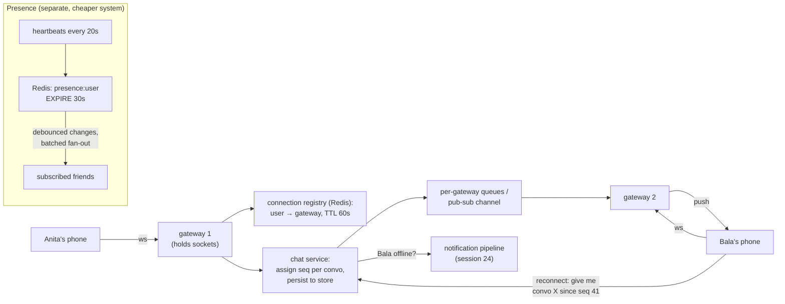

# Canonical Design 3: Chat + Presence — the design is a state problem wearing a websocket costume

**Level 13 · The Arena · Session 25 · [INTERVIEW-CRITICAL]**

## TL;DR

- Chat's three honest sub-problems: **(1) stateful connections at scale** (websockets pin users to boxes — routing/failover), **(2) message ordering + delivery guarantees** (per-conversation sequence, at-least-once + client dedup), **(3) fan-out to offline devices** (hand off to the notification pipeline from [session 24](canonical_2_feed_notifications.md)).
- The load-bearing decision: a **connection registry** (`user → gateway node`) so any server can route to whoever holds the socket — or skip the registry and pub/sub per conversation. Pick one, defend it.
- Ordering truth: **global ordering is a lie you don't need** — order *per conversation* via a per-conversation sequence (single partition / single owner), and let clients render by (seq, sent_at).
- Presence is a **TTL heartbeat system, not an events system**: "online" = heartbeat seen in last 30 s. Naive presence fan-out (notify all friends on every flap) is the scale killer — batch it, debounce it, and pull-on-open for the long tail.
- Delivery states (sent/delivered/read) are just more messages — tiny, high-volume, batched. Group chat = same design with per-member cursors; the 10k-member group forces the cursor model.

## Mental Model

## What Actually Happens

**One message, Anita → Bala, through every layer:**

1. **Connections:** Anita's app holds a websocket to gateway-1 (picked by the LB — L4 or least-conn, [load balancer.md](../load%20balancer.md); the connection *is* state now, [stateless_design.md](../compute/stateless_design.md)'s exception clause). Gateway-1 wrote `route:anita → g1` into the **connection registry** (Redis, TTL-refreshed). Capacity math to say aloud: a tuned gateway holds ~100k–1M mostly-idle sockets ([epoll economics — this is literally why event loops exist](../../fundamentals/os/fds_sockets_epoll.md)); 50M concurrent users ≈ 50–500 boxes. Memory, not CPU, is the ceiling.
2. **Send:** Anita's message hits gateway-1 → chat service. Client attached a **client_msg_id** (UUID minted on-device) — the idempotency key that survives her retries over flaky mobile networks ([the usual contract](../data/idempotency_retries.md)).
3. **Order + persist:** the conversation's messages must have one authoritative order. Cheapest correct mechanism: all writes for convo-X flow through one owner — a Kafka partition keyed by convo_id, or a per-convo sequence in the message store (Cassandra `(convo_id, seq)` clustering — [LSM-friendly write pattern](../../db/lsm_vs_btree.md), messages are the canonical LSM workload). Assign `seq`, persist, *then* ack Anita ("sent ✓"). Durability before ack — say it explicitly.
4. **Route:** chat service asks the registry "where is Bala?" → `g2` → pushes over gateway-2's channel (per-gateway queue or Redis pub/sub) → g2 writes to Bala's socket → "delivered ✓✓" flows back as a status message. Registry alternative worth naming: **pub/sub per conversation** (gateways subscribe to convos their users belong to) — simpler routing, more subscription churn; registry wins for 1:1-heavy, pub/sub for huge-group-heavy.
5. **Offline / reconnect:** Bala's socket is gone (registry miss or TTL-expired entry) → hand the message to the notification pipeline (push notification) and move on. When Bala reconnects — possibly to gateway-5 — the client sends per-convo cursors ("convo X: have up to seq 41") → backfill from the store → dedupe by client_msg_id/seq. **At-least-once + client dedup + seq gaps trigger re-fetch** = the delivery guarantee story, whole and honest. Gateway-1 dying is the same flow: sockets drop, clients auto-reconnect through the LB, registry entries expire, nothing is lost because *the store, not the gateway, owns messages*.
6. **Group chat (the escalation you should pre-empt):** small groups (≤~200): loop the routing step per member — fine. Large groups (10k+): stop pushing full messages per member; write once to the group's log, keep a **per-member read cursor**, push a lightweight "new message in G" ping and let clients pull the delta — write amplification collapses from O(members) to O(online-and-active members). This is fan-out-on-write → on-read again; [session 24's lesson](canonical_2_feed_notifications.md) wearing different clothes. Read receipts in big groups: aggregate counts, never per-member ticks.
7. **Presence, the separate system:** every client heartbeats (~20–30 s) → `SETEX presence:bala 30 online`. Online = key exists; offline = TTL lapse (no logout event needed — crash-safe by construction). The trap is the **fan-out on flap**: a subway commuter flaps 20×/hour × 500 contacts = 10k notifications/hour *per user*. Fixes, all three: **debounce** (state must hold N seconds before broadcasting), **batch** (presence deltas every ~10 s, not per-event), **pull-on-open** (presence of your visible contact list is fetched when you open the app; only actively-viewed conversations get live subscriptions).

## The Opinionated Take

- **The store owns messages; gateways own nothing.** Every hard failure question (node death, reconnect, multi-device) melts if gateways are dumb socket-holders and truth lives in the log + cursors. Design gateways to be killable mid-conversation and say so proactively.
- **Choose per-conversation ordering and refuse global ordering out loud.** "Two unrelated conversations don't need a mutual order" kills a whole class of accidental-consensus complexity. If the interviewer pushes cross-convo ordering, that's a feature negotiation, not a systems requirement.
- **Presence is an eventually-consistent gossip product, not a correctness product.** 10 s of staleness is invisible; the systems that melt are the ones that treated it as real-time truth. Budget presence at 1/10th the rigor of messaging and spend the savings on delivery cursors.
- **Multi-device is not an edge case** (phone + laptop): registry maps user → *set* of connections; delivery states move to per-device cursors with "read anywhere = read everywhere" merged server-side. Mention it before they do; it's a 1-sentence add if designed in, a redesign if not.
- Where this breaks: E2E encryption changes the server's role (blind relay + per-device key fan-out — server-side search and backfill get hard); federation (Matrix-style) turns ordering into a genuinely distributed problem. Name them as out-of-scope deliberately.

## Interview Ammo

1. **"How do you scale websockets horizontally?"** — Sockets pin state to boxes → connection registry (or convo pub/sub) for routing, LB with least-conn, gateways as disposable socket-holders, reconnect-with-cursor as the universal recovery. Capacity: ~100k+ idle conns/box, memory-bound.
2. **"How do you guarantee delivery and order?"** — Per-convo seq assigned by single owner (partition), durable before ack, at-least-once push, client dedup by client_msg_id, gap-detection triggers backfill. Global order: explicitly not needed — say why.
3. **"What happens when a gateway dies with 200k connections?"** — Clients reconnect through LB (jittered backoff or you self-DDoS — [retry doctrine](../data/idempotency_retries.md)), registry TTLs expire stale routes, cursors backfill missed messages from the store. Loss: zero messages, ~seconds of latency. The reconnect *stampede* is the real risk — connection-rate limiting at the LB.
4. **"Design presence for 50M users."** — Heartbeat + TTL key = state; debounce + batch + pull-on-open = fan-out control; the flapping-commuter arithmetic as the motivating example. Presence is allowed to lie for 10 seconds.
5. **"How does 1:1 design change for 25k-member groups?"** — Write-once log + per-member cursors + ping-and-pull instead of per-member push; receipts become aggregates. It's the fan-out-on-write→read transition; bonus points for naming the threshold reasoning from session 24.

## Practice Rep (60 min, pass/fail)

1. **35 min, recorded: full chat design** against [`System Design Challenge Simulator.md`](../System%20Design%20Challenge%20Simulator.md), demanding these escalations: gateway crash mid-send; user on 2 devices; group grows 50 → 50,000; "why is Anita seeing messages out of order?"
2. **15 min: presence mini-design** from a cold start — must include heartbeat/TTL mechanism, the flap arithmetic, and all three fan-out controls.
3. **10 min: self-grade** against: durability-before-ack stated? client_msg_id dedup present? cursor-based reconnect (not "resend everything")? global ordering explicitly rejected? group-chat cursor pivot articulated with a threshold?

**Pass:** all four escalations answered without redesign-on-the-fly (the design already contained the answer), and self-grade ≥4/5.
**Fail:** any answer that required inventing new architecture mid-escalation (means the core design was incomplete), or presence designed as per-event fan-out.

## Self-Check (5 questions, answers at bottom)

1. Why must the server persist a message before acking "sent," and what does the client_msg_id add on top?
2. Your registry says Bala is on g2, but g2 just crashed. Trace the message's path to Bala's eyeballs.
3. Why is a per-conversation sequence sufficient — construct the case where users would notice its absence, and the case where global ordering would matter (and doesn't exist).
4. Compute the presence fan-out load: 5M online users, average 300 contacts, 4 state flaps/user/hour, naive per-event broadcast. Then apply the three controls and re-estimate.
5. WhatsApp-style ✓/✓✓/blue-✓ — where does each transition originate, and why are these just messages?

---

Answers

1. Ack = a durability promise; ack-then-persist has a crash window where the sender believes a lost message was sent (the worst failure class: silent loss). client_msg_id makes the sender's retry safe: server dedupes, so "timeout → resend" can't double-post — at-least-once from the client, exactly-once effect in the log.
2. Send hits registry → g2 → connection refused/timeout → treat as offline: persist stands (store owns it), fire push notification, done. Bala's client reconnects (new gateway g5), registry updates, cursor backfill pulls seq > last-seen from the store. The crash cost Bala seconds of latency, not data.
3. Users only perceive order *within* a conversation (a reply before its question is the visible bug — per-convo seq fixes exactly that). Across conversations, "message in chat A vs chat B" has no user-meaningful order; imposing one would require cross-partition coordination (consensus tax) for a property nobody can observe.
4. Naive: 5M × 4 × 300 = 6B presence events/hour ≈ 1.7M/s — dead on arrival. Debounce (kill sub-30s flaps, ~÷4) → batch at 10 s windows (events become digests, ~÷5–10) → pull-on-open (broadcast only to contacts with the app foregrounded + you visible, commonly ~÷10+) → order of thousands-to-tens-of-thousands/s. Showing ~1.7M/s → ~10k/s *is* the answer.
5. ✓ sent: server persisted (server-origin). ✓✓ delivered: recipient device acked receipt (device-origin, flows back through their gateway). Blue read: recipient opened the convo (app-origin). Each is a tiny status message riding the same pipe — same ordering, same at-least-once + dedup, batched aggressively because they're 3× message volume at 1% of the importance.

