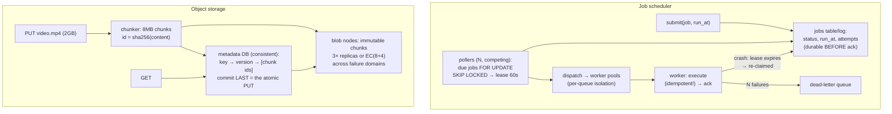

# Canonical Design 4: Distributed Job Scheduler + Object Storage — one is "exactly-once under crashes," the other is "metadata is the database, bytes are the easy part"

**Level 13 · The Arena · Session 26 · [INTERVIEW-CRITICAL]**

## TL;DR

- **Job scheduler** (cron-at-scale / delayed jobs): the whole interview is four guarantees — don't lose jobs (durable enqueue), don't run twice (lease + fencing), don't run late invisibly (SLO + lag metric), don't let one bad job starve the rest (isolation/DLQ). Everything else is bookkeeping.
- Its core mechanic: **due-time index → claim with lease → execute idempotently → ack or lease-expire-and-retry.** `SELECT ... FOR UPDATE SKIP LOCKED` on Postgres is the legitimate v1; it's [session 11's machinery](../../db/postgres_internals_2_mvcc.md) verbatim.
- **Object storage** (S3/Dropbox-style): split brain deliberately — a **metadata service** (the hard, consistent, small part: names, versions, chunk maps) and **blob storage** (the easy, huge, dumb part: immutable chunks on many disks, replicated or erasure-coded).
- Its core mechanics: **content-addressed chunks** (hash = identity → dedup + integrity + immutability for free), **erasure coding** vs 3× replication (1.5× vs 3× storage for same-ish durability, at repair/latency cost), and metadata as the consistency boundary.
- Both designs are "boring components + sharp guarantees" — the senior move is *stating the guarantee first*, then showing the mechanism that earns it.

## Mental Model

## What Actually Happens

### Design A — job scheduler ("run this at 9:00", "retry this webhook", "nightly at scale")

1. **Requirements:** one-shot delayed jobs + recurring crons; scale ~10k enqueues/s, 1M due/minute at peak; **at-least-once execution with idempotent handlers** (state exactly-once-effect up front — [you have a whole doc on why](../data/idempotency_retries.md)); per-queue priorities; job SLO: within X s of due time.
2. **Durable enqueue:** `INSERT INTO jobs (id, queue, payload, run_at, status='pending')` — commit before acking the producer. Recurring crons are just rows that, on completion, insert their next occurrence (materialize next-fire-time; don't evaluate cron expressions at query time).
3. **The claim — where correctness lives:** N pollers race for due jobs. `UPDATE jobs SET status='leased', lease_until=now()+'60s', attempts=attempts+1 WHERE id IN (SELECT id FROM jobs WHERE status='pending' AND run_at<=now() ORDER BY run_at LIMIT 100 FOR UPDATE SKIP LOCKED) RETURNING *` — **SKIP LOCKED** means competing pollers grab disjoint batches without herding ([the job-queue cheat code from MVCC](../../db/postgres_internals_2_mvcc.md)). Worker crashes mid-job → `lease_until` passes → a reaper flips it back to pending → re-claimed. **This is why handlers must be idempotent: the lease-expiry retry *is* the at-least-once.**
4. **The zombie problem — say "fencing" here:** worker A stalls (GC pause, network partition), its lease expires, worker B re-runs the job, then A wakes and *finishes too*. Two executions live. The lease alone can't stop A — A must be fenced: attempt number as a **fencing token**, checked at every side-effect boundary (the job's DB writes carry `WHERE attempts = :my_token`-style guards, or the downstream idempotency key includes the attempt). [Straight from consensus_and_coordination.md](../data/consensus_and_coordination.md) — this cross-reference is the senior flex of the whole design.
5. **Scaling the tick:** Postgres + SKIP LOCKED honestly serves to ~5–10k claims/s. Past that: partition the due-time index (Redis zset per shard, `ZRANGEBYSCORE` for due jobs) or a Kafka-backed timer wheel; the *claim/lease/fence* logic survives every backend swap — say that invariance explicitly. One scheduler-leader for cron *evaluation* (leader election via the [usual lease](../data/consensus_and_coordination.md)) with workers stateless.
6. **Operational guarantees:** per-queue worker pools (bulkhead: `webhooks` backlog can't starve `billing` — [bulkheads again](../requests/backpressure_load_shedding.md)); exponential backoff with jitter per retry; attempts > N → **dead-letter queue** with alerting (a job that fails forever must become a human's problem visibly, not a retry loop's secret); the one metric that matters: **schedule lag** (now − run_at at claim time) — it's your Little's-Law canary ([queueing_theory.md](../requests/queueing_theory.md)).

### Design B — object storage (S3-flavored; Dropbox sync = one paragraph on top)

1. **Requirements:** PUT/GET/DELETE by key, versions, ~11-nines durability, GB–TB objects, read-heavy; strong read-after-write on new keys (S3 gives this now — know it).
2. **The split:** clients never "save a file" — they (a) write **chunks** to blob nodes, (b) commit a **metadata record**. Metadata service (Postgres/spanner-ish, small data, strongly consistent) owns: `key → current version → ordered chunk list → chunk locations`. Blob layer owns: dumb immutable bytes at `sha256(chunk)` addresses. **The metadata commit is the atomic unit** — a PUT that wrote 200 chunks but died before metadata commit simply… never happened; orphaned chunks are garbage-collected later. That's how multi-GB uploads get all-or-nothing semantics without distributed transactions.
3. **Content addressing earns three properties at once:** dedup (same chunk hash = store once — massive for Dropbox-style workloads), integrity (re-hash on read; corruption is *detected*, then repaired from replicas), immutability (updates write new chunks + new metadata version — no in-place mutation anywhere, [the LSM worldview](../../db/lsm_vs_btree.md) at exabyte scale).
4. **Durability arithmetic (have this cold):** 3× replication across failure domains = 3.0× storage. **Erasure coding** (8 data + 4 parity shards across 12 domains) = 1.5× storage, survives any 4 losses — better durability *and* half the disk of 3×. The costs: reads touch 8 nodes (fine for large objects, painful for small/hot ones), and repair after a node loss is a cluster-wide read storm you must pace. Standard answer: **replicate hot/small, erasure-code warm/large**, tier by access.
5. **Failure machinery:** background scrubbers re-hash chunks (bit-rot patrol); a repair queue re-replicates under-replicated chunks — **prioritized by how many replicas remain** (1-copy chunks jump the queue; this detail reads very senior); placement across racks/AZs ([failure domains, multi_region_dr.md](../resilience/multi_region_dr.md)).
6. **Dropbox delta on top:** client-side chunking + hashing means editing 10 MB of a 2 GB file uploads ~2 chunks; sync = compare metadata trees (namespace journal), fetch missing chunks. Same storage core, plus a per-client cursor into the metadata log — [chat's reconnect-cursor pattern](canonical_3_chat_presence.md), reused.

## The Opinionated Take

- **Postgres-as-queue is the correct v1 and you should say so unapologetically** — transactional enqueue-with-your-business-write (outbox for free), SKIP LOCKED, one system to operate. Migrate the due-index when *measured* claim throughput demands it. "We'd start with Kafka" for 200 jobs/s is résumé-driven design; interviewers know it.
- **In both designs, name the consistency boundary and keep it tiny.** Scheduler: the claim row. Storage: the metadata record. Everything outside the boundary is allowed to be dumb, duplicated, retried, eventual — that's what makes both systems scale. This one sentence is transferable to nearly every design interview.
- **Guarantee-first narration wins:** "at-least-once + idempotent handlers + fencing for zombies" before any boxes; "all-or-nothing PUT via metadata-commit-last" before any chunk math. Interviewers grade the invariants; boxes are set dressing.
- Where the v1s break: scheduler — sub-second precision timers and millions of *distinct* fire times (timer-wheel territory, not rows); storage — billions of *tiny* objects (metadata becomes the bottleneck; pack small objects into aggregate blobs — Haystack's whole thesis).

## Interview Ammo

1. **"Design a delayed-job system. How do you guarantee a job runs exactly once?"** — Trap; correct opening: "exactly-once execution is unachievable under crashes; I'll give at-least-once with idempotent handlers and fencing = exactly-once *effect*," then lease + SKIP LOCKED + attempt-token.
2. **"Worker takes a job and dies / stalls. Walk both."** — Dies: lease expiry → reaper → re-claim → idempotent re-run. Stalls (zombie): re-claim *plus* fencing token invalidating the stale worker's side effects — distinguishing the two cases is the senior marker.
3. **"How does S3 not lose data?"** — Layered: replicas/EC across failure domains (durability math), scrubbing + prioritized repair (entropy patrol), content hashes (detection), metadata-commit atomicity (no torn writes). Quote the 1.5× EC vs 3× replication numbers.
4. **"Why split metadata from blobs?"** — Different problems: small/hot/consistent/queryable vs huge/cold/immutable/dumb. The split lets each layer scale on its own axis and confines consistency (the expensive property) to the small layer.
5. **"How would you do a 5 GB upload atomically over flaky networks?"** — Chunked multipart, each chunk retried independently (content hash = chunk idempotency key), metadata commit as the final atomic rename. Resume = ask which chunks the server has.

## Practice Rep (60 min, pass/fail)

1. **35 min, recorded: scheduler design** against [`System Design Challenge Simulator.md`](../System%20Design%20Challenge%20Simulator.md); demand escalations: "worker GC-pauses 90 s and comes back," "billing queue backed up behind 2M webhook retries," "cron leader dies at 8:59:59," "job must run at 9:00:00 ± 1 s."
2. **15 min: object-storage lightning round** — whiteboard the PUT path with metadata-commit-last, then answer: EC vs replication numbers; how corruption is caught; how dedup falls out of content addressing.
3. **10 min self-grade:** exactly-once disclaimed and rebuilt as effect? SKIP LOCKED named? zombie/fencing case handled *distinctly* from crash case? per-queue bulkheads + DLQ present? metadata named as the consistency boundary?

**Pass:** all four scheduler escalations answered from within the design (the fencing answer must reference the attempt-token, not just "the lease"), lightning round fluent on the 1.5×/3× arithmetic; self-grade ≥4/5.
**Fail:** claiming exactly-once execution, or an escalation answered by bolting on a new component that the base design should have contained.

## Self-Check (5 questions, answers at bottom)

1. Why is a lease insufficient against a stalled worker, and what exactly does the fencing token change?
2. Write (from memory) the shape of the SKIP LOCKED claim query and explain why competing pollers don't serialize behind each other.
3. In the object store, a client uploads 500 chunks and crashes. What's the cleanup story and why was nothing corrupted?
4. Derive: 100 PB stored — disk bought under 3× replication vs EC(8+4)? What operational costs did EC's savings buy?
5. Your scheduler's schedule-lag P99 is climbing while worker CPU sits at 40%. Give the two most likely bottlenecks and the metric that separates them.

---

Answers

1. The lease can expire while the stalled worker is *unaware* it lost it — it resumes and completes side effects concurrently with the new owner. The fencing token (attempt number) makes staleness *checkable at every side-effect boundary*: downstream writes guarded by the token reject the old attempt. The lease bounds re-claim time; the token invalidates the zombie's hands.
2. `UPDATE ... SET status='leased', lease_until=..., attempts=attempts+1 WHERE id IN (SELECT id FROM jobs WHERE status='pending' AND run_at <= now() ORDER BY run_at LIMIT k FOR UPDATE SKIP LOCKED) RETURNING *`. SKIP LOCKED makes each poller skip rows already row-locked by rivals instead of queueing on them — disjoint batches, no lock convoy.
3. Chunks are content-addressed and *unreferenced* — no metadata record points at them, so no GET can ever see them; the PUT observably never happened (atomicity via commit-last). An async GC walks blob storage for chunks unreferenced past a grace window and deletes them.
4. 3×: 300 PB raw. EC(8+4): 150 PB — 150 PB saved. Bought with: reads reconstructing from 8 shards (worse small-object latency), parity CPU, and repair storms on node loss that must be rate-limited against foreground traffic — hence hot-data-replicated, cold-data-EC tiering.
5. (a) The claim path is the bottleneck — pollers can't drain the due set fast enough (lock contention/one poller/undersized batch): claim throughput (jobs claimed/s) flat while due-backlog grows. (b) One queue's slow jobs occupy the shared pool (missing bulkheads): per-queue lag diverges — webhooks' P99 exploding while billing's is flat. Per-queue schedule-lag breakdown separates them instantly.

